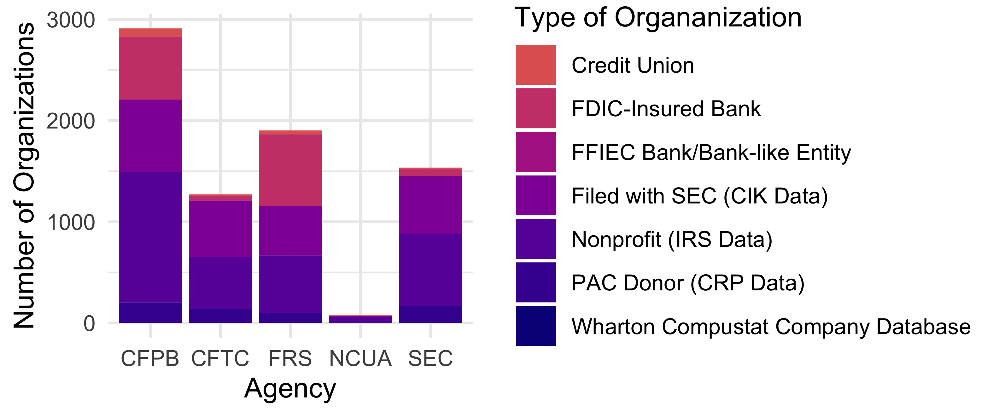
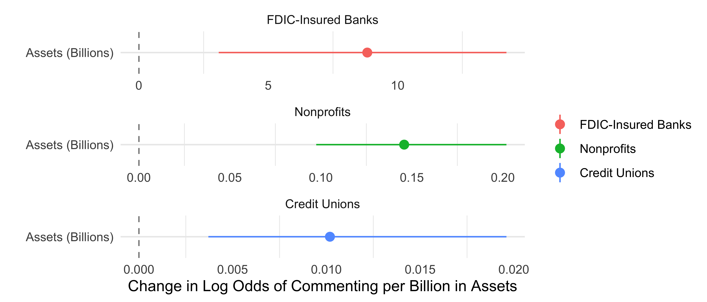
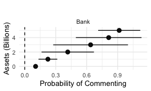
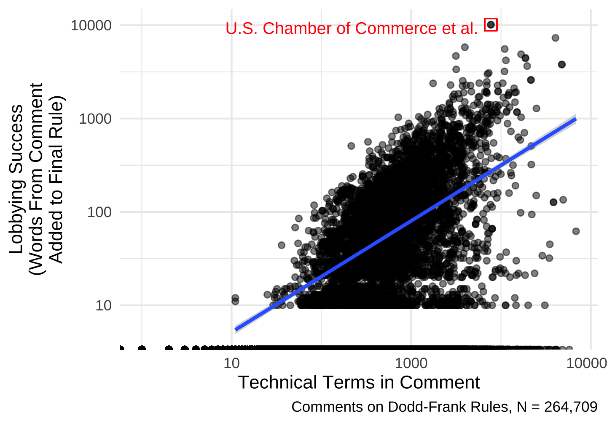

```{r setup, include = FALSE}
short = "false"
exclude_stepwise = "true"
exclude_extra = "true"

# chunks options:
# hide code and messages by default (warning, message)
# cache everything 
knitr::opts_chunk$set(warning = FALSE, 
                      message = FALSE,
                      echo = FALSE, 
                      #fig.path = "Figs/",
                      cache = FALSE, 
                      fig.align = 'center',
                      fig.retina = 2,
                      dpi = 100)
# Xaringan: https://slides.yihui.name/xaringan/
library("xaringan")
library("xaringanthemer")
library("here")
library("tidyverse")
library("magrittr")


style_mono_light(base_color = "#3b444b",
          inverse_link_color	
 = "#85bb65",
          #background_image = "Figs/ej-superfund-light.jpeg",
          background_color = "FFFFFF", #FAF0E6", # linen
          header_font_google = google_font("PT Sans"), 
          text_font_google = google_font("Old Standard"), 
          text_font_size = "40px",
          padding = "10px",
          code_font_google = google_font("Inconsolata"), 
          code_inline_background_color    = "#F5F5F5", 
          table_row_even_background_color = "#ddede5"#, extra_css = list(".remark-slide-number" = list("display" = "none"))
 )
```


# Question: 

## Does wealth mean power in agency rulemaking? 

???

I just have three slides

This is the first paper to come out of a project where we have spent years collecting data and now get to write papers. 

Your feedback will be helpful in the directions we take this. 

We start with a simple question that has received a lot of attention in the legislative context. With 90% of US law now made in the executive branch. 


--

e.g., the Inflation Reduction Act delegates authorities to 30+ agencies.

--

Who do we expect to win and lose as fights move to agency policymaking? 

???

There is also a body of work demonstrating that businesses win more often than other types of organizations in rulemaking. We push this forward in two ways: 
First, we investigate mechanism of busness influence related to wealth and sophisticated lobbying
Second, we assess inequalities *within* types of organizations


---

# 📊 Data 

- All 200+ Dodd-Frank Rulmakings (800+ policy documents)
- All ~300k comments on these rules

???

First, we collect all policy documents coming out of dodd frank and all comments on those proposed rules.
Then, we link comments to organizations with various measures of wealth
--
- Linked to 6k+ organizations (+ all ~500k similar organizations that did not comment)

```{r org-types, fig.cap= "Number of Organizations by Type and Agency to which they Commented, Including the Consumer Financial Protection Bureau (CFPB), Commodity Futures Trading Commission (CFTC), Federal Reserve (FRS), National Credit Union Administration (NCUA), and Securities and Exchange Commission (SEC)", out.width = "73%"}


```

---

# Argument: 

## 💰 $\rightarrow$ seat at the table


```{r mp-assets, fig.cap= "", out.width="90%"}

#
```

---

# Argument: 

## 💰 $\rightarrow$ lobbying success

???

Finally, we test one mechanism by which wealth translates to power: as Wendy Wagner and others show, money to hire lawyers and experts. 

---

# Argument: 

## 💰 $\rightarrow$ sophistication (e.g., lawyers) $\rightarrow$ lobbying success

```{r, efficacyXsophistication, fig.cap="Lobbying Success by Comment Sophistication", out.width= "62%"}

```

???

So we measure the sophistication of comments. 
The x-axis here is the number of words that appear in dictionaries of legal and banking terms. 

---

# 🙏 Feedback 

This paper: 

- **Omitted variables**?
- **Benchmarks** to compare lobbying inequality across Congress and the bureaucracy? 


Next: 

- Other **mechanisms**? 
- Dimensions of variation across **venues** or policy **domains**? 


???

