```{r setup, include = FALSE}
#source(here::here("code", "setup.R"))
short = "false"
exclude_stepwise = "false"
exclude_extra = "false"

# cache everything 
knitr::opts_chunk$set(warning = FALSE, 
                      message = FALSE,
                      echo = FALSE, 
                      fig.topcaption=TRUE,
                      cache = TRUE, 
                      fig.align = 'center',
                      fig.retina = 2,
                      fig.show="hold",
                      fig.pos= "htbp",
                      fig.path = "Figs/",
                      fig.cap = '   ',
                      out.width = "100%",
                      out.extra = "")


# Xaringan: https://slides.yihui.name/xaringan/
library("xaringan")
library("xaringanthemer")
library("here")
library("tidyverse")
library("magrittr")
library("knitr")
library("kableExtra")


style_mono_light(base_color = "#000000", # "#F2DFCE",
          link_color	 = "#0D7680",
          inverse_link_color	 = "#FFCFB3",
          background_color = "#FFF1E0", 
          header_background_content_padding_top = "7rem",
          table_row_even_background_color = "#FFCFB3",
 header_font_google = google_font("Playfair Display"), 
          text_font_google = google_font("Playfair Display"), 
          base_font_size = "30px",
  text_font_size = "1rem",
 code_font_size = "1rem",
 header_h1_font_size = "1.5rem",
  header_h2_font_size = "1.25rem",
  header_h3_font_size = "1.25rem",
          padding = "25px",
          code_font_google = google_font("Inconsolata")
 )

```

name: question
background-color: #FFCFB3

## Does wealth mean power in agency rulemaking? 

???


This is the first paper to come out of a project where we have spent years collecting data and now get to write papers. 

Your feedback will be helpful in the directions we take this. 

We start with a simple question that has received a lot of attention in the legislative context. With 90% of US law now made in the executive branch. 


--

## If so, why? 

- Are wealthy organizations structurally advantaged (i.e., do they always win)?

--

- Or do they win *because* of their lobbying (i.e., because it is more sophisticated)?

--

*not mutually exclusive. But _how much_ influence is due to lobbying?

---

.pull-left[
```{r}
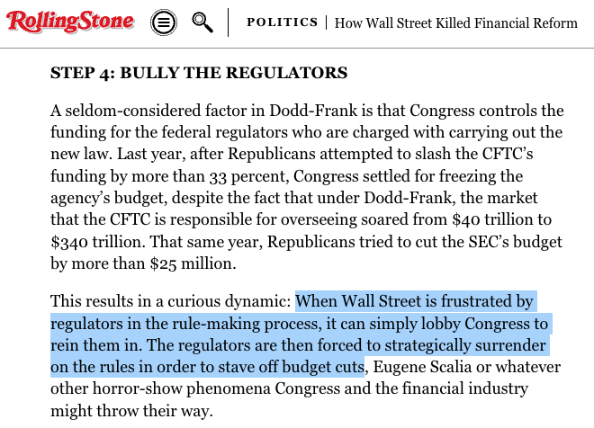
```
]

.pull-right[
  
```{r}
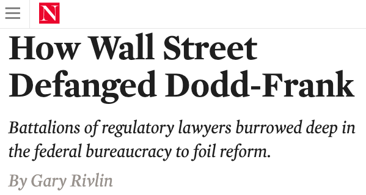
knitr::include_graphics("figs/clip-lobbying-info.png")
```

]

---
# PREVIEW

💰 $\rightsquigarrow$ seat at the table

- Wealthy organizations are more likely to comment 
- Among commenters, frequent commenters are wealthier 

--

Among commenters, 💰 $\rightsquigarrow$ sophistication (e.g., lawyers) $\rightsquigarrow$ lobbying success

- Wealthy organizations submit more sophisticated comments
--

- Agencies are more likely to adopt language from sophisticated comments
--

- Much of the relationship between wealth and lobbying success* can be attributed to lobbying sophistication**

*We observe only a small slice of influence that is most likely to be the result of specific sophisticated lobbying. 

**Much more to do on mediation
 

???

(ideas for better competing hypotheses?)


e.g., the Inflation Reduction Act delegates authorities to 30+ agencies.

Who do we expect to win and lose as fights move to agency policymaking? 

There is also a body of work demonstrating that businesses win more often than other types of organizations in rulemaking. We push this forward in two ways: 
First, we investigate the mechanism of business influence related to wealth and sophisticated lobbying
Second, we assess inequalities *within* types of organizations

Hogan and Burns (2019) find a total annual increase in Dodd-Frank-related compliance costs of $64.5 billion for banks with more than $10 billion in assets
https://clsbluesky.law.columbia.edu/2022/06/29/rolling-back-dodd-frank-investors-and-banks-responses-to-financial-market-deregulation/

---

## 📊 DATA  

- All 200+ Dodd-Frank Rulemakings (800+ policy documents) 2010-2018
- All ~300k comments on these rules

???

First, we collect all policy documents coming out of dodd-frank and all comments on those proposed rules.
Then, we link comments to organizations with various measures of wealth.
--
- Linked to 6k+ organizations (+ all ~500k similar orgs. that did not comment)

```{r org-types, fig.cap= "", out.width = "80%"}

knitr::include_graphics("figs/org_count_type-2.png")
```

Number of Organizations by Type and Agency to which they Commented, Including the Consumer Financial Protection Bureau (CFPB), Commodity Futures Trading Commission (CFTC), Federal Reserve (FRS), National Credit Union Administration (NCUA), and Securities and Exchange Commission (SEC)


---

##  💰 $\rightsquigarrow$ seat at the table

```{r, commenters-noncommenters1, fig.cap="Financial Resources of Organizations that Did and Did Not Comment", out.width= "49%"}
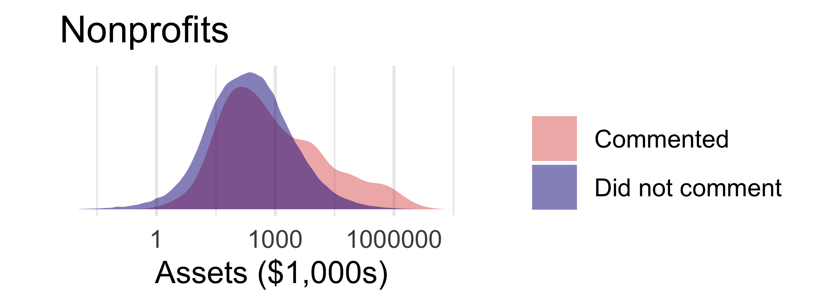
```

---

##  💰 $\rightsquigarrow$ seat at the table

```{r, commenters-noncommenters2, fig.cap="Financial Resources of Organizations that Did and Did Not Comment", out.width= "49%"}
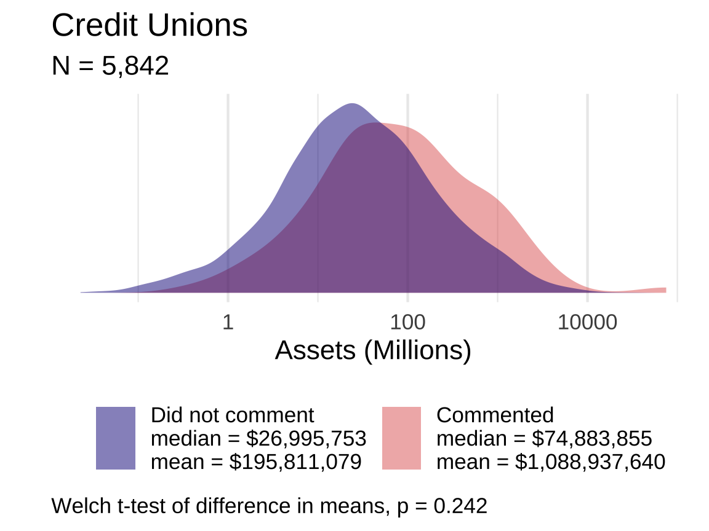
```

---


##  💰 $\rightsquigarrow$ seat at the table

```{r, commenters-noncommenters3, fig.cap="Financial Resources of Organizations that Did and Did Not Comment", out.width= "49%"}
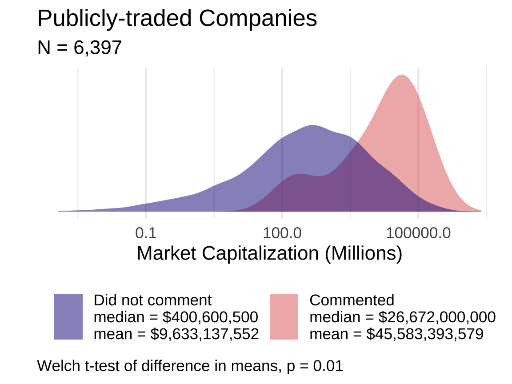
```

---

##  💰 $\rightsquigarrow$ seat at the table

```{r, commenters-noncommenters4, fig.cap="Financial Resources of Organizations that Did and Did Not Comment", out.width= "49%"}
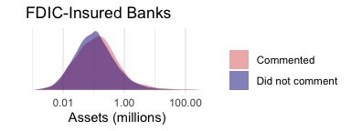
```


---

##  💰 $\rightsquigarrow$ seat at the table, especially if profit-motivated
  
  
```{r, mp-all-predict-quad-1, fig.cap= "Predicted Probability of Participating in Dodd-Frank Rulemaking by Assets", out.width="55%"}
knitr::include_graphics("figs/mp-all-predict-quad-1.png")
#TODO: THIS SHOULD SPLIT OUT COMMERCIAL BANKS AND COMBINE WITH THE BANK MODELS BELOW FOR TWO FIGURES BUT ONE TABLE. (STILL ESTIMATE A MODEL WITH BANKS SEPARATELY THO)--> 
```


---

background-image: url("figs/mp-all-table.png") 
background-position: center
background-size: cover


---

class: middle

> ## [Comercial Banks]() were [four]() times more likely to comment on a Dodd-Frank rule than the average non-profit [Savings Association](), [six]() times more likely to comment than the average [Credit Union]() and [60]() times more likely to comment than the average [non-profit](). 

---

##  💰 $\rightsquigarrow$ seat at the table, especially if profit-motivated

```{r, mp-FDIC2, fig.cap= "Predicted Probability of Participating by Type of Bank", out.width="70%"}
#TODO CREDIT UNIONS SHOULD BE IN THIS MODEL 
knitr::include_graphics("figs/mp-FDIC2-predict-1.png")
```


---

background-image: url("figs/mp-FDIC2-table.png") 
background-position: center
background-size: cover

---

name: success
background-color: #FFCFB3
class: middle center

```{css, echo=FALSE}
#embeded_pdf {
 width: 100%; 
 height: 100%;
}

```

# LOBBYING SUCCESS

<embed src="s73310-110.pdf" type="application/pdf" id="embeded_pdf">


???


much harder to measure

---

##  💰 $\rightsquigarrow$ lobbying success

```{r repeated-text-assets2, fig.cap="Amount of Text Repeated in Final Rules by Commenter Resources", out.width="49%"}
knitr::include_graphics("figs/assets-efficacy-2.png")
```

???

Finally, we test one mechanism by which wealth translates to power: as Wendy Wagner and others show, money to hire lawyers and experts. 

---

##  💰 $\rightsquigarrow$ lobbying success

```{r repeated-text-assets4, fig.cap="Amount of Text Repeated in Final Rules by Commenter Resources", out.width="49%"}
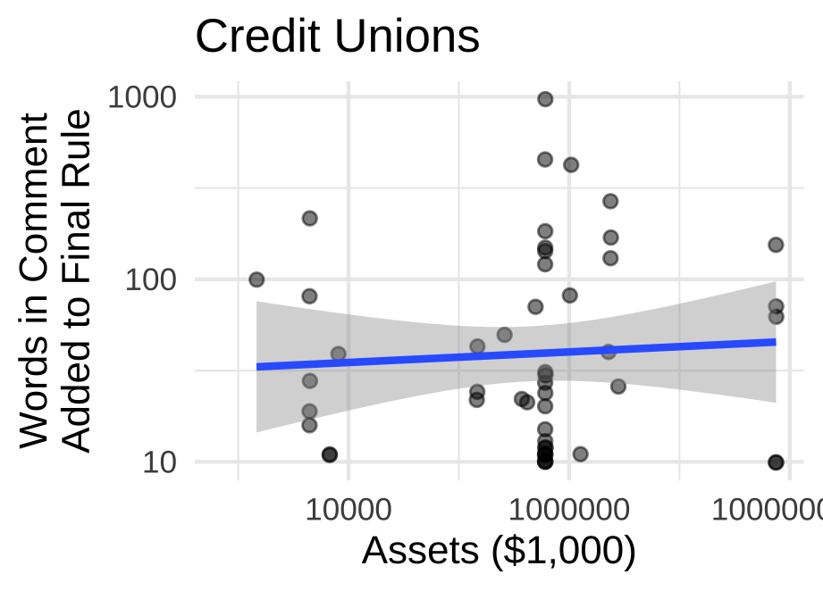
```

---

##  💰 $\rightsquigarrow$ lobbying success

```{r repeated-text-assets6, fig.cap="Amount of Text Repeated in Final Rules by Commenter Resources", out.width="49%"}
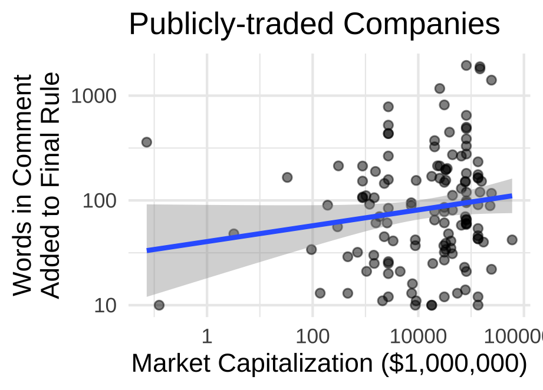
```

---

##  💰 $\rightsquigarrow$ lobbying success

```{r repeated-text-assets8, fig.cap="Amount of Text Repeated in Final Rules by Commenter Resources", out.width="49%"}
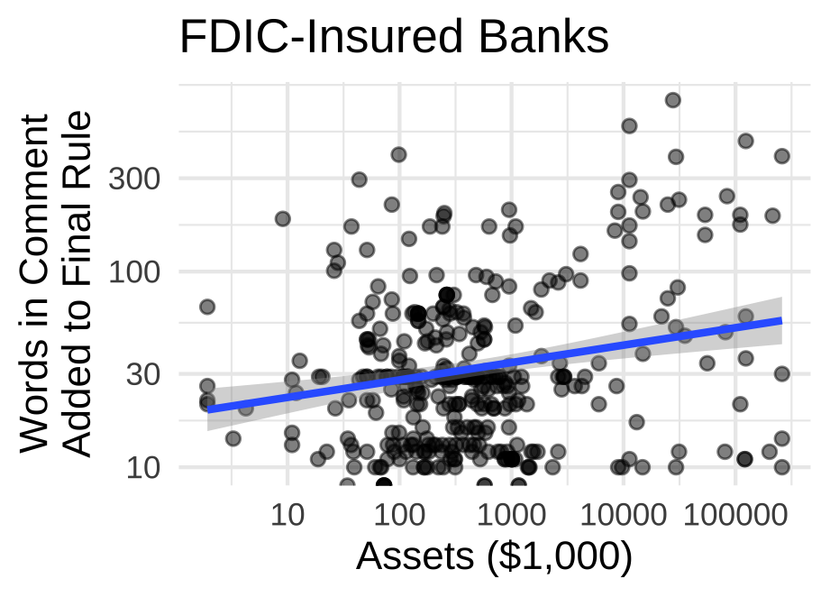
```


---

## 💰 $\rightsquigarrow$ sophistication (e.g., lawyers) $\rightsquigarrow$ lobbying success

--

```{r, efficacyXsophistication, fig.cap="Lobbying Success by Comment Sophistication", out.width= "55%"}
knitr::include_graphics("figs/efficacyXsophistication-2.png")
```

???

So we measure the sophistication of comments. 
The x-axis here is the number of words that appear in dictionaries of legal and banking terms. 

---

## 💰 $\rightsquigarrow$ sophistication (e.g., lawyers) $\rightsquigarrow$ lobbying success

--

```{r, acme, fig.cap="Lobbying Success by Comment Sophistication", out.width= "100%"}
knitr::include_graphics("figs/mediation-4wayNo0-acme-1.png")
```

---

## 💰 $\rightsquigarrow$ sophistication (e.g., lawyers) $\rightsquigarrow$ lobbying success


```{r, acme2, fig.cap="Lobbying Success by Comment Sophistication", out.width= "100%"}
knitr::include_graphics("figs/mediation-4wayNo0-acme-3.png")
```

---

## 💰 $\rightsquigarrow$ PAC Donations $\nrightarrow$ lobbying success

```{r mediation-pac, out.width="60%",  fig.cap= "PAC Donations as a Mediator Between Wealth and Lobbying Success"}
# TODO DEVIN WILL INSERT mediation terms from https://judgelord.github.io/finreg/efficacy#Market_cap_x_legal_citations

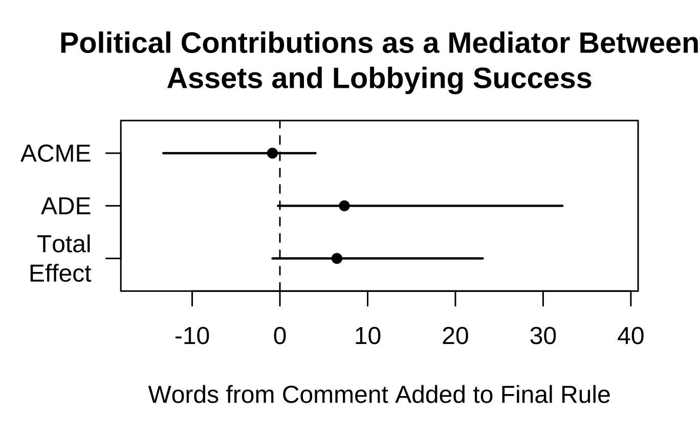
```

---

## 💰 $\rightsquigarrow$ sophistication (e.g., lawyers) $\rightsquigarrow$ lobbying success

```{r mediation-terms, out.width="60%",  fig.cap= "Technical Language as a Proposed Mediator Between Wealth and Lobbying Success"}
# TODO DEVIN WILL INSERT mediation terms from https://judgelord.github.io/finreg/efficacy#Market_cap_x_legal_citations

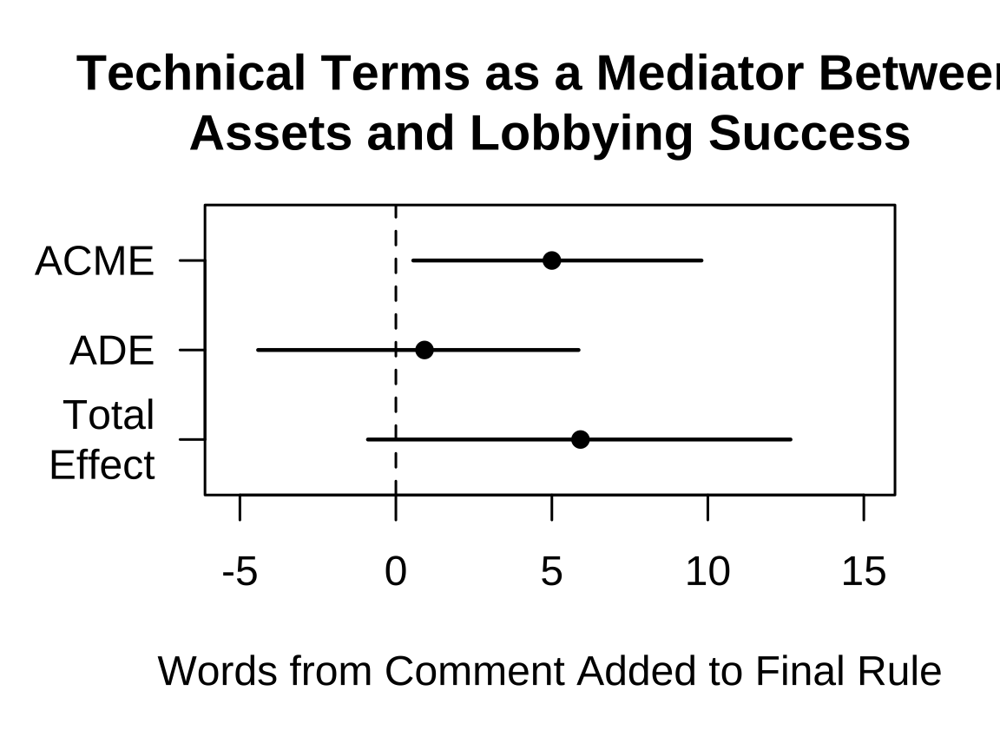
```

---

## Alternative explanations 

- sophistication is just stylistic emulation 
--
(but sophisticated comments get cites)

--
- sophisticated comments are just more "correct" (?)

--

## Alternative interpretations: This is good, actually.

Wealthier organizations "represent" more people (?)

--

- employees? customers? shareholders? 
- volunteers? members vs. memberless?
- regulated industry vs. consumers?
- narrow private aims (US Chambers) vs. broad public aims (US PIRG)?

--

Wealthy organizations better internalize collective benefits (but these are often private gains [Libgober 2020])

???

Large/wealthy orgs may create collective benefits. Libgober 2020 finds these are often private gains, so let's just say that. I don't know how else to address this in an easy way. Even if big firms are creating policy benefits for all firms in the industry, the small ones are still being ignored more often, so I think our finding holds. I think hand-coding is the only way to know if the small firms are really winning just as much as the big ones from the agency adopting the big firm's suggestions.

---

# 🙏 Feedback 

- Setup 
- Omitted variables
- [Validation](https://judgelord.github.io/finreg/validation)
- Do we need to model a selection process? 

???

Selection model --- I am not convinced that Heckman is what we want or that there is really even a problem here. It seems that a selection model would be right if we were trying to make inferences about lobbying success about the whole population of orgs but only observing some (or if we were making inferences about all commenters from only some selected comments). However, I think we only want to make claims about lobbying success *among those who lobby* and we observe *all* of this population. Happy to discuss that further, but perhaps we just need to clarify that we are making inferences about different populations in different parts of the paper. Perhaps I'm wrong.

--

# Next: 

- Compare lobbying on rules that regulate big banks vs. other rules
- **Benchmarks** to compare lobbying inequality across Congress and the bureaucracy? 
- Assess other **mechanisms**? 
  -   legislator comments
- Dimensions of variation across **venues** or policy **domains**? 

???

---

# RECAP

💰 $\rightsquigarrow$ seat at the table

- Wealthy organizations are more likely to comment 
- Among commenters, frequent commenters are wealthier 

--

Among commenters, 💰 $\rightsquigarrow$ sophistication (e.g., lawyers) $\rightsquigarrow$ lobbying success

- Wealthy organizations submit more sophisticated comments
--

- Agencies are more likely to adopt language from sophisticated comments
--

- Near all of the relationship between wealth and lobbying success* can be attributed to lobbying sophistication

*We observe only a small slice of influence that is most likely to be the result of specific sophisticated lobbying

---

exclude: true

```{r mp-assets-table, fig.pos = "!H", out.extra = ""}
load(here::here("models", "pr-of-comment.Rdata"))
library(modelsummary)

modelsummary(models, caption = "Log Odds of Commenting on Any Dodd-Frank Rule")  %>% kableExtra::kable_styling()
```

---

exclude: true

```{r mpFDIC-table}
load(here::here("models", "mpFDIC.Rdata"))

modelsummary(models, caption = "Log Odds of Commenting on Any Rule by Bank Type", notes = "Reference category = savings associations")  %>% kableExtra::kable_styling()
```

???

TODO 
- richest nonprofits 
- 10k words adopted from chamber comment? On which rule? 
