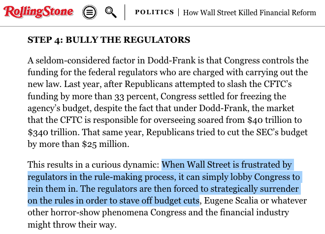
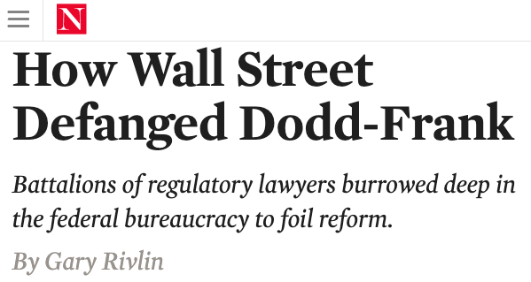
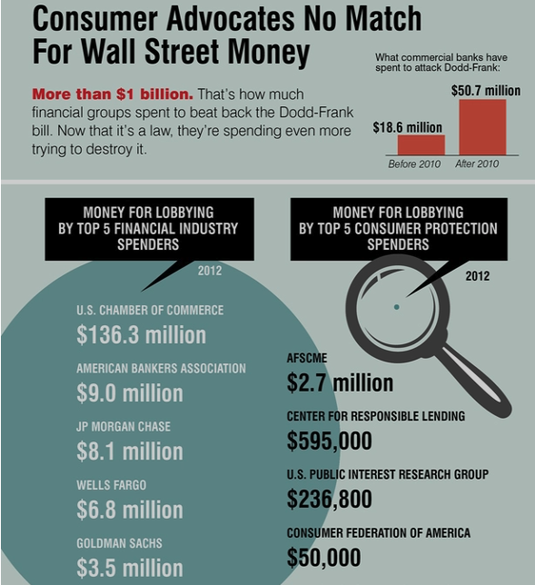
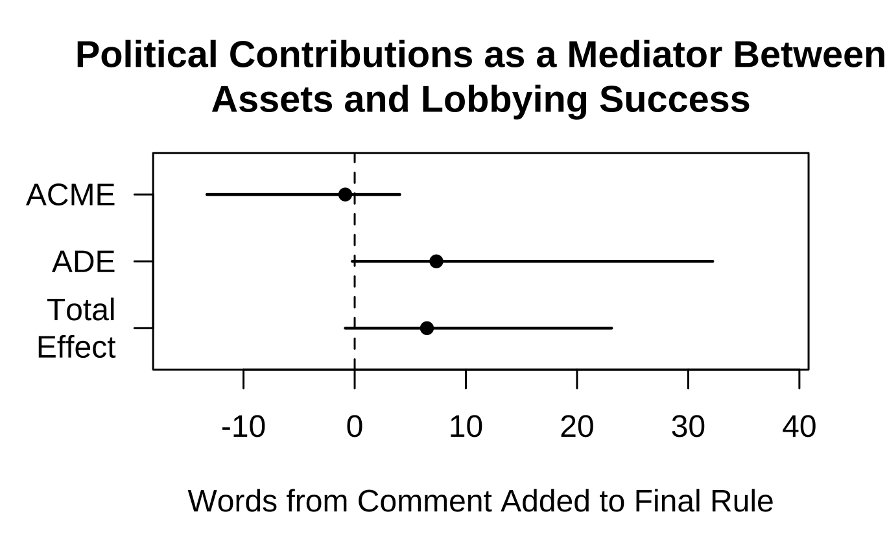
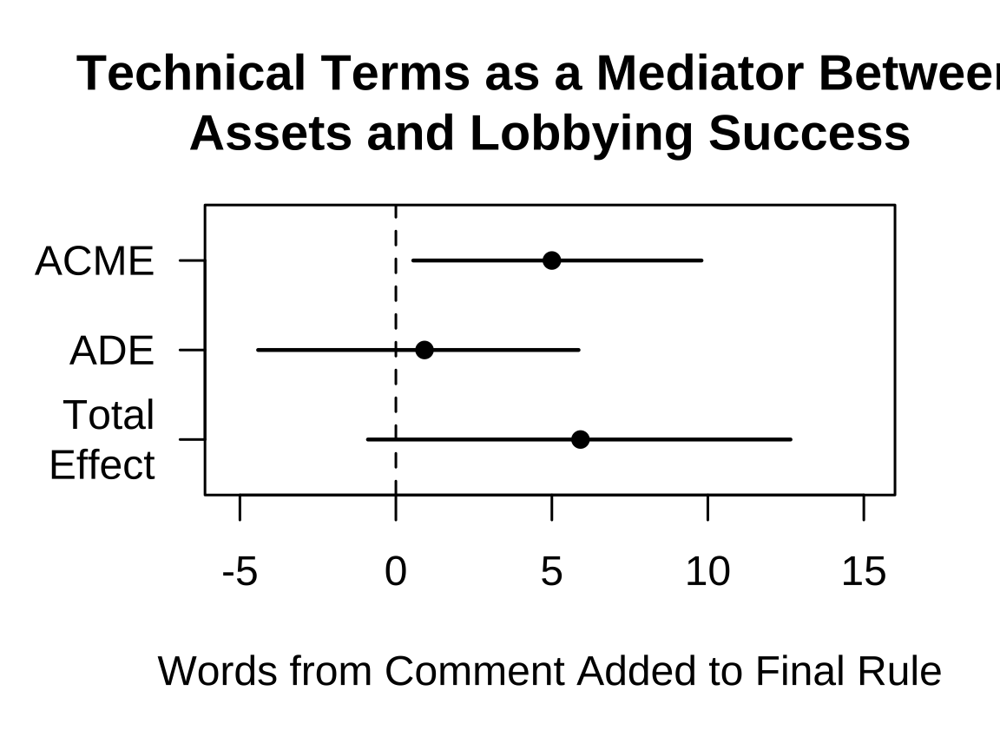

## Does wealth mean power in agency rulemaking? 

::: {.notes}
This is the first paper to come out of a project where we have spent years collecting data and now get to write papers. 

Your feedback will be helpful in the directions we take this. 

We start with a simple question that has received a lot of attention in the legislative context. With 90% of US law now made in the executive branch. 
:::


### If so, why? 

- Are wealthy organizations structurally advantaged (i.e., do they always win)?
- Or do they win *because* of their lobbying (i.e., because it is more sophisticated)?

. . . 

*not mutually exclusive. But _how much_ influence is due to lobbying?

##

::: {layout="[[1,1]]"}


```{r}
#| out-width: 100%


```

  
```{r}
#| out-width: 100%

```

:::

## The Headlines

💰 $\rightsquigarrow$ seat at the table

- Wealthier organizations are more likely to comment 
- Among commenters, frequent commenters are wealthier 

. . . 

💰 $\rightsquigarrow$ sophistication (e.g., lawyers) $\rightsquigarrow$ lobbying success

- Wealthy organizations submit more sophisticated comments
- Agencies adopt more language from sophisticated comments
- Much of the relationship between wealth and lobbying success can be attributed to lobbying sophistication^[We observe only a type of influence that is most likely to be the result of specific sophisticated lobbying.]


::: {.notes}

(ideas for better competing hypotheses?)


e.g., the Inflation Reduction Act delegates authorities to 30+ agencies.

Who do we expect to win and lose as fights move to agency policymaking? 

There is also a body of work demonstrating that businesses win more often than other types of organizations in rulemaking. We push this forward in two ways: 
First, we investigate the mechanism of business influence related to wealth and sophisticated lobbying
Second, we assess inequalities *within* types of organizations

Hogan and Burns (2019) find a total annual increase in Dodd-Frank-related compliance costs of $64.5 billion for banks with more than $10 billion in assets
https://clsbluesky.law.columbia.edu/2022/06/29/rolling-back-dodd-frank-investors-and-banks-responses-to-financial-market-deregulation/
:::

## 📊 DATA  

- All Dodd-Frank Rules (800+ policy documents) 2010-2018
- All ~300k comments on these rules
- Linked to 6k+ organizations (+ all ~500k similar orgs. that did not comment)

```{r}
#| label: fig-org-types
#| fig-cap: "Number of Organizations by Type and Agency to which they Commented"
#| out-width: 100%

# Agencies include the Consumer Financial Protection Bureau (CFPB), Commodity Futures Trading Commission (CFTC), Federal Reserve (FRS), National Credit Union Administration (NCUA), and Securities and Exchange Commission (SEC).
knitr::include_graphics(here::here("figs/org_count_type-2.png"))
```

::: {.notes}

Number of Organizations by Type and Agency to which they Commented, Including the Consumer Financial Protection Bureau (CFPB), Commodity Futures Trading Commission (CFTC), Federal Reserve (FRS), National Credit Union Administration (NCUA), and Securities and Exchange Commission (SEC)

First, we collect all policy documents coming out of dodd-frank and all comments on those proposed rules.
Then, we link comments to organizations with various measures of wealth.
:::


##  💰 $\rightsquigarrow$ seat at the table

```{r, commenters-noncommenters1, fig.cap="Financial Resources of Organizations that Did and Did Not Comment", out.width= "49%"}
knitr::include_graphics(here::here("figs/nonprofit-density-1.png"))
```


##  💰 $\rightsquigarrow$ seat at the table

```{r, commenters-noncommenters2, fig.cap="Financial Resources of Organizations that Did and Did Not Comment", out.width= "49%"}
knitr::include_graphics(here::here("figs/creditunion-density-1.png"))
```


##  💰 $\rightsquigarrow$ seat at the table

```{r, commenters-noncommenters3, fig.cap="Financial Resources of Organizations that Did and Did Not Comment"}
#| out-width: 100%
knitr::include_graphics(here::here("figs/compustat-density-1.png"))
```


##  💰 $\rightsquigarrow$ seat at the table

```{r, commenters-noncommenters4, fig.cap="Financial Resources of Organizations that Did and Did Not Comment"}
#| out-width: 100%

knitr::include_graphics(here::here("figs/FDIC-density-select-1.png"))
```


##  💰 $\rightsquigarrow$ seat at the table, especially if profit-motivated
  
  
```{r, mp-all-predict-quad-1, fig.cap= "Predicted Probability of Participating in Dodd-Frank Rulemaking by Assets"}
#| out-width: 100%

knitr::include_graphics(here::here("figs/mp-all-predict-quad-1.png"))
#TODO: THIS SHOULD SPLIT OUT COMMERCIAL BANKS AND COMBINE WITH THE BANK MODELS BELOW FOR TWO FIGURES BUT ONE TABLE. (STILL ESTIMATE A MODEL WITH BANKS SEPARATELY THO)--> 
```


##  💰 $\rightsquigarrow$ seat at the table, especially if profit-motivated <!--([Table](tbl-mp-all-table))-->

```{r, mp-FDIC2, fig.cap= "Predicted Probability of Participating by Type of Bank"}
#| out-width: 100%

#TODO CREDIT UNIONS SHOULD BE IN THIS MODEL 
knitr::include_graphics(here::here("figs/mp-FDIC2-predict-1.png"))
```


## 💰 $\rightsquigarrow$ seat at the table, especially if profit-motivated

> [Comercial banks]() were [four]() times more likely to comment on a Dodd-Frank rule than the average non-profit [aavings association](), [six]() times more likely to comment than the average [credit union]() and [60]() times more likely to comment than the average [non-profit](). 


```{css, echo=FALSE}
#embeded_pdf {
 width: 100%; 
 height: 100%;
}

```

## Lobbying Success

<embed src="s73310-110.pdf" type="application/pdf" id="embeded_pdf">


::: {.notes}
much harder to measure

a) Any award made pursuant to these rules will be paid from the Securities and Exchange Commission Investor Protection Fund the Fund b A recipient of a whistleblower award is entitled to payment on the award only to the extent that a monetary sanction is collected in the Commission action or in a related action upon which the award is based c Payment of a whistleblower award for a monetary sanction collected in a Commission action or related action shall be made following the later of 1 The date on which the monetary sanction is collected or 2 The completion of the appeals process for all whistleblower award claims arising from i The Notice of Covered Action in the case of any payment of an award for a monetary sanction collected in a Commission action or ii The related action in the case of any payment of an award for a monetary sanction collected in a related action d If there are insufficient amounts available in the Fund to pay the entire amount of an award payment within a reasonable period of time from the time for payment specified by paragraph c of this section then subject to the following terms the balance of the payment shall be paid when amounts become available in the Fund as follows 1 Where multiple whistleblowers are owed payments from the Fund based on awards that do not arise from the same Notice of Covered Action or related action priority in making these payments will be determined based upon the date that the collections for which the whistleblowers are owed payments occurred If two or more of these collections occur on the same date those whistleblowers owed payments based on these collections will be paid on a pro rata basis until sufficient amounts become become available in the Fund to pay their entire payments	

:::


##  💰 $\rightsquigarrow$ lobbying success (banks)

```{r}
#| fig-cap: "Amount of Text Repeated in Final Rules by Commenter Resources."
#| out-width: 90%
knitr::include_graphics(here::here(c(
  "figs/boxplot-assets-efficacy-10.png")))
```

##  💰 $\rightsquigarrow$ lobbying success (companies)

```{r}
#| fig-cap: "Amount of Text Repeated in Final Rules by Commenter Resources."
#| out-width: 90%
knitr::include_graphics(here::here(c(
  "figs/boxplot-assets-efficacy-8.png")))
```

::: {.notes}

Finally, we test one mechanism by which wealth translates to power: as Wendy Wagner and others show, money to hire lawyers and experts. 

:::


## 💰 $\rightsquigarrow$ sophistication (e.g., lawyers) $\rightsquigarrow$ lobbying success

```{r}
#| label: fig-efficacyXsophistication
#| fig-cap: "Lobbying Success by Comment Sophistication."
#| out-width: 100%
knitr::include_graphics(here::here("figs/boxplot-efficacyXsophistication-2.png"))
```

::: {.notes}

So we measure the sophistication of comments. 
The x-axis here is the number of words that appear in dictionaries of legal and banking terms. 

 Each point represents a comment. The horizontal axis bins comments by the order of magnitude of the number of technical terms per comment.

:::

## 💰 $\rightsquigarrow$ sophistication (e.g., lawyers) $\rightsquigarrow$ lobbying success

```{r, acme, fig.cap="Lobbying Success by Comment Sophistication", out.width= "100%"}
knitr::include_graphics(here::here("figs/mediation-4wayNo0-acme-1.png"))
```


## RECAP

💰 $\rightsquigarrow$ seat at the table

- Wealthier organizations are more likely to comment 
- Among commenters, frequent commenters are wealthier 

💰 $\rightsquigarrow$ sophistication (e.g., lawyers) $\rightsquigarrow$ lobbying success

- Wealthy organizations submit more sophisticated comments
- Agencies adopt more text from sophisticated comments
- Much of the relationship between wealth and lobbying success can be attributed to lobbying sophistication


## Alternative explanations 

- sophistication is just stylistic emulation 

. . . 

(but sophisticated comments get cites)

. . . 

- sophisticated comments are just more "correct" (?)

## Alternative interpretations

This is good, actually. Wealthier organizations "represent" more people (?)

- Non-profit volunteers? members vs. memberless? (❌)
- employees? customers? shareholders? 
- regulated industry vs. consumers?
- narrow private aims (US Chambers) vs. broad public aims (US PIRG)?
- 501(c) 3 vs 4 vs 5 vs 6 (🔜)


::: {.notes}

Wealthy organizations better internalize collective benefits (but these are often private gains [Libgober 2020])

Large/wealthy orgs may create collective benefits. Libgober 2020 finds these are often private gains, so let's just say that. I don't know how else to address this in an easy way. Even if big firms are creating policy benefits for all firms in the industry, the small ones are still being ignored more often, so I think our finding holds. I think hand-coding is the only way to know if the small firms are really winning just as much as the big ones from the agency adopting the big firm's suggestions.

:::

# 🙏 Feedback 

- Setup 
- Omitted variables
- [Validation](https://judgelord.github.io/finreg/validation)
- Do we need to model a selection process? 
- Thoughts on matching 

::: {.notes}

Selection model --- I am not convinced that Heckman is what we want or that there is really even a problem here. It seems that a selection model would be right if we were trying to make inferences about lobbying success about the whole population of orgs but only observing some (or if we were making inferences about all commenters from only some selected comments). However, I think we only want to make claims about lobbying success *among those who lobby* and we observe *all* of this population. Happy to discuss that further, but perhaps we just need to clarify that we are making inferences about different populations in different parts of the paper. Perhaps I'm wrong.
:::

## Next: 

- Compare lobbying on rules that regulate big banks vs. other rules
- **Benchmarks** to compare lobbying inequality across Congress and the bureaucracy? 
- Assess other **mechanisms**? 
  -   legislator comments
- Dimensions of variation across **venues** or policy **domains**? 

::: {.notes}

:::


# Extra 

## Participation by Market Capitalization 

```{r}
#| label: fig-mpcompustat
#| fig-cap: "Predicted Probability of Participating in Dodd-Frank Rulemaking by Market Capitalization"
#| out-width: 35%
knitr::include_graphics(here::here(                 "figs/mp-compustat-predict-1.png"))
```

## Participation Table {#tbl-mp-all-table}

 

<!--FIXME 

## Commenting Table

```{r mp-assets-table, fig.pos = "!H", out.extra = ""}
load(here::here("models", "pr-of-comment.Rdata"))
library(modelsummary)

modelsummary(models, caption = "Log Odds of Commenting on Any Dodd-Frank Rule")  |> kableExtra::kable_styling()
```


## Table

 


## 

```{r mpFDIC-table}
load(here::here("models", "mpFDIC.Rdata"))

modelsummary(models, caption = "Log Odds of Commenting on Any Rule by Bank Type", notes = "Reference category = savings associations")  |> kableExtra::kable_styling()
```
--> 

##  💰 $\rightsquigarrow$ lobbying success (nonprofits)

```{r}
#| fig-cap: "Amount of Text Repeated in Final Rules by Commenter Resources."
#| out-width: 90%
knitr::include_graphics(here::here(c(
  "figs/boxplot-assets-efficacy-2.png")))
```

##  💰 $\rightsquigarrow$ lobbying success (credit unions)

```{r}
#| fig-cap: "Amount of Text Repeated in Final Rules by Commenter Resources."
#| out-width: 90%
knitr::include_graphics(here::here(c(
  "figs/boxplot-assets-efficacy-4.png")))
```

##  💰 $\rightsquigarrow$ lobbying success (industry assn.)

```{r}
#| fig-cap: "Amount of Text Repeated in Final Rules by Commenter Resources."
#| out-width: 90%
knitr::include_graphics(here::here(c(
  "figs/boxplot-assets-efficacy-6.png")))
```


##  💰 $\rightsquigarrow$ lobbying success

```{r repeated-text-assets4, fig.cap="Amount of Text Repeated in Final Rules by Commenter Resources", out.width="49%"}
knitr::include_graphics(here::here("figs/assets-efficacy-4.png"))
```


##  💰 $\rightsquigarrow$ lobbying success

```{r repeated-text-assets8, fig.cap="Amount of Text Repeated in Final Rules by Commenter Resources", out.width="49%"}
knitr::include_graphics(here::here("figs/assets-efficacy-8.png"))
```


##  💰 $\rightsquigarrow$ lobbying success

```{r repeated-text-assets6, fig.cap="Amount of Text Repeated in Final Rules by Commenter Resources", out.width="49%"}
knitr::include_graphics(here::here("figs/assets-efficacy-6.png"))
```


## ACME 💰 $\rightsquigarrow$ PAC Donations $\nrightarrow$ lobbying success

```{r mediation-pac, out.width="60%",  fig.cap= "PAC Donations as a Mediator Between Wealth and Lobbying Success"}
# TODO DEVIN WILL INSERT mediation terms from https://judgelord.github.io/finreg/efficacy#Market_cap_x_legal_citations


```

## Technical Terms by Assets 


```{r}
#| label: fig-assets-terms
#| fig-cap: "Amount of Technical Language by Assets. Each point represents a comment. The horizontal axis bins comments by orders of magnitude of the assets of the commenting organization in millions of dollars. Axis labels represent the lower bound of the bin."
#| out-width: 100%
#| layout-ncol: 1
#| fig-subcap: 
#| - "Non-profits"
#| - "Credit Unions"
#| - "Industry Associations"
#| - "Banks"
#| - "Publicly-traded Companies"
knitr::include_graphics(here::here(c(
  ## Nonprofits
  "figs/boxplot-assets-tech-2.png",
  ## Credit unions 
  "figs/boxplot-assets-tech-4.png",
  ## Industry Associations 
  "figs/boxplot-assets-tech-6.png",
  ## FDIC-insured banks 
  "figs/boxplot-assets-tech-10.png",
  ## Market cap (publicly-traded companies)
  "figs/boxplot-assets-tech-8.png")))
```


## ACME 💰 $\rightsquigarrow$ sophistication (e.g., lawyers) $\rightsquigarrow$ lobbying success

```{r mediation-terms, out.width="60%",  fig.cap= "Technical Language as a Proposed Mediator Between Wealth and Lobbying Success"}
# TODO DEVIN WILL INSERT mediation terms from https://judgelord.github.io/finreg/efficacy#Market_cap_x_legal_citations


```


## Multiple Mediation 

💰 $\rightsquigarrow$ sophistication (e.g., lawyers) $\rightsquigarrow$ lobbying success


```{r, acme2, fig.cap="Lobbying Success by Comment Sophistication", out.width= "100%"}
knitr::include_graphics(here::here("figs/mediation-4wayNo0-acme-3.png"))
```


::: {.notes}

TODO 
- richest nonprofits 
- 10k words adopted from chamber comment? On which rule? 
:::
