# (APPENDIX) Appendix {-} 

\singlespacing 


# Data collection and processing {#collection}

Table \@ref(tab:master-table) and Figure \@ref(fig:docket-table) show the status of data collection and processing. We have yet to attempt to match comments on rules by the OCC and FDIC to organizations with asset data. These comments will be included in the above analysis shortly.
To match comments to organizations found in various databases, we first extract entity names from the text or from comment metadata where available. We then use a custom probabilistic matching algorithm that was iteratively built to correctly match organizations in these data using a combination of term-frequency times inverse document frequency (TF-IDF) and Jaccard distance. For each commenter, we start with the most uncommon token (word) in the entity name string and search for names in each dataset that have that token. For example, if Klamath First Federal Bank submitted a comment, the algorithm first looks for names with the token "Klamath.". We then rank the resulting candidate matches using a modified Jaccard index that scores each token in the commenter's name that matches a token in the candidate name in inverse proportion to the token's frequency in the commenter dataset (normalizing by the sum of the inverse frequencies of all the tokens in the commenter's name, matching or otherwise) so that 'more informative' words contribute more to the 'match score. We then set a threshold match score that, upon inspection, yields correct matches. 
Finally, we inspect all matches that occurred ten times or more and a sample of others and implement a custom set of corrections.


<!--As noted, the data we use in our analysis is the subset of all comments that match an organization with one or more types of wealth data.
Practically, acquiring wealth information for all commenters---including thousands of individuals who submit form comments as part of mass comment campaigns (with no little identifying information)---would have been impossible. Moreover, because nearly all individual commenters are mobilized by an organization, form comments are best conceptualized as supporting the more sophisticated comments we focus on in our analysis here [@judgelord2019SPSA].--> 

```{r master-table, fig.pos = "b", out.extra = ""}
#master-table

read_csv(here::here("data", "master_tables_status.csv")) %>% 
  mutate(attachments_table = replace_na(attachments_table, 0)) %>% 
  rename(`Attachments` = attachments_table,
         `Lobbying Success and
         \nSophistication Measures` =`term counts`,
         Comments = `comments table`,
         Agency = agency_acronym) %>% 
  left_join(
    commenter_assets %>% 
      drop_na(best_match_name) %>% 
      count(Agency, name = "Wealth Measures") 
    ) %>% 
  mutate(`Wealth Measures` = replace_na(`Wealth Measures`, 0)) %>% 
  # #FIXME NOT SURE WHY NCUA NOW HAS 66 WEHN IT IHAD 140 last time
  # mutate( `Wealth Measures` = ifelse(Agency == "NCUA", 
  #                                   Comments,
  #                                    `Wealth Measures`)) %>% 
  drop_na(Agency) %>% 
  kable3(
    caption = "Comments, Comment Attachments, Comment Sophistication, Comment Lobbying Success, and Commenter Wealth Data on Rules Implementing the Dodd-Frank Act"
    ) 
```


\clearpage 

## Entity extraction and matching {#matching}

Figure \@ref(fig:docket-table) shows the number of rulemaking dockets and the number of comments matched to organizations with resource data by agency. 

```{r, docket-table, fig.cap="Dockets and Comments Matched to Asset Data by Agency", out.width="70%"}
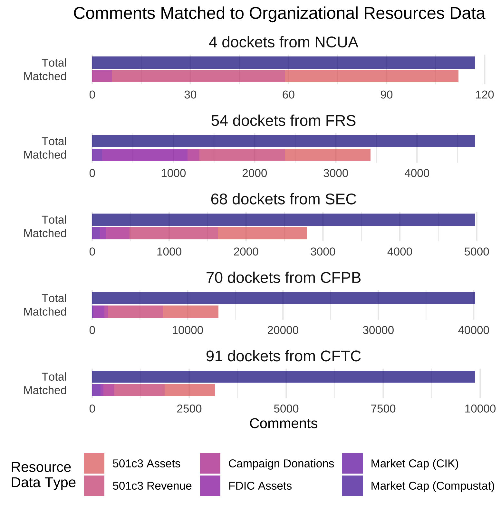
```

<!-- TODO: PAGE DESCRIBING MATCHING METHOD--> 


\clearpage 

# Additional descriptives {#descriptives}

## Non-profit revenue

Figure \ref{fig:commenters-noncommenters-revenue} shows that the relationship between assets and commenting shown in Figure \ref{fig:commenters-noncommenters} also appears when we look at revenue rather than assets. Indeed the relationship between revenue and commenting is much stronger than the relationship between assets and commenting. We focus on assets in the body of the text because it is more comparable to wealth measures from for-profit organizations.  

```{r, commenters-noncommenters-revenue, fig.cap="Revenue of Non-profits that Did and Did Not Comment", out.width= "49%"}
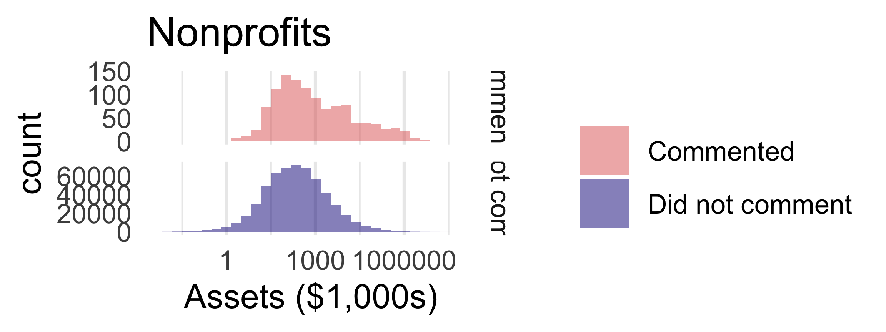
```


## Non-profit volunteers 

Figure \ref{fig:assets-vol} shows that the a non-profit's assets and the number of volunteer it has are not especially correlated for the sample of organizations that commented on a Dodd-Frank rule. This offers further evidence that the relationship between wealth and lobbying success we observe should not be interpreted as larger membership organizations being more successful. Rather, it is wealthy organizations, regardless of membership that enjoy success rulemaking. 

```{r, assets-vol, fig.cap="Volunteers of Non-profits that Did and Did Not Comment", out.width= "80%"}
knitr::include_graphics("figs/assets-vol-1.png")
```

Figure \ref{fig:efficacyXvol} shows that the a non-profit's number of volunteer does not predict its level of lobbying success. 

```{r efficacyXvol, out.width="60%",  fig.cap= "Efficacy by Number of Volunteers"}
knitr::include_graphics("figs/efficacyXvol-2.png")
```


## Variation within classes of banks 

When we look within categories of banks, we see that the wealthier banks within each class are also more likely to submit comments on financial rules than similar banks with less wealth. Figure \@ref(fig:FDIC-density-by-class) shows that, within each class of bank (i.e., commercial banks, commercial banks, state banks, and savings associations), wealthier banks participate in financial rulemaking more than less wealthy banks.
<!--
^[There are over seventeen different categories of banks (see <https://www.ffiec.gov/npw/Help/InstitutionTypes>). This paper focuses on commercial banks, commercial banks, state banks, savings associations, and Credit Unions because they are among the most prominent types of banks. commercial banks are publicly-traded corporations that make loans to businesses and individuals. Credit Unions are non-profit banks. savings associations are non-profits primarily involved in mortgages.]
-->
While the differences within types of banks are fairly large, these differences in means only reach statistical significance at the 0.05 level for for-profit categories of banks. <!--Differences in means among for-profit commercial banks are significant at the .1 level in a Welch Two Sample t-test. -->

Figure \ref{fig:FDIC-density-by-class} shows wealth distributions for four prominent types of banks: commercial banks, commercial banks, state banks, and non-profit savings associations. 
The top-left panel of Figure \ref{fig:FDIC-density-by-class} shows that commercial banks that comment are wealthier than those that did not comment. The modal commercial bank that commented has 40 percent more assets than the modal commercial bank that did not comment. 
The top-right panel of Figure \ref{fig:FDIC-density-by-class} shows that commercial banks banks that comment are wealthier than those that did not comment. The modal commercial bank that commented has nearly twice the assets of the modal commercial bank that did not comment. 
Similarly, the bottom-left panel of Figure \ref{fig:FDIC-density-by-class} shows that the average assets of state banks that commented were three times the average assets of the state banks that did not comment. While savings associations are less likely to comment than more profit-oriented banks, such as commercial banks (see Figure \ref{fig:mp-FDIC}), the bottom-right panel of Figure \ref{fig:FDIC-density-by-class} shows that when savings associations do comment, they tend to be the wealthier ones. 

```{r, FDIC-density-by-class, fig.cap="Financial Resources of Banks that Did and Did Not Comment", out.width= "49%"}
# 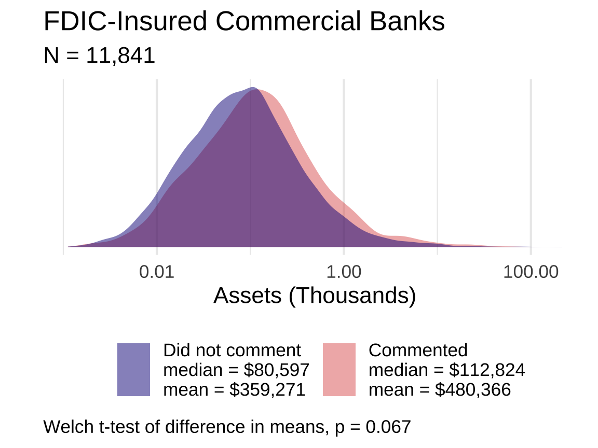
# knitr::include_graphics("figs/FDIC-density-by-class-2.png")
# 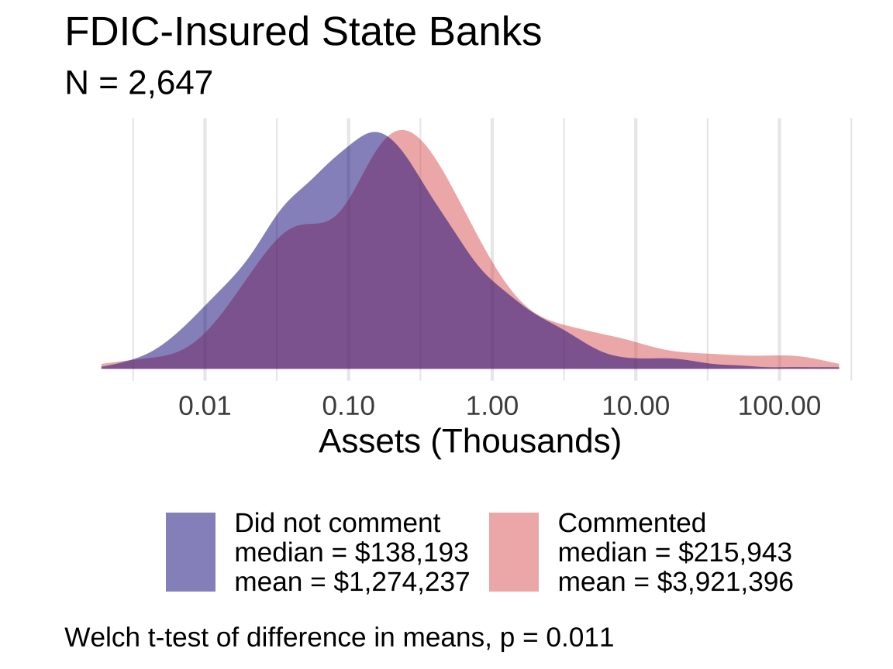
# knitr::include_graphics("figs/FDIC-density-by-class-4.png")
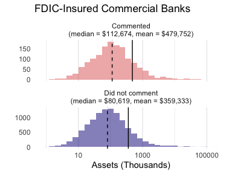
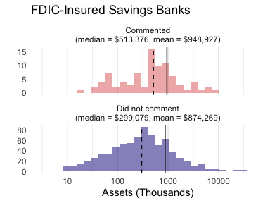
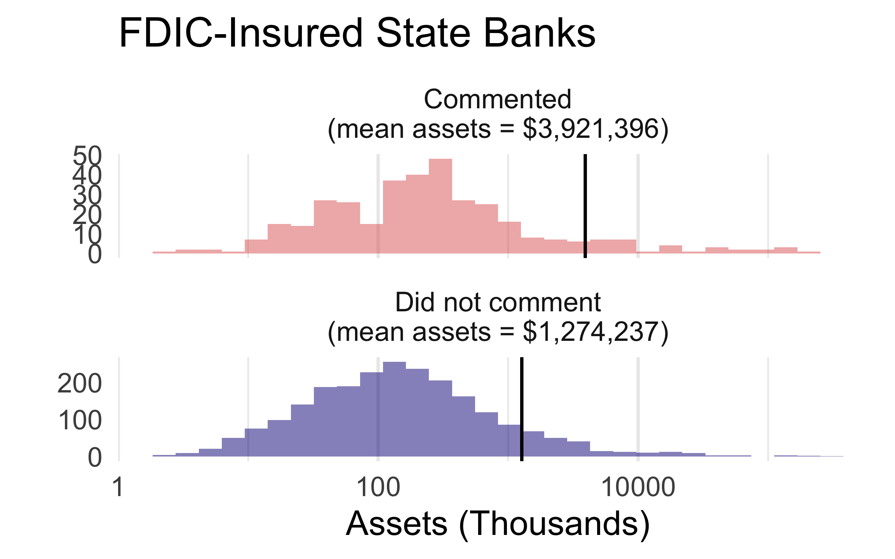
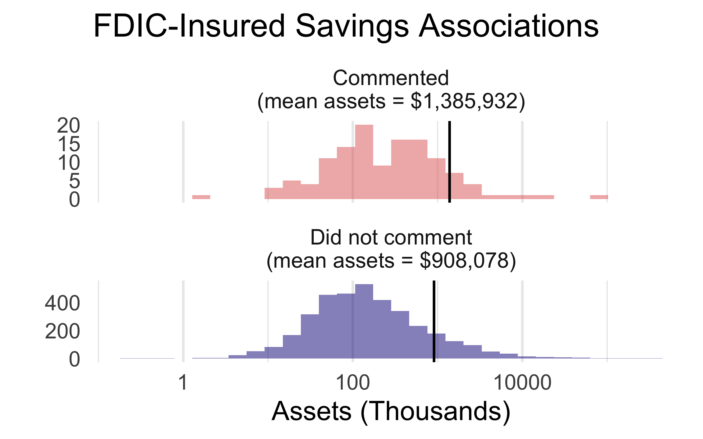
```


Figures \ref{fig:commenters-noncommenters-counts}, \ref{fig:FDIC-density-by-class}, and \ref{fig:opensecrets-count} present histograms of wealth distributions by whether an organization commented on a Dodd-Frank rule.

```{r, commenters-noncommenters-counts, fig.cap="Financial Resources of Organizations that Did and Did Not Comment", out.width= "49%"}
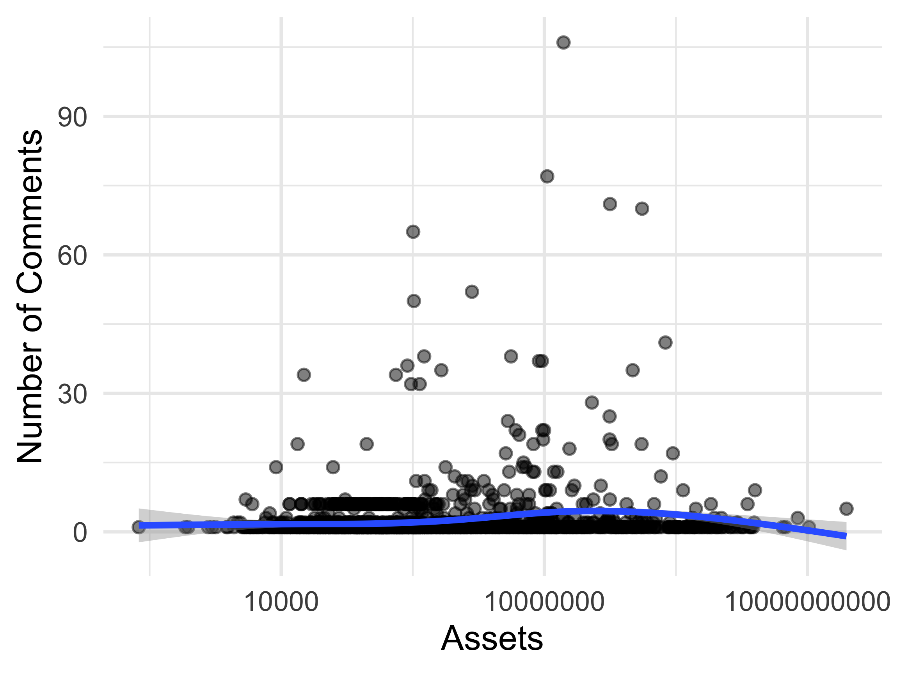
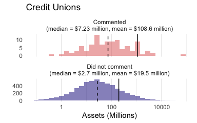
knitr::include_graphics("figs/compustat-count-1.png")
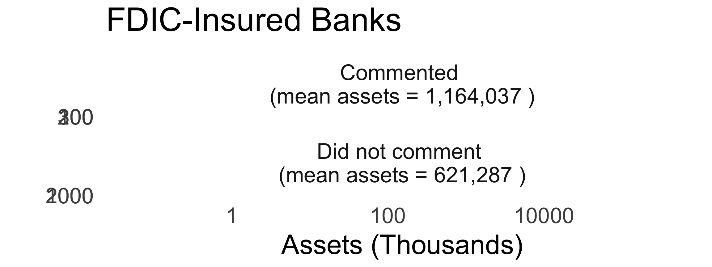
```

```{r opensecrets-count, fig.cap= "Campaign Spending of Organizations that Did and Did Not Comment", out.width="49%"}
knitr::include_graphics("figs/opensecrets-count-1.png")
```

<!--
```{r, FDIC-count-by-class, fig.cap="Financial Resources of Banks that Did and Did Not Comment", out.width= "49%"}


```
--> 

## Frequent commenters by number of  Dodd-Frank rules 

Note that commenting on *more rules*  is not the same as submitting *more comments* overall. Many wealthy organizations only submit one sophisticated comment per rulemaking docket. Some organizations also submit many comments on the same rule as a form of public pressure. Pressure campaigns are mostly organized by public interest groups but are also occasionally organized by regulated companies [@judgelord2019SPSA]. For example, Axcess Financial (a payday lending company) and Advance Financial (a credit union) both mobilized over 1000 comments from their retail stores on the Consumer Financial Protection Bureau's Payday Loan Rule. Mobilizing public pressure is different from lobbying. Our analysis here focuses on the breadth, not the amplitude of lobbying.

```{r, number-of-dockets, fig.cap= "Number of Dockets on Which Each Type of Organization Commented", out.width="49%", fig.show= "hold"}
knitr::include_graphics(c(
    "figs/nonprofit-rules-1.png",
  "figs/creditunion-rules-1.png",
  "figs/compustat-rules-1.png",
    "figs/fdic-rules-1.png",
  "figs/opensecrets-rules-1.png"
))
```

```{r, dockets-percentile-five, fig.cap="Frequent and Infrequent Commenters (By the Number of Dockets on Which Each Organization Commented) by Resources (Log Scale)", out.width="49%", fig.show= "hold"}
knitr::include_graphics(c(
    "figs/nonprofit-rules-2.png",
      "figs/creditunion-rules-2.png",
  "figs/compustat-rules-2.png",
    "figs/fdic-rules-2.png",
  "figs/opensecrets-rules-2.png"
))
```

<!--
```{r rules-by-assets}
# Models of the number of rules commented on by assets
load(here::here("models", "rules-by-assets.Rdata"))

modelsummary(models, caption = "OLS Predicting the Number of Dodd-Frank Rules On Which an Organization Commented")  %>%  kableExtra::kable_styling(latex_options = c("scale_down"))     
```

OLS regression models (Table \@ref(tab:rules-by-assets)) show statistically significant relationships between wealth and frequency of commenting on Dodd-Frank rules for non-profits (Model 1) credit unions (Model 2), publicly-traded companies (Model 3), banks (Model 4), and campaign donors (Model 5), providing additional evidence in support of Hypothesis 3. For instance, these results suggest that for. For every additional billion dollars in assets under management, a bank commented on about 30 additional Dodd-Frank rules on average. 
A credit union is predicted to comment on one additional rule for every additional $4 billion in assets. 
-->


\clearpage 

<!--
Figures \@ref(fig:repeated-text-assets2) and  \@ref(fig:assets-terms2) are the same as figures Figures \@ref(fig:repeated-text-assets) and  \@ref(fig:assets-terms) except with the x-axis unlogged. 

```{r repeated-text-assets2, fig.cap="Amount of Text Repeated in Final Rules by Commenter Resources", out.width="47%"}
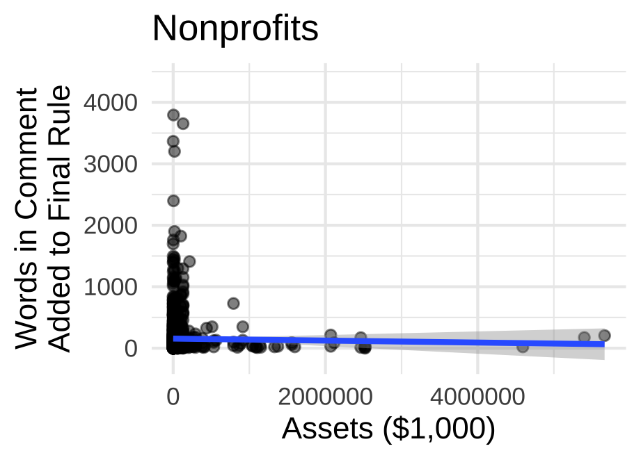
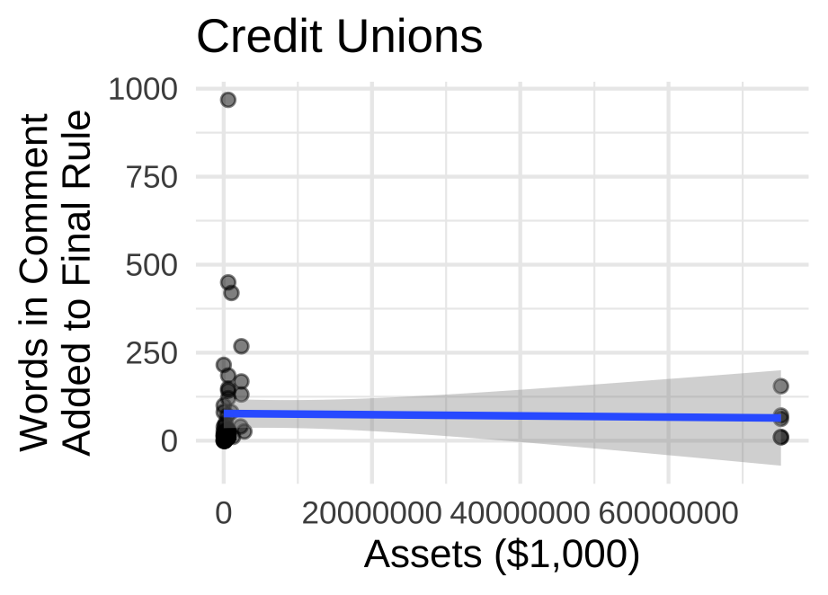
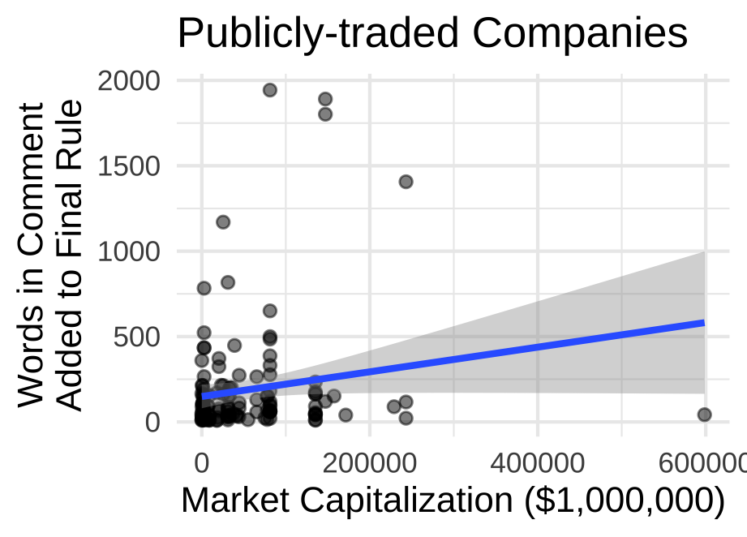
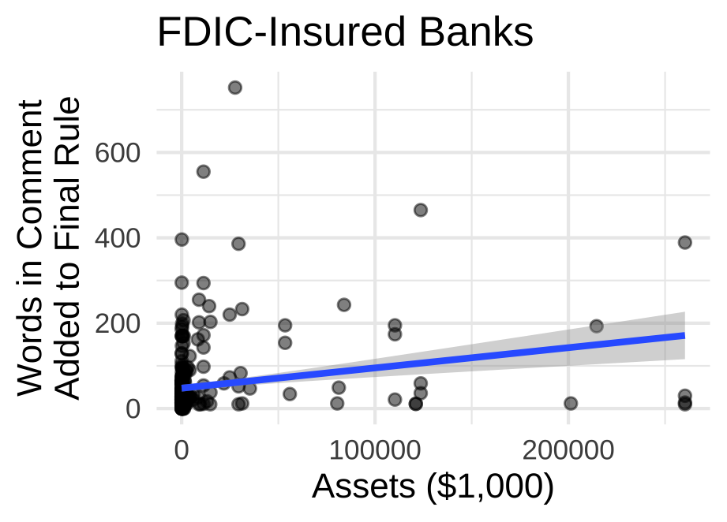
#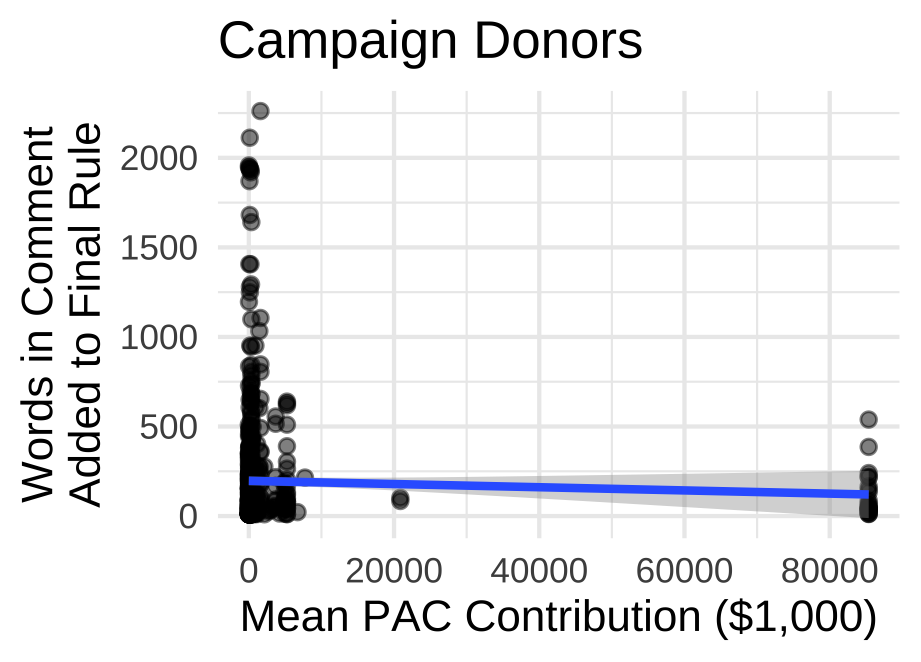
```


```{r assets-terms2, out.width="49%",  fig.cap="Amount of Technical Language by Assets (Among Comments from Banks on Dodd-Frank Rules)"}
## non-profits 
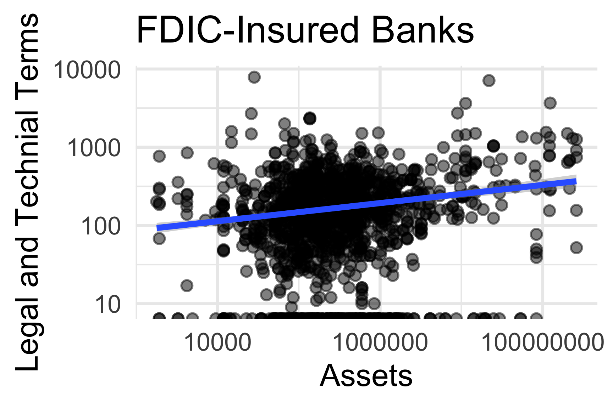

## Credit unions 
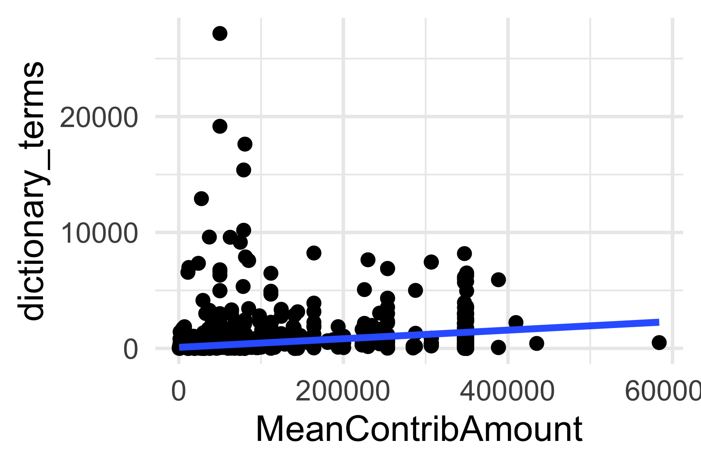

## Market Cap
knitr::include_graphics("figs/assets-tech-5.png")

## FDIC 
knitr::include_graphics("figs/assets-tech-7.png")

## Campaign donors 
knitr::include_graphics("figs/assets-tech-9.png")
```


\clearpage

-->

# Regression tables {#tables}

## The Odds of Commenting by Wealth 

Figure \ref{fig:mp-assets} (Table \ref{tab:mp-assets-table}) shows the results of logit models predicting the log odds of commenting on a Dodd-Frank rule by assets for banks, credit unions, and non-profits. These models show that wealthier organizations of all three types are significantly more likely to comment. Of these three types of organizations, the marginal effect of assets on the log odds of commenting is the largest for banks. 

```{r mp-assets, fig.cap= "Log Odds of Participating in Dodd-Frank Rulemaking by Assets", out.width="90%"}
knitr::include_graphics("figs/mp-nonprofit-credit-unions-1.png")
```

Table \ref{tab:mp-assets-table} presents the full regression table for models shown in Figure \ref{fig:mp-assets}.

```{r mp-assets-table, fig.pos = "!H", out.extra = ""}
load(here::here("models", "pr-of-comment.Rdata"))

modelsummary(models, caption = "Log Odds of Commenting on Any Dodd-Frank Rule")  %>% kableExtra::kable_styling()
```

Figure \@ref(fig:mp-FDIC) and Table \@ref(tab:mp-FDIC-table) show that commercial banks were disproportionately represented in Dodd-Frank rulemaking and non-commercial banks (e.g. savings associations) were less represented, even controlling for asset differences. This provides further support for the *Profit-motivated Participation* Hypothesis (H2). 

Likewise, assets remain a significant predictor of whether an organization comments even controlling for differences in the type of bank institution. This provides additional evidence for the *Differential Participation* Hypothesis (H1). 

```{r, mp-FDIC, fig.cap= "Predicted Probability of Participating in Dodd-Frank Rulemaking by Type of Bank", out.width="70%"}
#TODO CREDIT UNIONS SHOULD BE IN THIS MODEL 
knitr::include_graphics("figs/mp-FDIC-predict-1.png")
```


```{r mp-FDIC-table}
load(here::here("models", "mpFDIC.Rdata"))

modelsummary(models, caption = "Log Odds of Commenting on Any Dodd-Frank Rule by Bank Type", notes = "Reference category = savings associations") %>% kableExtra::kable_styling()
```


\clearpage

# Measuring comment sophistication with legal citations {#legal}

Our analyses investigating the *Differential Sophistication* (H5) and *Dividends of Sophistication* (H6) hypotheses rely on a measure of comment sophistication based on the number of technical terms used in a given comment. However, using technical terms is only one way to gauge sophistication. An alternate measure would be the number of legal citations in the comment. Wealthier organizations may be more influential by using sophistical legal arguments in commenting.

This section replicates the descriptive and regression analyses conducted in sections 4.2.3 and 4.2.4, using the number of legal citations as the measure of comment sophistication. 
We count the number of citations to the U.S. Code, Supreme Court cases, appellate and district court cases, the code of federal regulations, and the federal register. Like in the analyses relying on technical terms, we sum up citations across all the submitted documents of a commenter. Figure \ref{fig:efficacyXsophistication-legal} shows a strong relationship between legal citations and comment lobbying success, again highlighting the comment from the Chamber of Commerce discussed in Section 3. 

```{r, efficacyXsophistication-legal, fig.cap="Lobbying Success by Comment Sophistication", out.width= "70%"}
knitr::include_graphics("figs/efficacyXsophistication-6.png")
```

Our findings on wealth technical sophistication (H5) hold even with an alternative legal measure of sophistication. Figure \ref{fig:assets-terms-legal} shows that the number of words from the comment added to the final rule is correlated with the number of legal citations. Like the analyses using technical terms, the figure also shows a positive correlation between the number of legal citations in a comment and the amount of text it shares with the final rule. 

```{r assets-terms-legal, out.width="49%",  fig.cap="Amount of Legal Language by Assets (Among Comments from Banks on Dodd-Frank Rules)"}
## TODO: non-profits #SPLIT OUT CREDIT UNIONS FROM NONPROFITS FIGURE 

## FDIC 
knitr::include_graphics("figs/assets-blue-2.png")

## Market Cap
knitr::include_graphics("figs/assets-blue-8.png")

## Campaign donors 
knitr::include_graphics("figs/assets-blue-6.png")
```

Figure \ref{fig:assets-terms-legal} also corroborates with regression findings on technical sophistication. Here, comments from wealthier organizations tend to include more legal language, a pattern permeated across banks, publicly traded companies, and campaign donors. Similar to the relationship between technical terms and commenter wealth, most of the comments from publicly traded companies with ten or more legal citations were submitted by companies with over \$50 billion in market capitalization.

```{r marketcap-terms-legal, out.width="90%",  fig.cap="Amount of Legal Language by Market Capitalization (Among Comments  on Dodd-Frank Rules)"}
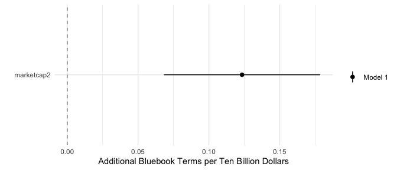

```


Analyses on sophistication and influence (H6) also hold up when using a measure of legal sophistication. \ref{fig:efficacyXsophistication-legal} shows that comments using more legal language are more likely to contain text added in the final rule. 
<!-- (Angelo 7/14/2022: Will have the change exact prediction amount when Poisson conducted) -->

```{r efficacy-sophistication-second, out.width="80%",  fig.cap="OLS Models of Lobbying Success by Legal Language"}
knitr::include_graphics("figs/mes-2.png")
```

<!---

## The relationship between assets and sophistication
```{r marketcap-terms, out.width="90%",  fig.cap="Amount of Legal and Technical Language by Market Capitalization (Among Comments on Dodd-Frank Rules)"}
knitr::include_graphics("figs/mt-2.png")
```
--->

# Mediation

<!--the ability of the wealthy to mobilize lawyers and experts to make sophisticated and thus influential arguments on their behalf-->


 Figure \ref{fig:mediation} demonstrates that the Average Conditional Marginal Effect for technical sophistication is nearly identical to the Total Effect of market capitalization on lobbying success. This means that technical sophistication explains nearly all of the greater success of wealthier companies.  Legal sophistication also explains a large share of the total relationship when we use legal citations as an alternative mediator. This means that legal citations explain much of the greater success of wealthier companies. 

```{r mediation, out.width="49%",  fig.cap= "Political Spending, Lobbying, Technical Sophistication, and Legal Sophistication as a Proposed Mediators Between Wealth and Lobbying Success"}
knitr::include_graphics("figs/mediation-marketcap-lobbying-1.png")
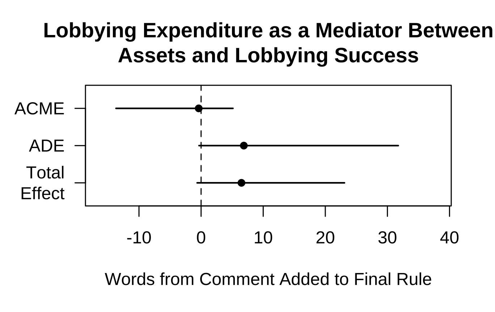
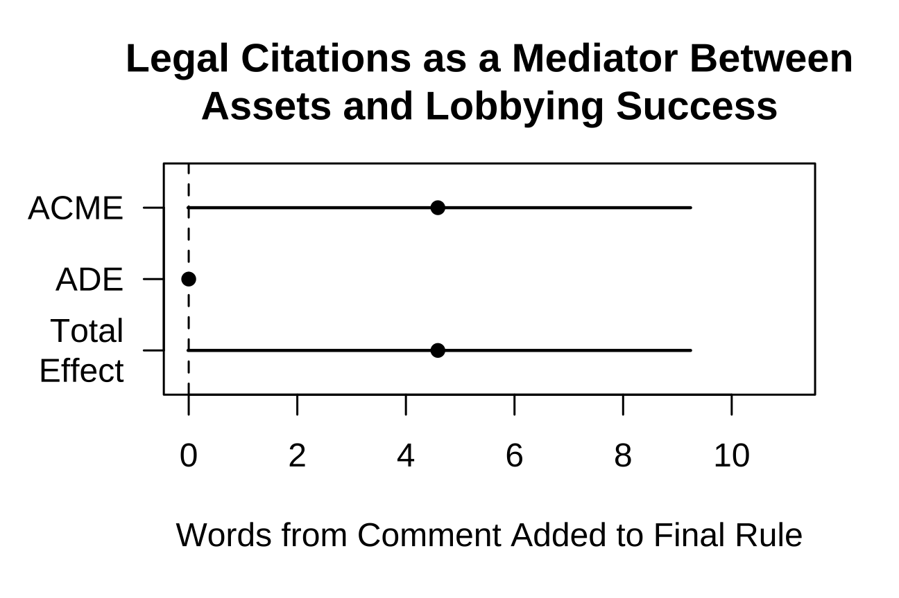
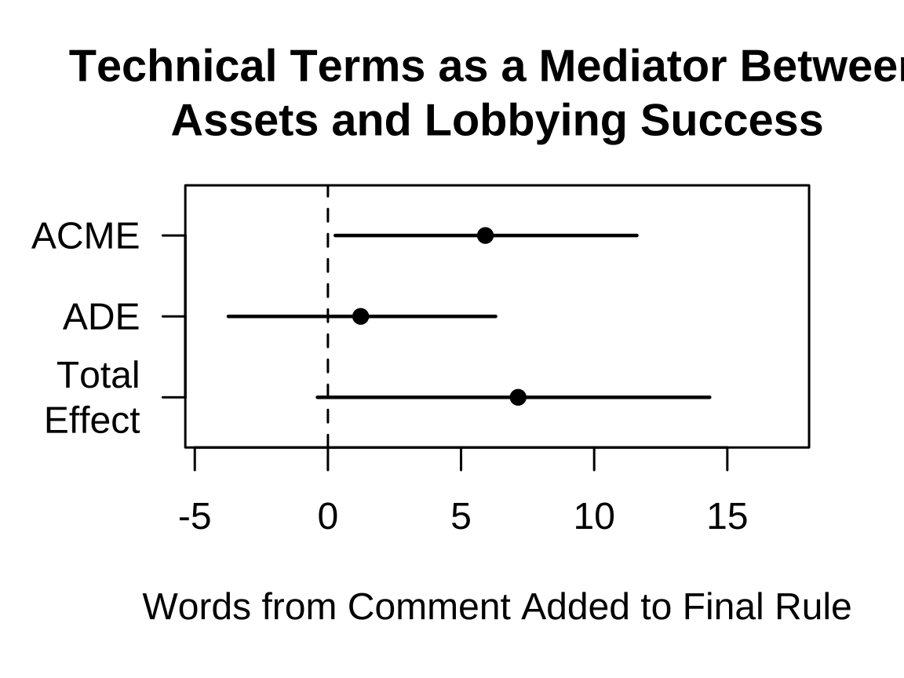
```

```{r mediation-table}
# load(here::here("models", "models.m.Rdata")) # FIXME
load(here::here("models", "models.m4No0.Rdata")) # FIXME this is multi-mediation models data 

modelsummary(models.m4No0, caption = "Models for Mediation Analysis", notes = "")  %>% kableExtra::kable_styling(latex_options = "scale_down")
    #FIXME sometimes scale_down causes an error 
```


<!--
### Multiple mediation 
```{r mediation-4, out.width="49%",  fig.cap= "Political Spending, Lobbying, Technical Sophistication, and Legal Sophistication as a Proposed Mediators Between Wealth and Lobbying Success"}
knitr::include_graphics("figs/mediation-4way-1.png")
knitr::include_graphics("figs/mediation-4way-2.png")
knitr::include_graphics("figs/mediation-4way-3.png")
knitr::include_graphics("figs/mediation-4way-4.png")
```

```{r mediation-4-table}
load(here::here("models", "models.m4No0.Rdata"))

modelsummary(models.m4No0, caption = "Models for Mediation Analysis", notes = "")  %>% kableExtra::kable_styling()
    #FIXME sometimes scale_down causes an error 
```
-->

# Measuring change between draft and final rules

In dealing with endogeneity, one methodological choice merits elaboration: we excluded text from the proposed rule when measuring lobbying success but not when measuring sophistication. This choice rests on the underlying concepts we are attempting to measure. In measuring text reuse, we aim to capture ideas that were not yet in the policy when the comment was submitted. Thus, text copied from the agency's proposal must be excluded. Indeed, text that appears in both the draft and final rule is what did *not* change. If a commenter attached a marked-up version of the proposed rule, we aim to exclude all but their suggested changes. 

In contrast, in measuring sophistication, we aim to assess how much the commenter utilizes expertise to engage in technical policy debates. Here, attaching a marked-up version of the proposed rule captures the underlying concept of sophistication. Thus, our counts of technical banking terms do not exclude the text of the draft rule. Even if they are the agency's terms, engaging with its texts indicates sophistication. For example, the comment with the most legal terms from a bank contained a 4-page comment and 112 pages of attachments, 105 of which were the full proposed rule. These 105 pages were excluded from our measure of text reuse but included in the legal and banking terms count.  


# Validation of text re-use as a measure of lobbying success

Our algorithm works in the following steps:
Match each comment to the proposed rule that came after the proposed rule and before the final rule.  For a simple sequence (1) proposed rule, (2) comment, (3) final rule, this step is perfunctory.  Not all rulemaking sequences, however, follow this template.  Some have multiple proposed rules.  Suppose a rule has 2 proposed rules and a final rule and a comment came after the second proposed rule (i.e. (1) proposed rule, (2) proposed rule two, (3) comment, and (4) final rule).  We would match the comment to the second proposed rule, since this comment is likely responding to that version of the proposed rule rather than the first one.

For the proposed-final pair, tokenize the proposed and final rule into sentences and then remove the text of the proposed rule from the final rule.  
Re-tokenize both the proposed and final rules into 10-grams.   Find the overlap between proposed and final rules, keeping track of the position index of the 10-grams.  10-grams that are consecutive in the proposed rule should be treated as consecutive n-grams for the purpose of counting consecutive words.  In this manner, two consecutive 10-grams would have a sequence length of 11 and not 20. 

This algorithm has a few notable strengths.  First, it focuses on text that is both legally binding and the explanation for why it is legally binding.  Second, the results are easy to interpret: efficacy is simply the number of words in a comment and its corresponding final rule.  (Third, comments that score highly… .)  There are, however, several drawbacks.  Notably, not all sequences in both comments and final rules are equally influential.  Second, when there are multiple proposed or final rules, the results of the algorithm are   

Below, we shed light on why several comments have efficacy values that are particularly high.  

1) https://www.sec.gov/comments/s7-33-10/s73310-110.pdf, Efficacy score = 10131

This letter is unusual in that its members (Americans for Limited Government, Ryder Systems, Inc., Financial Services Institute, Inc., U.S. Chamber of Commerce, Verizon, and White & Case, LLP) are all part of multiple coalitions and submitted multiple comments.  The Chamber of Commerce, for example, submitted five comments and attended seven meetings and was a part of two separate coalitions.  

2) https://www.sec.gov/comments/s7-33-10/s73310-35.pdf, Efficacy score =             10131

This is the same letter as above, submitted twice to the SEC.  Reassuringly it has the same efficacy!

3) https://comments.cftc.gov/Handlers/PdfHandler.ashx?id=24275, Efficacy score =      7593

4) https://comments.cftc.gov/Handlers/PdfHandler.ashx?id=24205, Efficacy score =      7411

5) https://www.sec.gov/comments/s7-41-11/s74111-230.pdf, Efficacy score =             7312

The following three comments (https://comments.cftc.gov/Handlers/PdfHandler.ashx?id=24275, https://comments.cftc.gov/Handlers/PdfHandler.ashx?id=24205, https://www.sec.gov/comments/s7-41-11/s74111-230.pdf) are all related.  The CFTC, OCC, FRB, FDIC, and SEC all worked together to develop rules to prohibit banking companies from engaging in proprietary trading (trading securities with their own money instead of clients’).  While all five agencies worked together to write a final rule, in the end the CFTC wrote one rule and the OCC, FRB, FDIC, and SEC wrote another.  Despite the different final rules, the agencies “the CFTC and the other agencies have worked closely together to develop the same rule text and supplementary information, except for information specific to the CFTC or the other agencies, as applicable.”

The comment https://comments.cftc.gov/Handlers/PdfHandler.ashx?id=24275 is a 340-page letter from Occupy the SEC, a group affiliated with Occupy Wall Street, submitted on the CFTC’s version of the final rule.  It was cited 285 times in the preamble to the final rule.

The comment https://comments.cftc.gov/Handlers/PdfHandler.ashx?id=24205 is a 325-page letter from Occupy the SEC and was submitted on the CFTC’s version of the final rule.  It was cited 284 times in the preamble to the final rule.

The comment https://www.sec.gov/comments/s7-41-11/s74111-230.pdf is a 325-page letter from Occupy the SEC and was submitted to the OCC, FRB, FDIC, and SEC’s version of the rule.  It was cited 284 times  in the preamble to the final rule.    

6) https://www.sec.gov/comments/s7-25-11/s72511-55.pdf, Efficacy score =                    5809

SIFMA is cited over 500 times  by the CFTC in the preamble to the final rule.

7) https://www.sec.gov/comments/s7-18-11/s71811-32.pdf, Efficacy score =                    5563

Standard & Poors’s letter to the SEC is cited over 200 times  by the SEC in the preamble to the final rule.

8) https://comments.cftc.gov/Handlers/PdfHandler.ashx?id=25016, Efficacy score =            4965

Not only did the FIA help develop the guidelines that were codified into a final rule, the FIA’s letter was cited 98 separate times by the CFTC in the preamble to the final rule.


