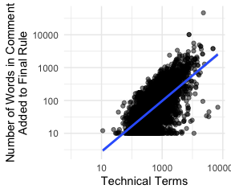
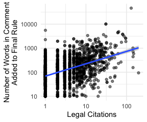

```{r, echo=F, message=F, warning=F}
source("code/setup.R")
```


# Introduction

Studies of political inequality have revealed profound and durable patterns of the disproportionate influence of wealthier citizens on lawmaking processes, which @Gilens2012 calls the influence of affluence. Critical work in American politics by @Bartels2008, @Baumgartner2009, @Hacker2010, @Gilens2012, @Skocpol2004, and @Schlozman2012, among others, documents ties between economic and political inequality. Relatedly, @Piketty2014 and others in economics and the social sciences have demonstrated rising capital-based wealth inequality over the twentieth century, especially in the United States [e.g., @Saez2020]. 

In contrast to the large literature on inequality in legislative lawmaking, research on inequality in administrative lawmaking is sparse, especially when one considers the bureaucracy’s most powerful policy tool: rulemaking. By writing rules, agencies convert congressional intent into legally binding policies with real human and economic effects  [@West1995; @Kerwin2018]. After all, "policies mean little to nothing until they are given concrete expression through the bureaucracy" (Moe and Wilson 1994, 4). 

Research suggests that firms spend hundreds of millions of dollars lobbying after a bill has been signed into law, including lobbying those agencies tasked with implementing congressional legislation [@You2017; @Libgober2020]. Legislators who receive more corporate Political Action Committee (PAC) money from companies are much more likely to lobby federal agencies on behalf of those companies [@Powell2022]. Interest groups---particularly business interests---are often the main lobbying participants to most agency rules [@GoldenJPART1998; @YackeeJOP2006]. 
<!--By writing rules, agencies convert congressional intent into legally-binding policies with real human and economic effects.-->
Given the scale and importance of bureaucratic policymaking and the large volume of data on business and interest group lobbying, rulemaking presents opportunities to study inequalities in policy influence [@Carpenter2020].

As an indicator of the stakes of these developments, consider how media reporting in 2017 illustrated the political priorities of those at the very upper end of the income and power scale in the United States. During that year, major newspapers documented high-level gatherings between CEOs and officials at the Trump White House. For our purposes, what is interesting about these meetings is that the existing inequality literature would likely have predicted America’s wealthiest business leaders and allocators of capital would direct their lobbying at congressional lawmaking. Instead, these business leaders and their lobbyists were targeting the rules implementing the Dodd-Frank Wall Street Reform and Consumer Protection Act of 2010 (hereafter Dodd-Frank) [see e.g., @Protess2017; @Radnofsky2017].


*When policymaking occurs in the administrative realm, do inequalities in the legislative process persist or morph? Are they magnified or reduced?* We present a suite of measurement and analytic tools to identify organizational commenting, measure of commenter wealth and comment sophistication, and assess relationships between wealth, sophistication, and influence.

In this study of financial rulemaking, we draw upon a database of over 300,000 comments submitted to U.S. agencies tasked with implementing the Dodd-Frank Wall Street Reform and Consumer Protection Act of 2010 (hereafter Dodd-Frank). Our data cover over eight hundred regulatory actions such as proposed and final rules^[We define a regulatory action as the publication of a proposed or final rule by one agency. We count a joint rule issued by the SEC and the Federal Reserve as two regulatory actions.] on 239 discrete rulemakings. The Dodd-Frank Act has the advantage of spurring significant rulemaking activity and mobilizing interests to shape those rules. Beyond its provision of granular data, however, financial policymaking offers another reason for studying inequality - finance is perhaps an unparalleled site of interaction between economic inequality and unequal democracy. 

As an indicator of the stakes of these developments, consider how media reporting in 2017 illustrated the political priorities of those at the very upper end of the income and power scale in the United States. During that year, major newspapers documented high-level gatherings between CEOs and officials at the Trump White House. For our purposes, what’s interesting about these meetings is that the existing inequality literature would likely have predicted America’s wealthiest business leaders and allocators of capital would direct their lobbying at Congress or the president in the hope of indirectly influencing congressional lawmaking. Instead, the business leaders and their lobbyists were, targeting the rules implementing the Dodd-Frank Act [@LaCapra2013].

The idea that inequality has affected financial policymaking is far from new. Reports of CEO meetings and financial lobbying on regulatory policy issues raise important yet unanswered questions: how can we know what various interests are asking for in regulation; how can we get a handle on whether they are getting what they ask for; and how can we measure what regulation is worth to them? And, perhaps most importantly, what do answers to these questions tell us about political inequality?

We produce four main findings. First, wealthier organizations disproportionately lobby on agency rules via the submission of comments—a result that we produce for both for-profit firms and non-profit organizations.  Second, conditioned on commenting, wealthier organizations advance more sophisticated comments than less wealthy organizations. Third, wealthier organizations are more successful in shifting the content of federal agency rules through their comments. And fourth, using causal mediation analysis, we demonstrate that the influence of wealthier organizations on regulatory content is largely driven by the sophistication of their comments.  

The study also has several limitations. For instance, our analyses of wealth focus on organizational commenters, setting aside the views of individual participants, including those submitted via form commenters. Additionally, our tools and findings are focused on the notice and comment rulemaking process, and thus, must be combined in the future with observations drawn from the legislative policymaking process to provide a full picture of how inequality may manifest across policymaking in America’s key political institutions.

As we detail below, the idea that wealth inequality has affected financial policymaking is far from new. Nevertheless, critical questions have herein remained unanswered, such as: Does wealth inequality drive differential lobbying participation?  Do wealthy organizations get what they want more often during rulemaking?  And, if so, why?  We provide the data and tools to address these questions, and our analysis of financial rulemaking yields initial answers and evidence within a significant policy domain. Such information is critical to inform scholarly research regarding the impact of wealth inequality on American policymaking, as well as further our understanding of modern American governance, lobbying influence, and the role of money in politics within our administrative democracy.


# Theorical Foundations


The past two decades have witnessed an outpouring of social science research on inequality in the United States and other nations, focusing on national-level policymaking. While several scholars concentrated on the structural and technological determinants of inequality [e.g., @Goldin2009; @Piketty2014], others examined the political realm as a place where economic inequality shapes political outcomes, which plausibly generates further economic and social inequality. 

In *Unequal Democracy*, @Bartels2008 established an important empirical case for political inequality by showing, among other findings, that legislative voting patterns in the U.S. Senate disproportionately reflect the preferences of those individuals at the highest levels of the income distribution. @Hacker2010 described a "winner-take-all politics" by which wealthier Americans improved and secured their economic prospects under both liberal and conservative political leadership. In contrast, the prospects of middle- and working-class Americans stagnated. In *Affluence and Influence*, @Gilens2012 further systematized these findings on political inequality using an innovative combination of survey data and legislative voting records. Further studies support and refine their observations [see, e.g., @Baumgartner2009; @Winters2009; @Kelly2010; @Schlozman2012; @Page2013; @Gilens2014; @Witko2021]. These studies mark critical innovations in our understanding, not only of inequality but also of U.S. political processes themselves. 

Yet our empirical portrait of the relationship between wealth and political inequality in America remains sorely incomplete. Policymaking does not stop when Congress passes a law. Many critical policy decisions are made by administrative agencies, in part because the legislature delegates significant policymaking authority and discretion to these agencies make public policy [@Epstein1999; @Huber2002; @Haeder2020]. Because some agencies have acquired sufficient legitimacy and expertise to gain deference in program initiation, interpretation and policy proposals [@Carpenter2001; @Carpenter2010]. Beyond this, it is well known that moneyed interests spend considerable resources in attempts to influence administrative and executive decision-making [@Haeder2015; @You2017]. These dynamics are often studied under the concept of regulatory capture [@Carpenter2013]. Yet, few regulatory capture projects speak to questions of political inequality, and likewise, few studies of political inequality address issues of capture.

This is a major omission, particularly within the financial regulation space. Because financial policymaking affects the aggregation, accumulation, and disposition of wealth and income so directly, its plausible role in increasing inequality is large. Numerous experts in financial policymaking have discussed the idea that political inequality affects financial policymaking. For example, as the 2008 financial crisis unfolded, @Johnson2010 and @Kwak2013 pinpointed industry influence in financial regulation, including during the Obama Administration, as one of the main culprits of the crisis and what they saw as the American government's problematic response to it. In their view, the necessity of regulators spending time with banks, combined with the status, sophistication, and resource differentials between bankers and their regulators, resulted in a convergence of the regulator's frames, assumptions, vocabularies, and methods towards those of the regulated industry. Others examine financial firms' lobbying behavior. For instance, @Igan2011 find correlations between lobbying behavior and pre- and post- financial crisis loan activity.

Critical research also highlights the revolving-door dynamics often present within financial regulation. This occurs when federal financial agencies hire those from the regulated sector, and/or those who work at these agencies leave to work in banks and non-bank financial firms [@Lucca2014; @DeHaan2015; @Cornaggia2016]. Many scholars have examined the development of coalitions between financial and non-financial interests [see, e.g., @Young2012; @Pagliari2017; @Heilman2017; @James2021]; for example, using network analysis techniques, @Young2017 focused on past and current employment ties between select business firms and the SEC and found that greater direct and indirect ties increase the likelihood of the firm engagement with SEC policy decision-making. 

What the literature currently lacks, however, are measures of wealth inequality in organizational participation and influence during one of the most important venues for political lobbying: agency rulemaking. Rulemaking is a critical, but understudied, part of the American political process. While Congress routinely passes statutes, their implementation almost always requires federal agencies, staffed primarily by civil servants, to devise legally binding standards and procedures (i.e., rules) that make the legislation practically effective [@West1995; @Kerwin2018). This kind of agency policymaking is pervasive; in 2018, for example, federal agencies finalized over 3,300 rules.

The Administrative Procedure Act of 1946 (APA) governs the rulemaking process. The APA requires federal agencies to solicit public comments on their draft policy proposals (called Notice of Proposed Rulemakings, NPRMs, or proposed rules) and to consider any comments before issuing the agency's legally binding rule (called Final Rules). Agency officials may or may not make changes to the proposed rule text based on the public comments—leaving open the possibility that the commenting process creates an avenue for unequal influence. Given the potential impact of agency-issued regulations, those individuals, firms, and other organizations most affected often attempt to influence regulatory policy content through the submission of public comments. Federal agency restrictions on ex parte (or “off the public record”) lobbying after the issuance of a proposed regulation allow researchers to use comments during notice and comment rulemaking to identify interest group mobilization [@Yackee2012].

Unequal levels of power and access to the government may be especially acute in financial regulation, where Congress tends to rely upon government agencies to develop key regulatory concepts and instruments and, in doing so, to carry out legislative intent. Administrative agencies made many of the most important deregulatory decisions of the past three decades. These include reductions in regulatory capital requirements and the deregulation of mortgage and other consumer loans [@Engel2011]. While ostensibly re-regulating the financial sector, Dodd-Frank handed considerable authority to federal financial agencies [@Carpenter2012; @Carpenter2013]. For instance, the law contains over 300 provisions authorizing new agency rulemaking, and each provision could result in multiple rules [@Copeland2010]. Each rule yields a fresh opportunity for the financial industry and others to lobby the government agency for policy change.

The traditional literature on bureaucratic politics has often shied away from questions of inequality of influence during rulemaking and financial policymaking. An older literature by @McCubbins1987 through @Balla1998 examined rulemaking as an important venue of policymaking, often debating whether legislative institutions (i.e., Congress) could use the APA to control administrative agencies. Other high-profile research focused on the legislature's delegation decision while largely leaving unanswered how administrative agencies respond to new grants of policymaking authority in practice [@Epstein1999; @Volden2002; @Huber2002]. Still other major work focused on the politics of agency decision-making in enforcement or permitting decisions but not in rulemaking  [e.g., @Wood1994]. 

These patterns shifted when scholars began focusing more on the role of public comments during rulemaking and attempted to correlate the requests made in comments with regulatory policy change  [@GoldenJPART1998; @WestPAR2004; @YackeeJOP2006; @YackeeJPART2006; @McKay2007]. This focus led to advancements in our understanding of political inequality during the agency rulemaking process, but without a specific concentration on wealth or on financial regulation.

<!-- CUT FOR NOW 

For example, @YackeeJOP2006 asked whether business interests could, by commenting on proposed regulations, induce greater changes in proposed rules than non-business interests. They observed that business comments better predicted subsequent changes to federal rules in their sample of transportation and labor regulations. @Haeder2015 similarly focused on political inequality in rulemaking but within the U.S. Office of Management and Budget's (OMB) review of important agency rules. They found more regulatory policy movement occurring during OMB review when business interests dominated other types of lobbying entities. Recent work has suggested a mechanism by which traditionally disadvantaged interests may combat business bias during rulemaking: band together to lobby in diverse coalitions [@Dwidar2021PSJ; @Dwidar2021APSR]. However, these studies point to continued inequalities, including that only certain types of coalitions appear to hold policy influence over agency rules, including those with greater financial capacity. 

END CUT-->

When we focus on the handful of existing financial rulemaking studies, we uncover a mixed portrait of the policy impact, if any, of wealth inequality. As a result, these studies—which tend to focus on single agency or a single rule—raise important questions for future scholarship. 


@Krawiec2013 studied public participation patterns early in the rulemaking process in section 619 of Dodd-Frank (commonly known as the Volcker Rule). She found that comments from financial institutions and industry were more detailed, complex, and lengthy during Volcker’s pre-NPRM stage than from non-financial firms. @BanBP2019 focused on lobbying and agency rulemaking on a sample of SEC rules after Dodd-Frank. They concluded that the resources that an organization devotes to lobbying appeared to influence the likelihood that the SEC would list an organization’s name in its final rule. @Rashin2020 examined thousands of public comments to SEC rules and found that organizational resources do not appear to be correlated with a commenter’s efficacy in securing policy changes. In doing so, Rashin’s account appears to align with Nixon, Howard, and DeWitt’s (2002) older analysis of SEC rule changes, which did not suggest a severe bias toward what they called “privileged” interests. Finally, @Gordon2020 find that a diverse coalition of actors can come together to counter the role of larger and more established regulated entities in the area of credit risk retention regulation [see also @Ziegler2016]. However, @Young2017 found that participants outside the affected firms are less likely to mobilize in the financial sector, especially when a rule is technically complex.
Thus, the existing literature yields a mix of conclusions on the impact of wealth inequality during rulemaking and thereby leaves open critical hypotheses regarding the plausible effects of wealth inequality during agency rulemaking in the financial regulation space.


<!-- @Nixon2002 older analysis of SEC rule changes, which did not suggest a severe bias toward what they called "privileged" interests. That said, other research points to the difficulty of diverse and non-industry coalitions coming together. @Pagliari2017, for example, find that such coalitions may not form with great frequency in the financial sector and that that the voices outside the affected firms were less likely to mobilize, especially when the regulation is technically complex.
-->

Thus, the existing literature yields a mix of conclusions on the impact of wealth inequality during rulemaking and thereby leaves open critical hypotheses regarding the plausible effects of wealth inequality during agency rulemaking in the financial regulation space.

## Wealth Inequality Hypotheses

We investigate the role that wealth inequality may play during the development of financial regulations.  We group our arguments under two categories, which represent the two kinds of potential bias in U.S. rulemaking: (A) bias in participation, and (B) bias in influential. Below we build these arguments and then list five testable hypotheses.

Differential Lobbying Participation. Previous work suggests that wealthier organizations, such as business firms, will participate in agency rulemaking via the submission of comments at a greater rate than other of less wealthy organized interests, such as labor and public interest organizations 

### Differential Lobbying Participation

Previous work suggests that wealthier organizations, such as business firms, will participate in agency rulemaking via the submission of comments at a greater rate than other of less wealthy organized interests, such as labor and public interest organizations [@Yackee2006]. Past research theorizes that the high costs associated with public comment submission is one reason for this bias. @Rossi1997 writes of the need to monitor the bureaucracy’s rulemaking activities, which can be complex and arcane, to know when and how to participate in regulation is being formulated [see also, @Kerwin2018]. @Yackee2019 implies that these high participation costs may be paid more readily by business interests, which often have hired lobbyists and government affairs offices to monitor agency rulemaking on their behalf [see also, @JewellJPART2006]. A separate rational driving differential comment participation by wealthy organizations focuses on the concentrated costs and benefits attached to lobbying on government regulations [see broadly, @Olson1965; @Wilson1989]. Wealthier organizations, such as big publicly traded companies and large banks (banks with assets over $10 billion), will tend to have a more focused stake in financial regulations than organizations with more diffuse and varied constituencies, such as public interest groups.[^We use the \$10 billion figure as it is what the FDIC used in 12 CFR 327.8(f) as a result of Dodd-Frank amending the the Federal Deposit Insurance Act.] 

While past research implies reasons why a wealth disparity in rulemaking lobbying participation may exist across different organizational types (i.e., business firms versus public interest groups), in this article we focus on wealth differentials in lobbying participation within organizational type.  For example, we theorize that, even amongst for-profit firms, wealthier firms will participate in rulemaking via the submission of comments to financial rules more often than poorer firms. The theoretical rationales for this expection, we argue, remain the same as articulated above—wealthy organizations are better able to pay the costs of rulemaking participation and often have more concentrated stakes in the rule—however, by comparing similar organizations, we will be better able to isolate whether wealth inequality drives lobbying participation differences in financial rulemaking.

> *H1* Organizations that comment on financial rules will be wealthier than organizations that do not comment on financial rules.

Moreover, we theorize that wealth inequalities in lobbying participation will persist even among those organizations that are able to pay the initial costs of rulemaking participation.  Stated differently, when focused on those entities that have submitted at least one comment to a financial regulation, we argue that more wealthy organizations will, again, hold an advantage over less wealthy organizations by participating across a larger number of rules. For instance, among the non-profit organizations that submit comments to financial regulations, we hypothesize that the wealthier non-profits, such as those with more assets, will comment on more regulations than those that are less wealthy. 


<!--
> *H1.1* Nonprofits with more assets will comment more frequently than nonprofits with fewer assets.

>  *H1.2* Among nonprofits participating in financial rulemaking, nonprofits with more assets will comment on more proposed rules.

>  *H1.3* Firms with more assets will comment more frequently than firms with fewer assets.

> *H1.4* Among firms participating in financial rulemaking, firms with more assets will comment on more proposed rules.
--> 

> *H2:* Among organizations commenting on financial rulemaking, organizations with greater wealth will comment on a larger number of financial rules.


### Differential Lobbying Success

Existing research hints at a differential lobbying benefit attached to wealth during rulemaking. For instance, @Haeder2015 find more policy movement on federal regulations during rulemaking when business interests are more active than other types of organizations, such as public interest groups.  Yet, such research does not provide a clean test of wealth inequality. After all, some businesses are large while some are small; some non-profits hold major financial assets while others are poor. We thus seek to understand whether it is wealth that is a common factor driving organizational influence during rulemaking. As a result, we theorize that, among similar organizations, wealthier ones will see greater lobbying success during financial rulemaking.  For example, we expect the comments of more wealthy large banks will be more impactful on the content of final financial rules than the comments of less wealthy large banks.

> *H3:* Comments from wealthier organizations will be more successful in shifting the content of agency rules.

Research suggest that wealthier organizations are more influential because they are better able to deploy sophisticated legal arguments and technical information than less well-off entities [@WagnerALR2011]. Put different, large organizations are disproportionately able to marshal the legal and technical expertise necessary to write sophisticated comments for rules, and we theorize that more sophisticated comments will be associated with greater lobbying success during rulemaking. Our argument builds on @Jewel2007 findings that agency officials pay greater attention to abstract and technical arguments, such as those often in comments in comments from business organizations, while tending to minimize moral and personal arguments that are common to less sophisticated comments from individuals. Similarly, @Krawiec2013, in her study of the pre-proposal stage of the Volcker rule, concludes that non-industry comments often lacked the specificity and the detail that agencies needed to change policy, and @Yackee2015 theorizes that impactful comments often provide technical information. Consequently, we hypothesize that wealthier entities will utilize their resources to produce comments that hold greater sophistication than less prosperous groups, and these comments will be more impactful.

> *H4:* Wealthier organizations will use more technical and sophisticated language when commenting on proposed rules.

> *H5:* Comments from wealthier organizations will be more successful in affecting the content of agency rules because of comment sophistication.  


Together, these hypothesis test for two major kinds of potential bias in policymaking: that the wealthy are better able to participate, and even when less wealthy groups participate, the wealthy are likely have their demands met. Additionally, they test a major theorized mechanism of lobbying influence: the ability of the wealthy to mobilize lawyers and experts to make sophisticated and thus influential arguments on their behalf.

# Data and Empirical Tools

```{r}
wide =  read.csv( here::here("data", "pivot_example.csv") )

long = read.csv( here::here("data", "actions.csv") )

long %<>% 
  mutate(year = publication_date %>% str_sub(1,4),
         Stage = stage  %>% 
           str_replace("ANPR", "Advance NRPM (ANPRM)") %>% 
           str_replace("^FINAL", "Final Rule") %>% 
           str_replace("GUIDANCE", "Guidance") %>% 
           str_replace("INTERIM-FINAL", "Interim Final Rule") %>% 
           str_replace("^NPR", "Notice of Proposed\nRulemaking (NPRM)")) %>% 
    group_by(agency_acronym) %>%
  add_count(name = "agency_total") %>% 
  ungroup()
```              

To assess the extent of organizational wealth inequality in rulemaking implementing the Dodd-Frank Act, we assembled data from the Federal Register, Regulations.gov, Wharton Research Data Services, Federal Financial Institutions Examinations Council (FFIEC), the Internal Revenue Service (IRS), the Consumer Financial Protection Bureau (CFPB), Commodity Futures Trading Commission (CFTC), the Federal Deposit Insurance Corporation (FIDC), Federal Reserve (FRS), National Credit Union Administration (NCUA), SEC, and the Center for Responsive Politics. This expansive data collection effort includes data on comment and rule texts, information drawn from the Dodd-Frank Act, and agency administrative data. We also developed new empirical tools to measure organizational wealth.

# Rules & Comments

To assess the extent of inequality in financial rulemaking, we assembled data from the Federal Register and regulations.gov on all rules promulgated under authorities granted in the Dodd-Frank Wall Street Reform and Consumer Protection Act.^[The law firm Davis Polk LLP maintains a list of Dodd-Frank related rules.] The final set includes all Dodd-Frank rules after enactment on July 20, 2010, and before July 8, 2018.

We focus on the seven primary financial regulators writing rules in reply to the Dodd-Frank Act: FRS, CFPD, SEC, CFTC, FDIC, OCC, and NCUA.  We identified XXX separate rules, covering XXX regulatory actions, between 2010 and July 8, 2018 that were issued by one or more of these seven agencies.^[Each rule in our sample may be thought of as a set connected regulatory actions, which must include a proposed and/or final rule and are connected by a Regulation Identifier Number (RIN). We count a joint rule issued by the SEC and FRS as two regulatory actions.]


## Organization Commments on Proposed Rules

Figure \ref{fig:actions} shows significant variation in regulatory activity across these major rule-writing agencies. For instance, the largest agency in our sample by regulatory volume is XXXX, while the smallest is NCUA. The figure also shows considerable over time variation in rule activity, as well as the range of regulatory actions that can be associated with each rule, including advanced notices of proposed rulemaking (ANPRMs), proposed rules, interim final rules, and final rules. 

We collected the text for all proposed and final rules in our sample from the Federal Register, and we scraped all available public comments from each agency’s website or from Regulations.gov. In doing so, we collected key information, including the name of the organization submitting the comments and the comment submission date.  We also collected the substance of all comments from open text boxes or from comment attachments. 

We identify over 30,000 comments submitted by organizations that appear in one or more datasets described below. Although we collected the text for all comments to Dodd-Frank rules, we focused our analyses on the organizational comments for measurement and practical reasons.  On the measurement side, past research suggests that organizations and individuals tend to submit quite different types of comments to rules (Jewell and Bero 2006). By limiting our attention to organizations—and indeed, we go one step further by only comparing similar organizational types to each other (i.e., large banks to other large banks)—we can control for this known variance in comment quality and thereby yield cleaner tests of our hypotheses.^[There are over seventeen different types of institutions that the U.S. government defines as banks (see <https://www.ffiec.gov/npw/Help/InstitutionTypes>).  In this paper we focus on commercial banks, thrifts (savings institutions), and credit unions.  In general, commercial banks are publicly owned corporations that make loans to businesses and individuals. Credit Unions are non-profits made up of people with a similar characteristic - such as working for the same institution.  Savings institutions (thrifts) are non-profits primarily involved in mortgages.] On the practical side, securing wealth information for all public commenters, including for the thousands of form comments submitted by individuals to Dodd-Frank rules with no personal identifying information, would have been impossible.  

There was considerable variation in the organizational comments received to rules across the seven financial regulators. For example, the largest number of organizational comments was received by (insert agency acronym) on the topic of __________ , which received XXX comments, while the smallest number was XXX organizational comments, which was received by (insert agency acronym) on __________. The agency with largest median number of organizational comments was XXX at XXX comments. 


```{r actions, fig.width=7, fig.height=4, out.width="100%", fig.cap= "Dodd-Frank Act Implimenting Actions by Agency, Including the Consumer Financial Protection Bureau (CFPB), Commodity Futures Trading Commission (CFTC), Federal Reserve (FRS), National Credit Union Administration (NCUA), and Securities and Exchange Commission (SEC)", cache=FALSE}
long %>% 
  filter(!is.na(stage), stage != "Unclassified", agency_total>9) %>% 
  count(year, agency_acronym, Stage) %>% 
  ggplot() +
  aes(y = n, x = year, fill = Stage) %>% 
  geom_col(alpha = .8) + 
  facet_wrap("agency_acronym") +
  scale_fill_viridis_d() +
  labs(fill = "Document Type",
       x = "", 
       y = "") + 
  theme_minimal() +
  theme(axis.text.x = element_text(hjust = .7, angle = 60),
        panel.grid.major.x = element_blank(),
        panel.grid.minor.x = element_blank())
```

## Organization Wealth 

We developed several new tools to test our wealth inequality hypotheses, including ones that allowed us to compare the wealth of organizations that commented on financial rules in our sample to the wealth of similar organizations that did not comment on these rules.  No single database provides wealth data on all such organizations. As a result, we cast a wide net and identified five separate databases of organizations that might participate in financial rulemaking. These databases include: 

1.	All publicly traded companies listed on U.S. exchanges during our analysis time frame. Following Libgober (2019), we gathered commonly reported financial data, such as market capitalization, from the Computstat and CIK on these public companies.

2.	All corporations listed on the Wharton Research Data Service’s Compustat and bank regulatory datasets. From the Compustat data, we selected a key measure of corporate size, including the firm’s total assets, representing a company’s reported assets and liabilities. 

3.	All bank and bank-like entities reported by the FFIEC. We then collected a measure of the bank’s total assets under management from call reports using NCUA data. 

4.	All nonprofit organizations as reported by the IRS, including their total assets.

5.	All organizations reporting Political Action Committee (PAC) donations and lobbying expendatures, compiled by the Center for Responsive Politics. We  calculated average annual PAC contributions for each organization.

The next step was to use a probabilistic matching algorithm to match the comments to organizations in these databases. This step took considerable innovation because the names that organizations use to submit comments and the names by which they appear in various databases can differ. As a result, we first identified comments that were likely from an organization, excluding those that were likely from an individual or a mass commenting campaign.  We then linked the remaining comments to the organization with the best matching name or to no organization when our matching algorithm did not identify a high-probability match in any of the five databases above.  We then spot-checked our processes to ensure ________.
These processes resulted in a dataset of over 6,378 distinct organizations that submitted 27,601 unique comments on the Dodd-Frank rules in our dataset. We use these data to compare the wealth of commenting organizations to those organizations that did not comment on financial regulations but who are present in one of the five wealth databases.


```{r org-types, fig.cap="Number of Organizations by Type and Agency to which they Commented, Including the Consumer Financial Protection Bureau (CFPB), Commodity Futures Trading Commission (CFTC), Federal Reserve (FRS), National Credit Union Administration (NCUA), and Securities and Exchange Commission (SEC)", out.width = "80%"}
knitr::include_graphics("figs/org_count_type-2.png")
```

Each database contains qualitatively different types of organizations; we can compare patterns of commenting within each type and across types. The remainder of this section describes the distribution of these data, which are not equally distributed across agencies, rules, and commenter types. Figure \ref{fig:org-types} shows the number of unique commenting organizations matched to each database by the agency or agencies to which they submitted comments. Across all agencies except for the Federal Reserve (FRS), most commenting organizations are nonprofits. The next most common federally-insured (FDIC) banks. Organizations that report to the SEC (CIK) and donors to PACs were less common. 


```{r comment-types, fig.cap=" Number of Comments by Authoring Organization Type and Agency, Including the Consumer Financial Protection Bureau (CFPB), Commodity Futures Trading Commission (CFTC), Federal Reserve (FRS), National Credit Union Administration (NCUA), and Securities and Exchange Commission (SEC)", out.width="80%"}
# NOTE: Devin will revise these figs to be clearer in the legend about what is in each database. We should do this for all figs so they can stand independently. 

knitr::include_graphics("figs/org_count_type-1.png")
```

Figure \ref{fig:comment-types} shows the number of comments submitted to each agency by an organization matched to each database described above.

## Comment Sophistication

We measure comment sophistication by counting the financial and legal terms in each comment. We argue that, on average, more sophisticated commenters will use more legal and financial terms in their arguments.^[Note that we're making no assumptions on how well an organization uses these terms. A commenter using ten terms incorrectly will have the same score as a commenter using the same terms in the correct context.]  For finance terms, we use the [Oxford Dictionary of Finance and Banking](https://www.oxfordreference.com/view/10.1093/acref/9780199664931.001.0001/acref-9780199664931). For law, we use the [Merriam Webster law dictionary](https://www.merriam-webster.com/browse/legal/).  ^[While Black's is a more common law dictionary, a complete version is not available online.]  As there are terms with both financial and legal meaning (e.g., consideration, immunization, underwrite, etc...), and we do not want to double count overlapping terms, we calculate the sophistication of each comment by summing the legal and financial terms and then subtracting the subset of those that appear in both dictionaries ^[For example, a comment may have 20 banking terms and 15 legal terms. If 5 of these are in both dictionaries, then the comment should have 30 banking and finance terms instead of 35.]

## Lobbying Success

We assess lobbying success by measuring the overlap in text between comments and final rules, excluding the text of the proposed rule.^[We exclude the text of the proposed rule so that if someone cited the proposed rule, they would not score highly on our measure of lobbying success. Formally, we do this by tokenizing the proposed and final rules by sentence and keeping only full sentences in the final rule that were not in the proposed rule.]  We argue that organizations whose language is cited more often are more influential than organizations whose language is cited less often. To construct the measure, we first link proposed rules to final rules by their RINs and docket numbers - internal agency identifiers that uniquely identify rulemaking sequences - where RINs are unavailable. We tokenize each rule and comment in groups of ten words and take the total number of words in the overlap as the measure of commenter lobbying success on a final rule. For rules with more than one proposed rule, we match comments to proposed rules by publication date; if a comment comes after the publication of a second proposed rule, it is assumed to be on the second proposed rule. For rules with multiple final rules, we take the sum of the comment's alignment with both final rules. When an organization submits a comment with multiple attachments, we include only the highest scoring document as the primary comment.^[We do this as organizations that submit multiple attachments often have one primary comment and a bunch of supporting material. We are only interested in the effect of the comment, not the supporting material.]

# Results

We test our hypotheses about wealth and access to the policy process using two broad sets of comparisons. First, we compare organizations that did and did not comment on Dodd-Frank rules. 
Because our data included data on a full population of similar organizations that could submit comments (e.g., all FDIC-insured banks and all tax-exempt nonprofits), only some of which submitted comments, we can compare commenters to similar organizations that did comment (e.g., FDIC-insured banks that did and did not comment). Second, we assess our hypotheses within the population of organizations that did comment. These analyses give us even more confidence that we are comparing similar organizations with similar interests---all commented on at least one Dodd-Frank rule, but some commented more frequently, used more sophisticated language, and addressed comments to more agencies than others. Moreover, phrases from the texts of some comments are much more likely to be added to the final rules than others. We explore whether each of these types of variation is related to wealth.

We find that organizations, banks, nonprofits, and credit unions that comment on proposed rules have much greater assets on average than similar organizations that did not comment. The median credit union that comments had three times the assets of the median credit union that does not. The median nonprofit that comments had six times the assets of the median nonprofit that does not. And the median bank had 40% more assets than the median bank that did not. Banks that comment were also much more likely to be profit-driven Commercial Banks than Savings Associations.

Wealth (measured by market capitalization) is strongly correlated with efficacy among publicly-traded firms. 
Market capitalization is also highly correlated with using technical terms, which are associated with efficacy, and causal mediation analysis suggests that much of the effect of market cap on efficacy is a result of the use of technical and legal terms.

## Variation Across Commenters and Non-Commenters

First, we compare levels of resources among commenting organizations and similar organizations that did not comment. 

### Commenting organizations are wealthier than non-commenters


```{r, commenters-noncommenters, fig.cap="Financial Resources of Organizations that Did and Did Not Comment", out.width= "49%"}
knitr::include_graphics("figs/nonprofit-density-1.png")

knitr::include_graphics("figs/creditunion-density-1.png")

knitr::include_graphics("figs/compustat-density-1.png")

knitr::include_graphics("figs/FDIC-density-select-1.png")
```


Figure \ref{fig:commenters-noncommenters} shows the distribution (on a log scale) of organizations' financial resources for commenting organizations that matched in our comment database compared to similar organizations. 

#### Nonprofits

The top left panel in Figure \ref{fig:commenters-noncommenters} shows that nonprofits that comment on proposed financial regulations tend to be significantly better-resourced than we would expect from a random sample of nonprofits. The average nonprofit that did not comment has about \$7.5 million in assets, whereas the average nonprofit that did comment has \$74.1 million in assets. The average assets of commenting nonprofits were ten times larger than nonprofits that did not participate. This supports the *Differential Participation* Hypothesis (H1), specifically H1.1.

#### Credit Unions

Similarly, the top right panel in Figure \ref{fig:commenters-noncommenters} shows that credit unions that comment on proposed financial regulations also tend to be significantly better-resourced than we would expect from a random sample of credit unions. The average nonprofit that did not comment has about \$19.5 million in assets, whereas the average credit union that did comment has \$108.6 million in assets. The average commenting credit union is five times larger than the average credit union that did not comment. This also supports the *Differential Participation* Hypothesis (H1), specifically H1.1.

#### Publicly-traded firms

The bottom left panel in Figure \ref{fig:commenters-noncommenters} shows the same distributions for banks and bank-like entities that file with the Securities and Exchange Commission. The banks that comment on proposed financial regulations are better-resourced than we would expect from a random sample of these organizations. Specifically, they have more capital, as measured by the total value of their stock. <!-- TODO: MORE ON THIS? --> 

<!-- TODO: ADD MARKET CAP RESULTS? 

```{r mp-marketcap, fig.cap= "Log Odds of Participating in Dodd-Frank Rulemaking by Market Capitalization", out.width="80%"}
knitr::include_graphics(
"figs/mp-compustat-1.png")
```

Similarly, \ref(fig:mp-marketcap) shows the results of logit models predicting the log odds of commenting on a Dodd-Frank rule by market capitalization (the total value of its stock).

END TODO NOTE -->

#### Banks 

In contrast, the bottom right panel in Figure \ref{fig:commenters-noncommenters} shows that, on average, large (FDIC-insured) banks that comment on proposed financial regulations are not significantly better-resourced, on average, than we would expect from a random sample of large banks. The x-axis shows assets in the (in thousands of dollars). 
At first glance, this does not support the *Differential Participation* Hypothesis (H1), specifically H1.3.
However, when we look within categories of banks, we see that the wealthier banks in each class are more likely to participate. The top-left panel of Figure \ref{fig:FDIC-count-by-class} shows that Commercial banks that comment are wealthier than those that did not comment. The top-right panel of Figure \ref{fig:FDIC-count-by-class} shows that Savings Banks banks that comment are wealthier than those that did not comment. The modal savings bank that commented has nearly twice the assets of the modal savings bank that did not comment. The bottom-left panel of Figure \ref{fig:FDIC-count-by-class} shows that state banks that comment are wealthier than those that did not comment. The average assets of state banks that commented were three times the average assets of the state banks that did not comment. While savings associations are less likely to comment than more profit-oriented banks (see Figure \ref{fig:mpFDIC}), the bottom-right panel of Figure \ref{fig:FDIC-count-by-class} shows that when savings associations do comment, it tends to be the wealthier ones. 

```{r, FDIC-count-by-class, fig.cap="Financial Resources of FDIC-Insured Banks that Did and Did Not Comment", out.width= "49%"}
knitr::include_graphics("figs/FDIC-count-by-class-1.png")

knitr::include_graphics("figs/FDIC-count-by-class-2.png")

knitr::include_graphics("figs/FDIC-count-by-class-3.png")

knitr::include_graphics("figs/FDIC-count-by-class-4.png")

```

Moreover, when we assess the odds of commenting among different types of FDIC banks,  we find that Commercial Banks, State Banks, and Savings Banks are much more likely to comment than Saving Associations. Commercial banks are often large multinational corporations managed by a board selected by shareholders. In contrast, Savings Associations are chartered with the narrow purpose of providing affordable residential mortgages. While both types of banks may hold large volumes of assets, Banks and Savings Associations serve different clients. Figure \ref{fig:mpFDIC} shows that banks serving corporations and wealthier clients were disproportionately represented in Dodd-Frank rulemaking and that savings associations were less represented, even controlling for asset differences. Likewise, assets remain a significant predictor of whether an organization comments, even controlling for differences in the type of institution. This supports the *Differential Participation* Hypothesis (H1), specifically H1.3.

```{r, mpFDIC, fig.cap= "Log Odds of Participating in Dodd-Frank Rulemaking by Type of FDIC-Insured Bank", out.width="90%"}
#TODO Make predicted probability plots showing that all kinds of banks are more likely to comment when wealthier
knitr::include_graphics(
"figs/mpFDIC-1.png")
```


### Wealthier organizations are more likely to participate


```{r mp-assets, fig.cap= "Log Odds of Participating in Dodd-Frank Rulemaking by Assets", out.width="90%"}
knitr::include_graphics(
"figs/mp-nonprofit-credit-unions-1.png")
```


Figure \ref{fig:mp-assets} (Appendix Table \ref{tab:mp-assets-table}) show the results of three logit models predicting the log odds of commenting on a Dodd-Frank rule by assets for FDIC-Insured banks, credit unions, and nonprofits. Aligned with the descriptive results above, logit models show that wealthier organizations of all three types are more likely to comment. Of these three types of organizations, the marginal effect of assets on the log odds of commenting is the largest for banks. 


### Organizations that make larger campaign donations are more likely to comment


```{r opensecrets-density, fig.cap= "Campaign Spending of Organizations that Did and Did Not Comment", out.width="49%"}
knitr::include_graphics(
"figs/opensecrets-count-1.png")
```

Figure \ref{fig:opensecrets-density} shows that organizations profiled by the Center for Responsive Politics (generally, those that donate to Political Action Committees) that comment on Dodd-Frank rules are better-resourced than we would expect from a random sample of political donor organizations. This aligns with the *Differential Participation* Hypothesis (H1), specifically H1.3. The average campaign spending per 2-year cycle was \$80 thousand for donor organizations that did not comment, and the average for a donor organization that did comment on a Dodd-Frank rule was \$96 thousand. 
<!-- TODO NOTE: DEVIN UPDATED THESE NUMBERS IN MAY 2022, BUT WE MAY NEED TO REVISE THESE NUMBERS WITH NEW DATA --> 


The main takeaway from this analysis is that resources correlate with nonprofits' commenting behavior. That is, wealthy nonprofits are represented more than less wealthy nonprofits. Generally, companies with high market capitalization are represented better than those with lower market capitalization. Additionally, campaign donations are correlated with commenting on Dodd-Frank rules.

## Variation Within Commenting Organizations

### Repeat players in commenting are substantially wealthier

```{r, dockets-percentile, fig.cap="Frequent and Infrequent Commenters (By Percentile of the Number of Dockets on Which each Organization Commented) by Resources (Log Scale)", out.width="49%", fig.show= "hold"}
knitr::include_graphics(c(
  "figs/fdic-rules-3.png",
    "figs/nonprofit-rules-3.png",
  "figs/compustat-rules-3.png",
  "figs/opensecrets-rules-3.png"
))
```

Figure \ref{fig:dockets-percentile} shows that organizations that comment on more rulemaking dockets tend to be wealthier.^[
Note that this does not necessarily imply that wealthier organizations submit more comments. Many wealthy organizations only submit one comment per rulemaking docket. Organizations may submit many comments on the same rule as a form of public pressure [see @judgelord2019SPSA]. For example, Axcess Financial (a payday lending company) and Advance Financial (a credit union) both mobilized over 1000 comments from their stores on the Consumer Financial Protection Bureau's Payday Loan Rule. Mobilizing public pressure on one rule is different from lobbying on many rules. Our analysis here focuses on the breadth, not the amplitude of lobbying.] 
More specifically, it shows that organizations that comment infrequently (most organizations) are more likely to have less financial resources.
In contrast, the few most frequent commenters tend to have more wealth. 
The top-left panel of Figure \ref{fig:dockets-percentile} shows that a large number of the banks in the top one percent of most frequent commenters (the select few that commented on more than five rules) had assets over a million dollars; many as much as 100 million. Yet, nearly all FDIC-insured banks in the bottom 99 percentiles of most frequent commenters (most of which only commented on one rule) had assets under a million dollars.
The top-right panel of Figure \ref{fig:dockets-percentile} shows that most of the nonprofits in the top one percent of most frequent commenters had assets over ten million dollars. In contrast, nonprofits in the bottom 99 percentiles of most frequent commenters had assets under ten million dollars.
The bottom-left panel of Figure \ref{fig:dockets-percentile} shows that most of the firms in the top ten percent of most frequent commenters had market capitalization over ten billion dollars, while most firms in the bottom 99 percentiles of most frequent commenters had market capitalization under ten billion dollars.
The bottom-right panel of Figure \ref{fig:dockets-percentile} shows that most of the campaign donors in the top ten percent of most frequent commenters donated over a thousand dollars. In contrast, most doners in the bottom 99 percentiles of most frequent commenters donated less than one thousand dollars.
 In line with Hypothesis 2.5, frequent commenters tend to be wealthy organizations.


```{r rules-by-assets}
# models of number of rules commented on by assets
load(here::here("models", "rules-by-assets.Rdata"))

modelsummary(models, caption = "Number of Dockets Commented on by Assets")  %>% 
  kableExtra::kable_styling(latex_options = c("scale_down"))     
```


Table \@ref(tab:rules-by-assets) shows that the means between the distributions shown in Figure \ref{fig:dockets-percentile} are statistically significant for FDIC-insured banks and campaign donors.
For every additional billion dollars in assets under management, banks commented on about 12 additional Dodd-Frank rules on average. Likewise, each additional three million in Political Action Committee donations correlates with commenting on one additional rule. <!--TODO: CHECK THESE COEFFICIENTS AFTER UPDATE--> 

### Wealthier companies are more sophisticated at lobbying

Wealthier organizations generally advance more sophisticated comments. 
Figure \ref{fig:assets-terms} shows that comments from wealthier organizations tend to include more legal citations (the left column of plots) and technical language (the right columns of plots). Specifically, it shows that FDIC-insured banks with more assets use more legal and banking terms. 

```{r assets-terms, out.width="49%",  fig.cap="Amount of Legal and Technical Language by Assets (Among Comments from FDIC-Insured Banks on Dodd-Frank Rules)"}
## FDIC 
knitr::include_graphics("figs/assets-tech-2.png")
knitr::include_graphics("figs/assets-blue-2.png")

## Nonprofits #DOTO SPLIT OUT CREDIT UNIONS

## Campaign donors 
knitr::include_graphics("figs/assets-tech-6.png")
knitr::include_graphics("figs/assets-blue-6.png")

## Market Cap
knitr::include_graphics("figs/assets-tech-8.png")
knitr::include_graphics("figs/assets-blue-8.png")

```

Similarly, Figure \ref{fig:marketcap-terms} shows that a company's comment uses four additional terms, on average, for every additional billion dollars in market capitalization. Both of these patterns align with the *Mobilization of Expertise* Hypothesis (H2) that better-resourced companies will utilize greater technical and legal expertise. 


```{r marketcap-terms, out.width="90%",  fig.cap="Amount of Legal and Technical Language by Market Capitialzation (Among Comments  on Dodd-Frank Rules)"}
knitr::include_graphics("figs/mt-2.png")
knitr::include_graphics("figs/mb-2.png")

```


### Wealthier commenters are more influential 

```{r repeated-text-assets, fig.cap="Amount of Text Repeated in Final Rules by Commenter Resources", out.width="49%"}
knitr::include_graphics("figs/assets-efficacy-2.png")
knitr::include_graphics("figs/assets-efficacy-4.png")
knitr::include_graphics("figs/assets-efficacy-6.png")
knitr::include_graphics("figs/assets-efficacy-8.png")
```

Our measure of commenter lobbying success increases with the wealth of the commenting organization. Figure \ref{fig:repeated-text-assets} shows the number of words that appear in 10-word phrases in both a comment and the final rule but were not present in the draft rule. This measure captures the extent to which text added to final policy documents contains exact phrases used or suggested by a particular commenter. While this does not necessarily represent a causal relationship (for example, both the commenter and regulator may have copied the phrase from a third source), it shows the alignment of specific comments and policy changes. Ten-word phrases are long enough that they rarely co-occur by chance and are thus a well-validated measure of textual similarity [@Wilkerson2015; @Casas2019; @JudgeLord2017; @Rashin2019]. The strong positive correlation between an organization's wealth and its comment's similarity to text added to the final rule aligns with the *Differential Lobbying Success* Hypothesis (H3).

<!-- TODO DEVIN: TEXT REUSE REGRESSION
```{r child = here::here("Tables/efficacy_and_resources.txt")}
```
-->


### More sophisticated comments are more influential 

```{r repeated-text-bluebook, fig.cap="Amount of Text Repeated in Final Rules by Comment Sophistication", out.width= "49%"}
 
 
```

To investigate our proposed mechanism for unequal influence, we assess the relationship between legal and technical sophistication and lobbying success. 
We find that legal citations and technical terms are highly correlated with efficacy.
Figure \ref{fig:repeated-text-bluebook} shows that comments that use more sophisticated legal and technical language are more likely to contain phrases added to the final rule. This aligns with the *Dividends of Sophistication* Hypothesis (H4). We measure the sophistication of comments in two ways and observe similar results. The top panel of Figure \ref{fig:repeated-text-bluebook} shows a positive correlation between the number of legal and banking terms and the amount of text a comment shares with the final rule. To capture sophistication with respect to the use of finance and banking jargon, we use the Oxford Dictionary of Finance and Banking, which includes 5260 finance and banking terms. To capture sophistication concerning legal jargon, we use the Merriam-Webster law dictionary, which includes 10,172 legal terms. 

```{r efficacy-sophistication, out.width="80%",  fig.cap="Estimated Efficacy of Legal and Technical Language"}
knitr::include_graphics("figs/mes-1.png")
knitr::include_graphics("figs/mes-2.png")
```

Figure \ref{fig:efficacy-sophistication} shows estimates of comment efficacy from a regression model where the predictor is the number of technical terms or legal citations. Each additional legal citation in a comment is associated with 34 additional words added to the final rule from phrases in the comment proposed rule. 

These relationships do not necessarily imply a causal relationship between sophistication and lobbying success. The processes that lead commenters to include particular phrases in comments may be endogenous to policy outcomes. For example, because comments explicitly respond to proposed policy texts, they often reference phrases and ideas already under consideration. 

In dealing with endogeneity, one methodological choice merits elaboration: we excluded text from the proposed rule when measuring lobbying success but not when measuring sophistication. This choice rests on the underlying concepts we are attempting to measure. In measuring text reuse, we aim to capture ideas that are not yet in the policy. Thus, text copied from the agency's proposal must be excluded. Indeed text that appears in both the draft and final rule is what did *not* change. If a commenter attached a marked-up version of the proposed rule, we aim to exclude all but their suggested changes. 

In contrast, in measuring sophistication, we aim to assess the extent to which the commenter utilizes expertise to engage in legal and technical policy debates. Here, attaching a marked-up version of the proposed rule captures the underlying concept of sophistication. Thus, our counts of legal and banking terms and bluebook citations do not exclude the text of the draft rule. Even if they are the agency's terms and citations, engaging with the agency's texts indicates sophistication. For example, the comment with the most bluebook/legal terms from an FDIC-insured bank contained a 4-page comment and 112 pages of attachments, 105 of which were the full proposed rule. These 105 pages were excluded from our measure of text reuse but included in the legal and banking terms count.

### Legal and Technical Sophistication Explains the Efficacy of Wealthy Companies

To investigate whether legal and technical language use explains the correlation between corporate wealth (e.g., market capitalization) and policy changing as wealthy commenters suggest, we conduct mediation analysis. Efficacy is the dependent variable, market capitalization is the predictor, and the number of legal citations and technical terms is the proposed mediator. 

We find that the bulk of the relationship between wealth and efficacy can be attributed to the use of technical and legal citations. Market capitalization is highly correlated with using technical terms, which are associated with efficacy. Causal mediation analysis suggests that much of the effect of market capitalization on efficacy results from the use of technical and legal terms.
In a model with legal citations as the mediator (Figure \ref{fig:mediation-bluebook}), the Average Conditional Marginal Effect is nearly identical to the Total Effect of market capitalization on efficacy. In a model with technical terms as the mediator (Figure \ref{fig:mediation-terms}), the Average Conditional Marginal Effect is a large share (69.4%)  of the Total Effect of market capitalization on efficacy.

```{r mediation-bluebook, out.width="60%",  fig.cap="Legal Citations as a Proposed Mediator Between Wealth and Efficacy"}
# TODO DEVIN WILL INSERT mediation-bluebook from https://judgelord.github.io/finreg/efficacy#Market_cap_x_legal_citations
knitr::include_graphics("figs/mediation-marketcap-bluebook-1.png")
```

```{r mediation-terms, out.width="60%",  fig.cap="Technical Language as a Proposed Mediator Between Wealth and Efficacy"}
# TODO DEVIN WILL INSERT mediation-terms from https://judgelord.github.io/finreg/efficacy#Market_cap_x_legal_citations

knitr::include_graphics("figs/mediation-marketcap-terms-1.png")
```

# Conclusion

By combining multiple methods and data sources, this paper offers a new and systematic perspective on inequality in bureaucratic policymaking. Our systematic approach, covering all rules across multiple agencies implementing the same landmark piece of legislation (the Dodd-Frank Act) and rich data on multiple participants, allows unique comparisons within and across agencies and types of organizations. This new dataset allows us to assess the relative level of access and lobbying success that different types of organizations enjoy across policymaking institutions.

We have shown that commenting is disproportionately concentrated among wealthier organizations. Many organizations do not have the baseline level of resources to engage in sophisticated lobbying.
Our finding that wealthier companies generally advance more sophisticated comments suggests that wealth correlates with the kind of lobbying behavior that past studies have found to be most influential. Sophisticated and technical lobbying strategies are effective. Indeed this has been a common explanation for why businesses enjoy unique levels of access and influence in agency rulemaking [@YackeeJOP2006]. Our results lend support to this theory. Where previous studies generally assume that businesses are wealthier, we show that businesses are wealthier and that within and across types of organizations---including businesses---organizations with more engage in more sophisticated and technical lobbying efforts.

Finally, we have shown that corporate wealth is positively correlated with the best available quantitative measures of commenter lobbying success. Given previous research and our analysis of commenter sophistication, this finding may not be surprising, but the magnitude of these relationships has implications for future research and policy reforms. 

\clearpage


# Appendix {-}

```{r, docket-table, fig.cap="Dockets and Comments Matched to Asset Data by Agency"}
knitr::include_graphics("figs/docket-table-1.png")
```

\clearpage

**QUESTION** Do we prefer these count plots to the density plots in Figure \ref{fig:commenters-noncommenters}? These take up a bit more space, but they have the means and medians on the plot. 

```{r, commenters-noncommenters-counts, fig.cap="Financial Resources of Organizations that Did and Did Not Comment", out.width= "49%"}
knitr::include_graphics("figs/nonprofit-count-1.png")

knitr::include_graphics("figs/creditunion-count-1.png")

knitr::include_graphics("figs/compustat-count-1.png")

knitr::include_graphics("figs/FDIC-count-select-1.png")
```


```{r, number-of-dockets, fig.cap="Number of Dockets on Which Each Type of Organization Commented", out.width="49%", fig.show= "hold"}
knitr::include_graphics(c(
  "figs/fdic-rules-1.png",
    "figs/nonprofit-rules-1.png",
  "figs/compustat-rules-1.png",
  "figs/opensecrets-rules-1.png"
))
```

```{r, dockets-percentile-five, fig.cap="Frequent and Infrequent Commenters (By the Number of Dockets on Which each Organization Commented) by Resources (Log Scale)", out.width="49%", fig.show= "hold"}
knitr::include_graphics(c(
  "figs/fdic-rules-2.png",
    "figs/nonprofit-rules-2.png",
  "figs/compustat-rules-2.png",
  "figs/opensecrets-rules-2.png"
))
```

\clearpage

Table \ref{tab:mp-assets-table} presents the full the regression table for models shown in Figure \ref{fig:mp-assets}.

```{r mp-assets-table}
# models of number of rules commented on by assets
load(here::here("models", "pr-of-comment.Rdata"))

modelsummary(models, caption = "Log Odds of Commenting on Any Dodd-Frank Rule")  %>% kableExtra::kable_styling(latex_options = c("scale_down"))
    #FIXME sometimes scale_down causes an error 
  
```

\clearpage

#   Refrences {-}

\singlespacing

