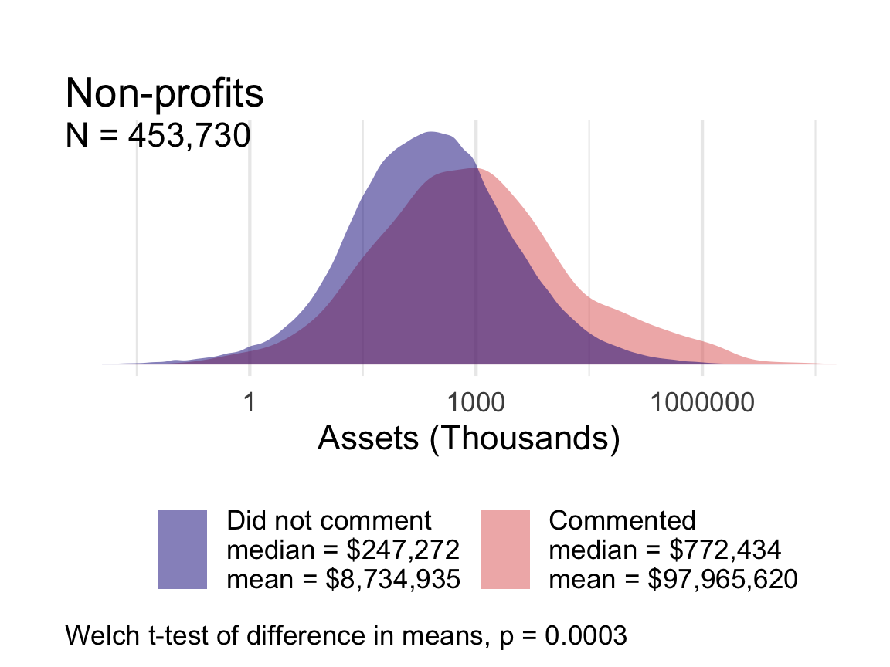
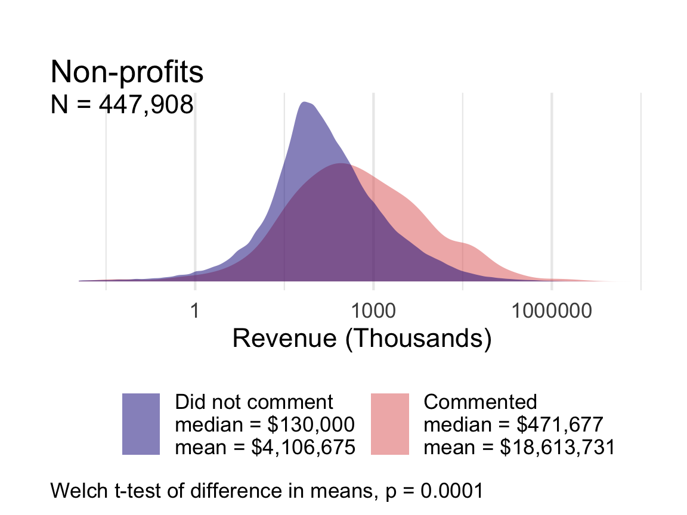
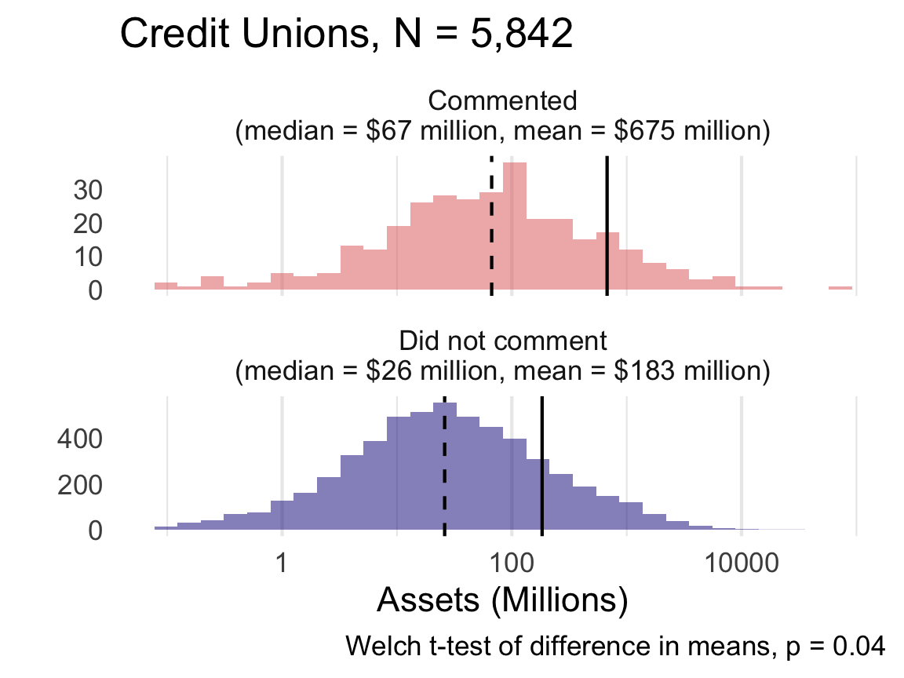
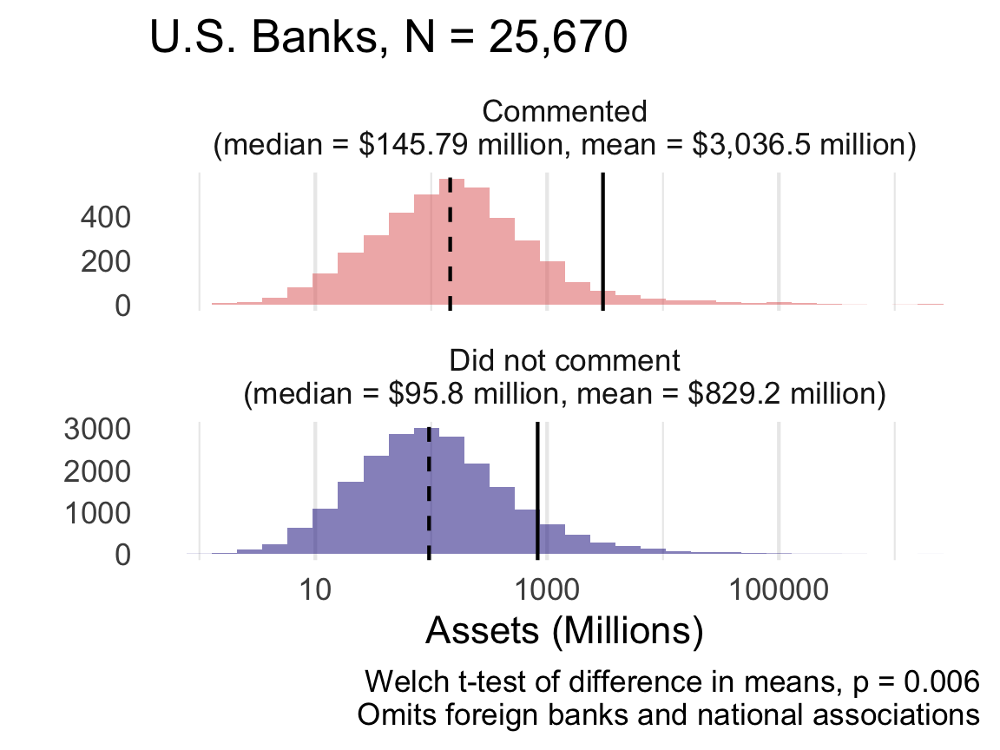
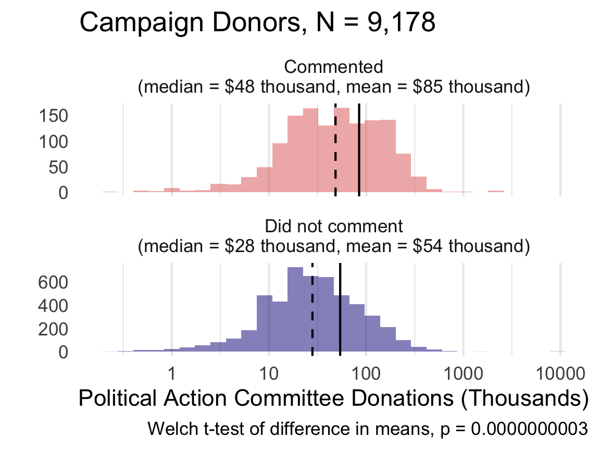

```{r, echo=F, message=F, warning=F}
source("code/setup.R")

# overide defaults 
knitr::opts_chunk$set(echo = FALSE,
                      cache = TRUE) 

# asset data from https://judgelord.github.io/finreg/participation#Save_asset_data
load(here::here("data", "commenter_assets.Rdata"))

# all comment data from https://judgelord.github.io/finreg/efficacy#Save_data
load(here::here("data", "efficacyXsophistication.Rdata"))
``` 


# Introduction

Studies of political inequality have revealed profound and durable patterns where wealthier citizens have a disproportionate influence on lawmaking processes. Critical work in American politics by @Bartels2008, @Baumgartner2009, @Hacker2010, @Gilens2012, @Skocpol2004, @Schlozman2012, and others documents ties between economic and political inequality. Relatedly, @Piketty2014 and others in economics and other social sciences have demonstrated rising capital-based wealth inequality over the twentieth century, especially in the United States [e.g., @Saez2020]. 

In contrast to the large literature on inequality in legislative lawmaking, research on inequality in administrative lawmaking is sparse. Agencies routinely convert broad legislative grants of authority into specific and legally-binding rules with vast social and economic effects  [@West1995; @Kerwin2018]. Agency rules give federal policy "concrete expression" [@Moe_Wilson1994]. When policymaking occurs via agency rulemaking, do the inequalities observed in the legislative process persist or morph? 

Several factors suggest cause for concern. We know, for instance, that firms spend hundreds of millions of dollars lobbying after a bill becomes law, including lobbying the agencies tasked with implementing the legislation [@You2017; @Ban2019; @Libgober2020]. We also know that legislators who receive more corporate Political Action Committee (PAC) money from companies are much more likely to lobby federal agencies on behalf of those companies [@Powell2022] and that, overall, business interests are the main lobbying participants in most agency rulemakings [@GoldenJPART1998; @YackeeJOP2006]. 

Given the scale and importance of U.S. administrative policymaking and the large volume of data on business and interest group lobbying, rulemaking presents an opportunity to study the relationship between wealth inequality and policy influence [@Carpenter2020].

While the methods we advance in this article will allow scholars to study wealth inequality across policy domains, we focus on financial rulemaking and specifically on the rules implementing the Dodd-Frank Wall Street Reform and Consumer Protection Act of 2010 (hereafter Dodd-Frank). Dodd-Frank spurred significant rulemaking activity and mobilized interests to shape those rules. Beyond its provision of granular data, however, financial policymaking offers another reason for studying inequality:  finance is perhaps an unparalleled site of interaction between economic inequality and unequal representation in democratic government.

Consider how media reporting in 2017 illustrated the political priorities of those at the very upper end of the income and power scale in the United States. During that year, major newspapers documented high-level gatherings between CEOs and officials at the Trump White House. For our purposes, what is interesting about these meetings is that the existing inequality literature would likely have predicted America's wealthiest business leaders and allocators of capital would direct their lobbying at congressional lawmaking. Instead, these business leaders and their lobbyists were targeting the rules implementing Dodd-Frank [@Protess2017; @Radnofsky2017].

<!-- (Chris 2022-07-23: We utilize a fair bit of weasel words here. I think we could fairly characterize the lit more strongly and succinctly, as below, starting with "For our purposes": -->

We make three primary contributions.
First, we create a new database of `r n_comments` comments submitted by organizations to agencies tasked with implementing Dodd-Frank.^[Our database includes all 264,709 public comments on Dodd-Frank rules, but we focus our analysis on comments from organizations for reasons described in Section 3.] Our data cover over eight hundred regulatory actions, in `r n_rules` rulemaking processes across seven agencies.^[We define a regulatory action as the publication of a proposed or final rule by one agency. We count a joint rule issued by the SEC and the Federal Reserve as two regulatory actions.] 
The data cover over eight hundred regulatory actions within `r n_rules` rulemaking processes across seven agencies.^[We define a regulatory action as the publication of a proposed or final rule by one agency. We count a joint rule issued by the SEC and the Federal Reserve as two regulatory actions.]
Second, we develop a suite of new measurement and analytic tools to study who lobbies during rulemaking and who influences final rules, as well as who does not. 
Third, we leverage these data and tools to provide the first large-scale assessment of the impacts of wealth inequality during agency policymaking. In doing so, we are able to answer questions on inequality and lobbying participation which were, up to now, only answerable in the legislative process.

<!-- (Chris 2022-07-23: We should tease here so that the question/method/answer is joined together really early on:
 
  To assess the influence of affluence in administrative democracy, we focus on...

Our findings uncover a familiar pattern that transfers to this arena. Wealthy organizations make more comments in quantity and sophistication and then enjoy greater success in moving the rule closer to their asks. ) 

Such information is critical to inform scholarly research regarding the impact of wealth inequality on American policymaking and further our understanding of modern American governance, lobbying influence, and the role of money in politics within our administrative democracy.

<!-- (Chris 2022-07-23, on succinctness in the intro: High-profile meetings between CEOS and lobbyists on financial regulations raise important, hereto-unanswered questions: What are commenters asking for? Do they get what they ask for? Perhaps most importantly, what do these tell us about political inequality?) -->

<!---FINDINGS ---> 
We produce six main findings---all of which support the conclusion that wealthy organizations are advantaged during the administrative policymaking process. 
First, we find that wealthier organizations participate in agency rulemaking at higher rates than less wealthy organizations. We replicate this result within and across various types of for-profit firms and non-profit organizations. 
Second, we find that for-profit banks are more likely to participate than non-profit banks. 
Third, we find that organizations that spend more money on political campaigns and lobbying are more likely to participate in rulemaking. Fourth, among organizations that participate in rulemaking, we show that organizations that participate frequently are wealthier than those that participate infrequently. 
Fifth, wealthier organizations advance more sophisticated comments than less wealthy organizations. 
Sixth, and finally, wealthier organizations are more successful in shifting the content of federal agency rules through their comments. Finally, using causal mediation analysis, we demonstrate that the influence of wealthier organizations on regulatory content is largely driven by the sophistication of their comments.  

<!--big effects MOVED TO CONCLUSION 
The substantive differences in wealth between organizations that participate and do not participate are large. Banks, non-profits, and credit unions that comment on proposed rules have much greater assets on average than similar organizations that did not. The median bank had 40 percent more assets than the median bank that did not comment. The median credit union that comments had three times the assets of the median credit union that does not. The median non-profit that comments had six times the assets of the median non-profit that does not.
--> 
<!-- (Chris 2022-07-23) Can we think about using the term Commenting [x] so that each time we talk about these, it's more like Commenting banks, non-profits, and credit unions have much greater assets on average than similar non-commenting organizations. -->

<!-- (Chris 2022-07-23 This paragraph below seems repetitive. We stake out what we do and find already. If we want to end on findings, I think it would work to cut the below, then re-order "We produce seven..." to be the last paragraph.) -->

The idea that wealth inequality has affected financial policymaking is far from new. Nevertheless, critical questions remain unanswered. Does wealth inequality drive differential lobbying participation during administrative policymaking? Do wealthy organizations get what they want more often during rulemaking? And, if so, why? We provide the data and tools to address these questions. Our analysis of financial rulemaking yields initial answers and evidence within a significant policy domain. Such information is critical to inform scholarly research regarding the impact of wealth inequality on policymaking and further our understanding of American government, lobbying influence, and the role of money in politics within our administrative democracy.


# Theoretical Foundations

The past two decades have witnessed an outpouring of social science research on inequality in the United States and other countries. Several scholars concentrated on the structural and technological determinants of inequality [e.g., @Goldin2009; @Piketty2014]. Others examined political processes as a place where economic inequality shapes policy outcomes that generate further economic and social inequality. 

In *Unequal Democracy*, @Bartels2008 established an important empirical case for political inequality by showing that legislative voting patterns in the U.S. Senate disproportionately reflect the preferences of those individuals at the highest levels of the income distribution. @Hacker2010 described a "winner-take-all politics" by which wealthier Americans improved and secured their economic prospects under both liberal and conservative political leadership while the prospects for middle- and working-class Americans stagnated. In *Affluence and Influence*, @Gilens2012 further systematized these findings using survey data and legislative voting records. Many studies support and refine these observations [e.g., @Baumgartner2009; @Winters2009; @Kelly2010; @Schlozman2012; @Page2013; @Gilens2014; @Witko2021]. Taken together, these studies mark critical innovations in our understanding of U.S. politics and policymaking. 

<!-- (Chris 2022-07-22: There have been some grounded criticisms of these lines of work. Can we utilize those criticisms here about the overbroadness or geographic connections to note that our work makes these connections pretty tight? By staying close to the data---the text of the rules---we can track the changes, which offers a finer outcome than elected official behavior.) -->

Yet our empirical portrait of the relationship between wealth and political inequality in the U.S. remains incomplete. Policymaking does not stop when Congress passes a law. Many critical policy decisions are made by administrative agencies, in part because the legislature delegates significant policymaking authority and discretion to these agencies to make public policy [@Epstein1999; @Huber2002; @Haeder2020]. Some agencies have acquired sufficient legitimacy and expertise to gain autonomy in program initiation, interpretation, and policymaking [@Carpenter2001; @Carpenter2010]. 
Because agencies make policy, moneyed interests spend considerable resources to influence administrative and executive decision-making [@Haeder2015; @You2017]. These dynamics are often studied under the concept of regulatory capture [@Carpenter2013]. Yet, few regulatory capture projects speak to questions of political inequality. Likewise, few studies of political inequality address bureaucratic policymaking.

This is a major omission. This omission is particularly large in the financial regulation space. <!--Because financial policymaking affects the aggregation, accumulation, and disposition of wealth and income so directly, its plausible role in increasing inequality is large.-->
Experts in financial policymaking have concluded that political inequality affects financial policymaking. For example, as the 2008 financial crisis unfolded, @Johnson2010 and @Kwak2013 pinpointed industry influence over financial regulation, including during the Obama Administration, as one of the main culprits of the crisis. In their view, the necessity of regulators spending time with banks, combined with the status, sophistication, and resource differentials between bankers and their regulators, resulted in a convergence of the regulator's frames, assumptions, vocabularies, and methods towards those of the regulated industry. Others examine financial firms' lobbying behavior. For instance, @Igan2011 find correlations between lobbying behavior and pre- and post- financial crisis loan activity. Others show the development of coalitions between financial and non-financial interests [see, e.g., @Young2012; @Pagliari2017; @Heilman2017; @James2021].

Critical research also highlights the revolving-door dynamics often present within financial regulation. This occurs when federal financial agencies hire those from the regulated sector or when agency officials leave to work in banks and non-bank financial firms [@Lucca2014; @DeHaan2015; @Cornaggia2016]. For example, using network analysis, @Young2017 focused on past and current employment ties between select business firms and the U.S. Securities and Exchange Commission (SEC) and found that greater direct and indirect ties increase the likelihood of the firm engagement with SEC policy decision-making. 

What the literature currently lacks, however, are measures of wealth inequality in participation and influence of organizations during one of the most important venues for political lobbying: agency rulemaking. While Congress routinely passes statutes, their implementation almost always requires federal agencies, staffed primarily by civil servants, to devise legally binding standards and procedures (i.e., rules) that make the legislation practically effective [@West1995; @Kerwin2018]. This kind of agency policymaking is pervasive; in 2018 alone, federal agencies finalized over 3,300 rules.

The Administrative Procedure Act of 1946 (APA) governs the rulemaking process. The APA requires federal agencies to solicit public comments on their draft policy proposals (also called Notices of Proposed Rulemaking, NPRMs, or proposed rules) and to consider any substantive comments before issuing a legally-binding Final Rule. Agency officials may or may not make changes to the proposed rule text based on the public comments. The rulemaking process thus creates opportunities for influence. Given the potential impact of agency-issued regulations, the firms and other organizations most affected often attempt to influence regulatory policy content by submitting public comments. Federal agency restrictions on ex parte (or "off the public record") lobbying after the issuance of a proposed rule allow researchers to use comments during notice and comment rulemaking to study lobbying [@Yackee2012]. <!--Even where groups may exercise influence in parallel forms of lobbying, they often still have incentives to enter their arguments and demands into the official rulemaking record via public comments.-->

Unequal levels of power and access to the government may be especially acute in financial regulation, where Congress tends to rely upon government agencies to develop key regulatory concepts and instruments and, in doing so, to carry out legislative intent. Administrative agencies made many of the most important deregulatory decisions of the past three decades. These include reductions in regulatory capital requirements and the deregulation of mortgage and other consumer loans [@Engel2011]. While ostensibly re-regulating the financial sector, Dodd-Frank handed considerable authority to federal financial agencies [@Carpenter2012; @Carpenter2013], with over 300 provisions authorizing new rulemaking. Each provision could result in multiple rules [@Copeland2010]. Each rulemaking process presents an opportunity for the financial industry and others to lobby the government agency for policy change.

<!-- TODO MORE LIT AND CONTEXT THAT IS RELEVANT TO THE RESEARCH QUESTION --> 
The traditional literature on bureaucratic politics has largely yet to address questions of wealthy inequality of influence during rulemaking and financial policymaking. An older literature [@McCubbins1987; @Balla1998] examined rulemaking as an important venue of policymaking, often debating whether Congress could use procedures like public comment periods to control administrative agencies. Other high-profile research focused on the legislature's decision to delegate [@Epstein1999; @Volden2002; @Huber2002]. <!--Other major work focused on the politics of agency decision-making in enforcement or permitting decisions but not in rulemaking  [e.g., @Wood1994]. --> 
These patterns shifted when scholars began focusing more on the role of public comments during rulemaking and attempted to correlate the requests made in comments with regulatory policy change  [@GoldenJPART1998; @WestPAR2004; @YackeeJOP2006; @YackeeJPART2006; @McKay2007]. <!--This advanced understanding of political inequality during the agency rulemaking process, but without a specific concentration on wealth or financial regulation.-->

<!-- CUT FOR NOW 
For example, @YackeeJOP2006 asked whether business interests could, by commenting on proposed regulations, induce greater changes in proposed rules than non-business interests. They observed that business comments better predicted subsequent changes to federal rules in their sample of transportation and labor regulations. @Haeder2015 similarly focused on political inequality in rulemaking but within the U.S. Office of Management and Budget's (OMB) review of important agency rules. They found more regulatory policy movement occurring during OMB review when business interests dominated other types of lobbying entities. 
END CUT-->

Recent work has suggested a mechanism by which traditionally disadvantaged interests may combat business bias during rulemaking: band together to lobby in diverse coalitions [@Dwidar2021PSJ; @Dwidar2021APSR]. However, these studies point to continued inequalities, including that only certain types of coalitions appear to hold policy influence over agency rules, including those with greater financial capacity. 

When we focus on the handful of existing financial rulemaking studies, we uncover a mixed portrait of the policy impact of wealth inequality. These studies---which tend to focus on a single agency or a single rule---raise important questions for future scholarship. 
<!--PARTICIPATION--> 
For example, there are mixed findings regarding the extent of bias in who is able to participate in financial rulemaking.
@Gordon2020 found that a diverse coalition of actors came together to counter the role of larger and more established regulated entities in the area of credit risk retention regulation [see also @Ziegler2016]. However, @Young2017 found that stakeholders beyond affected firms are much less likely to mobilize in the financial sector, especially when a financial rule is technically complex. 

There are also mixed conclusions about biases in who has influence in financial rulemaking. 
For example, @Krawiec2013 studied public participation patterns early in the rulemaking process for section 619 of Dodd-Frank (commonly known as the Volcker Rule). She found that comments from the financial industry, which presumably is better resourced, were more detailed, complex, and lengthy than those from non-financial firms.
@Ban2019 focused on lobbying and agency rulemaking on a sample of SEC rules after Dodd-Frank. They concluded that the resources an organization devotes to lobbying appeared to influence the likelihood that the SEC would list an organization’s name in its final rule.
In contrast, @Rashin2020 examined thousands of public comments on SEC rules and found that organization resources did not appear to correlate with a commenter's lobbying ability to secure policy changes. <!--In doing so, Rashin's account appears to align with older work by @Nixon2002, which did not find a severe bias toward what they called "privileged" interests.-->

<!--Thus, the existing literature yields a mix of conclusions on the impact of wealth inequality during rulemaking and thereby leaves critical hypotheses regarding the plausible effects of wealth inequality during agency rulemaking in financial regulation.-->

Thus, the existing literature yields a mixed set of conclusions on the impact of wealth inequality during rulemaking, leaving open critical hypotheses regarding the plausible effects of wealth inequality during agency rulemaking in financial regulation.

## Wealth Inequality Hypotheses

We investigate the role that wealth inequality may play during the development of financial regulations. We group our arguments under two categories, representing two potential biases in U.S. rulemaking: (1) bias in participation and (2) bias in influence. We develop three hypotheses about each form of bias.

### Differential Lobbying Participation

Previous work suggests that wealthier organizations, such as business firms, will participate in agency rulemaking via the submission of comments at a greater rate than other less wealthy organized interests, such as labor and public interest organizations [@YackeeJOP2006]. Past research theorizes that the high costs associated with public comment submission are one reason for this bias. @Rossi1997 writes of the need to monitor the bureaucracy's rulemaking activities, which can be complex and arcane, to know when and how to participate in regulation is being formulated [see also, @Kerwin2018]. @Yackee2019 implies that these high participation costs may be paid more readily by business interests<!--, which often have hired lobbyists and government affairs offices to monitor agency rulemaking on their behalf --> [see also, @JewellJPART2006].

While past research has focused on differences in lobbying participation across different organization types (i.e., business firms versus public interest groups), we go a step further to also address the effects of wealth differentials *within* organizations of a similar type. For example, we theorize that, even among banks, wealthier banks will participate in rulemaking via the submission of comments to financial rules more often than banks with fewer assets to draw upon. The theoretical reasons for this expectation are the same as articulated above---wealthy organizations are better able to pay the up-front costs of lobbying and often have more concentrated stakes in policy outcomes. By comparing similar organizations, however, we can better isolate whether wealth inequality (rather than other differences across organizations) drives differential lobbying participation in rulemaking.

> *Differential Participation Hypothesis (H1):* Organizations that comment on financial rules will be wealthier than organizations that do not comment on financial rules.

An additional driver of differential participation may be the concentration of the costs and benefits of lobbying on government regulations [see broadly, @Lowi1964; @Olson1965; @Wilson1989]. For-profit organizations---such as publicly-traded companies and banks---tend to have concentrated stakes in regulations. Wealthy profit-seekers then have especially strong incentives to lobby in rulemaking [@Libgober2020; @LibgoberQJPS2020]. By construction, non-profit organizations have less profit-seeking incentives. <!--Non-profits are often formed to advance broader concepts of the public interest rather than narrow private interests.-->  Thus, we anticipate differences between for-profit and non-profit organizations.^[Of course, some non-profits, including industry associations, are formed to advance narrow private interests. Because our data on nonprofits do not include a measure of the extent to which organizations advance public or private interests, we use this binary "profit-seeking" categorization based on incorporation status.]
 <!-- (Chris 2022-07-23: I really struggled with reading the paragraph )
-->

> *Profit-motivated Participation Hypothesis (H2):* Profit-seeking organizations will be more likely to comment.

Moreover, we theorize that wealth inequalities in lobbying participation will persist even among those organizations that can pay the initial costs of rulemaking participation. Stated differently, when focused on those entities that have submitted at least one comment to a Dodd-Frank regulation, we argue that more wealthy organizations will, again, hold an advantage over less wealthy organizations by participating across a larger number of rules. 

> *Differential Frequency of Participation Hypothesis (H3):* Among organizations commenting on financial rulemaking, organizations with greater wealth will comment on a larger number of financial rules.

### Differential Lobbying Success

Existing research hints at a differential lobbying benefit attached to wealth during rulemaking. For instance, @Haeder2015 find more policy movement on federal regulations during rulemaking when business interests are more active than other types of organizations, such as public interest groups. Yet, such research does not provide a clean test of wealth inequality. After all, some businesses are large while some are small; some non-profits hold major financial assets while others are poor. We thus seek to understand whether wealth is a common factor driving lobbying influence during rulemaking. As a result, we theorize that, among similar organizations, wealthier ones will see greater lobbying success during financial rulemaking. <!--For example, we expect the comments of more wealthy large banks will impact the content of final financial rules more than those of less wealthy large banks.-->

> *Differential Lobbying Success Hypothesis (H4):* Comments from wealthier organizations will be more successful in shifting the content of agency rules.

Research suggests wealthier organizations are more influential because they can better deploy sophisticated technical information than less well-off entities [@WagnerALR2011]. Put differently; large organizations are disproportionately able to marshal the technical expertise necessary to write sophisticated comments for rules. Moreover, agency officials pay greater attention to abstract and technical arguments, such as those in comments from business organizations, while often minimizing the moral and personal arguments found in less sophisticated comments from individuals [@JewellJPART2006]. Additionally, non-industry comments often lacked the specificity and the detail that agencies needed to change policy [@Krawiec2013]. Consequently, we hypothesize that wealthier entities will utilize their resources to produce comments that hold greater sophistication than less prosperous groups, and these comments will be more impactful.

> *Differential Sophistication Hypothesis (H5):* Wealthier organizations will use more technical and sophisticated language when commenting on proposed rules.

> *Dividends of Sophistication Hypothesis (H6):* Comments from wealthier organizations will be more successful in affecting the content of agency rules because of comment sophistication.  

<!--Susan suggested cutting this paragraph, but I think we need an end to this section, perhaps revise--> 
Together, these hypotheses test for two major kinds of potential bias in policymaking: (1) that the wealthy are better able to participate and (2) that even when less wealthy groups participate, the wealthy are likely to have their demands met. Additionally, they test a major theorized mechanism of lobbying influence: the ability of the wealthy to mobilize lawyers and experts to make sophisticated and thus influential arguments on their behalf.

# Data and Methods {#data}
        
<!-- (Angelo: Should we explicitly say "this data provides us with this variable...") -->
<!-- (Chris 2022-07-23: I agree with Angelo. For the next version, maybe this is a generic table.) -->

To assess the extent of inequality in financial rulemaking, we assembled data on draft and final rules, comments on those rules, and organization wealth and lobbying expenditures. Data sources included the Federal Register, Regulations.gov, Wharton Research Data Services, the Center for Responsive Politics, Federal Financial Institutions Examinations Council (FFIEC), the Internal Revenue Service (IRS), the Consumer Financial Protection Bureau (CFPB), Commodity Futures Trading Commission (CFTC), the Federal Deposit Insurance Corporation (FDIC), Federal Reserve (FRS), National Credit Union Administration (NCUA), Office of the Comptroller of the Currency (OCC), the Securities and Exchange Commission (SEC). This expansive data collection effort includes data on agency administrative data, public comment and rule texts, and measures of organization wealth.


## Agency Rules & Public Comments

From the Federal Register, we collected the text of all rules promulgated under authorities granted in Dodd-Frank
between its enactment on July 20, 2010, and July 8, 2018
by the seven primary financial regulators tasked with writing rules under the Dodd-Frank Act: FRS, CFPB, SEC, CFTC, FDIC, NCUA, and OCC. We also collected all public comments and comment metadata available on these rules from each agency's website or Regulations.gov. In doing so, we collected key information, including the name of the organization submitting the comments and the comment submission date. We also collected the text of all comments from comment submission forms and file attachments. These data include `r n_comments` comments on `r n_rules` separate rulemaking dockets, covering `r n_actions` regulatory actions issued by one or more of these seven agencies.^[
**NOTE:** This draft utilizes data from five of these seven agencies for which data processing is complete. Data from the OCC and FRS will be included shortly.
The law firm Davis Polk LLP maintains a list of Dodd-Frank-related rules. Each rule in our sample may be considered a set of connected regulatory actions, which must include a proposed and final rule connected by a Regulation Identifier Number (RIN). We count jointly-issued rules---such as a rule issued by the SEC and FRS---as two rules because both agencies collected comments separately.]

Figure \ref{fig:actions} shows significant variation in regulatory activity across these agencies. The largest agency in our sample by regulatory volume is the CFPB, while the smallest is NCUA. The figure also shows considerable variation in the range of regulatory actions, including advanced notices of proposed rulemaking (ANPRMs), proposed rules, interim final rules, and final rules. 

<!-- (Chris 2022-07-23: I agree with Angelo. For the next version, maybe this is a generic table.) 

DJL: figures often need to be self-contained for journals-->

```{r actions, out.width="100%", fig.cap= "Dodd-Frank Act Implimenting Actions by Agency", cache=FALSE}
knitr::include_graphics("figs/actions-1.png")
```


## The Wealth of Organizations

Our wealth inequality hypotheses focus on the lobbying behavior of organizations during rulemaking. 
As a result, to test these hypotheses, we had to develop a suite of new measurement and analytic tools designed to capture measures of wealth for organizations and then link these measures to lobbying activities. The final dataset is the subset of all comments on Dodd-Frank rules that match an organization with some form of wealth data. This dataset allows us to compare the wealth of organizations that commented on financial rules to the wealth of similar organizations that did not comment on these rules.

<!--TODO SUSAN SUGGESTED DELETING, BUT I THINK THIS PARAGRAPH IS NEEDED SOMEWHERE-->
Past research suggests that organizations and individuals tend to submit different types of comments to rules [@JewellJPART2006]. We go one step further and compare commenting behavior among similar types of organizations. For example, we compare the commenting behavior of large banks to other large banks. Thus, we control many known sources of variance in commenting behavior, yielding cleaner tests of our hypotheses.

The first step in creating these data was collecting and digitizing the texts of all public comments on Dodd-Frank rules. We then extracted entity names and matched them to organizations in databases that yield information on wealth (such as an organization’s market capitalization or total assets). No single database provides this data on wealth for all types of organizations. We thus cast a wide net and identified multiple databases of organizations that might participate in financial rulemaking. When combined, the six databases below contain nearly 500,000 publicly traded companies and non-profits. We identify `r n_assets` comments submitted by organizations that appear in one or more of the datasets described below. These databases are:

1.	Market capitalization for all publicly traded companies listed on U.S. exchanges during our analysis time frame from the Wharton Research Data Service's Compustat database, including financial data, such as market capitalization. 

2. Additionally, we collect market capitalization for corporations that filed disclosures with the SEC and are thus listed in the SEC's Central Index Key (CIK) database.

3.	Assets under management for all bank and bank-like entities covered by the FDIC.

4. Assets under management for all U.S. credit unions from consolidated call reports published by the NCUA.

5.	Total assets and annual revenue for all non-profit organizations reported by the IRS 990 forms.

6.	Political Action Committee (PAC) donations by all organizations filing campaign disclosure reports, as compiled by the Center for Responsive Politics. We then calculate the average annual PAC contributions for each organization.

<!--TODO
7.	All organizations reporting lobbying expenditures, as compiled by the Center for Responsive Politics. We then calculate the average annual lobbying expenditures for each organization.

TODO: Devin will replicate PAC figures and analyses with data/Lobbying_and_Contributions.csv
-->

Next, we used an iterative matching procedure to find matches for organizations that commented on Dodd-Frank rules in these six datasets. This step took considerable innovation because the names that organizations use to submit comments and the names by which they appear in various databases often differ. Our matching procedure involved several steps. We first identified comments that were likely from an organization, excluding those that were likely from an individual or a mass commenting campaign. We then linked these comments to the organization with the best matching name or to no organization when our matching algorithm did not identify a high-probability match in any of the above databases. We then spot-checked our processes for false positive matches by inspecting organizations that matched many comments and false negatives by inspecting especially long, sophisticated, or efficacious comments that did not match a known organization. We then improved the matching algorithm through dozens of iterations.

These procedures resulted in a dataset of `r n_orgs` distinct organizations that submitted  `r n_assets` unique comments on one or more Dodd-Frank rules. Below, we use these data to compare the wealth of commenting organizations to the `r n_orgs_total` similar organizations in one of the above wealth databases that did not comment on financial regulations.


```{r org-types, fig.cap="Number of Organizations by Type and Agency to which they Commented, Including the Consumer Financial Protection Bureau (CFPB), Commodity Futures Trading Commission (CFTC), Federal Reserve (FRS), National Credit Union Administration (NCUA), and Securities and Exchange Commission (SEC)", out.width = "80%"}

knitr::include_graphics("figs/org_count_type-2.png")
```

The remainder of this section describes the distribution of these data, which are not equally distributed across agencies, rules, and commenter types.
 Figure \ref{fig:org-types} shows the number of unique commenting organizations matched to each database by the agency or agencies to which they submitted comments. Across all agencies except for the Federal Reserve (FRS), most commenting organizations are non-profits. The next most common type of commenter was federally-insured (FDIC-insured) banks (hereafter "banks"). Organizations that filed with the SEC and donors to PACs were less common.
Figure \ref{fig:comment-types} shows the number of comments submitted to each agency by an organization matched to each database described above.
There was considerable variation in the number of comments from organizations on rules across the seven financial regulators. For example, the CFPB rules regulating payday loans generated the largest number of comments from organizations (3,898) in our data. At the same time, many low-salience rules received few comments. Several rules received no comments from organizations with publicly-available wealth data. However, for all rules that received more than 25 comments, we matched at least two organizations to asset data. The agency with the largest median number of comments from organizations was the CFPB at 21. 


```{r comment-types, fig.cap = "Number of Comments by Authoring Organization Type and Agency, Including the Consumer Financial Protection Bureau (CFPB), Commodity Futures Trading Commission (CFTC), Federal Reserve (FRS), National Credit Union Administration (NCUA), and Securities and Exchange Commission (SEC)", out.width = "80%"}
# NOTE: Devin will revise these figs to be clearer in the legend about what is in each database. We should do this for all figs so they can stand independently.
knitr::include_graphics("figs/org_count_type-1.png")
```


## Comment Sophistication {#methods-sophistication}

We measure comment sophistication by counting the technical terms in each comment. To capture sophistication with respect to the use of finance and banking jargon, we use the Oxford Dictionary of Finance and Banking, which includes 5,260 finance and banking terms. When an organization submits a comment with multiple attachments, we measure sophistication by summing up the technical terms and legal citations across all submitted documents. This approach follows the intuition that attachments with additional technical language reflect additional sophistication. <!--DJL LIKES THIS, BUT SUSAN CUT
For example, the most sophisticated organizations often submit a cover letter, a marked-up version of the proposed rules, and studies supporting their arguments.--> 

<!--TODO 
Second, we count the number of Tables and Figures. Looks at the maximum number of tables, with large jumps excluded. For example, a document with tables 1, 2, 3, and 99 would treat 99 as an error and say there were three tables. This mostly comes from bad OCRing or documents with footnotes between the word "table" and the table number.
-->


## Lobbying Success {#methods-success}

After reviewing an agency's proposed rule, organizations typically use their comments to articulate the changes they want to see the agency make in the final rule. 
To approximate the extent to which commenters' requested changes are made, we measure the overlap between the text of each organization's comment and the text added to the final rule. 
Our measure of lobbying success follows the intuition that an organization whose comment text is repeated by the agency in changes to the final rule is more influential in shifting regulatory content in their desired direction than an organization whose comment is not reflected in changes in the final rule. If this intuition is correct, greater text reuse suggests greater lobbying success. 

To construct this measure, we first link proposed rules to final rules by their Docket or Regulatory Identification Numbers. We match comments to proposed rules by publication date; if a comment comes after the publication of a second proposed rule, it is assumed to be on the second proposed rule. 
We then tokenize each draft and final rule and each comment in groups of ten words. Ten-word phrases are long enough that they rarely co-occur by chance and are thus a well-validated measure of textual similarity [@Wilkerson2015; @Casas2019; @JudgeLord2017; @Rashin2019]. 
Finally, we count the number of words in phrases of 10 or more that appear in the comment and final rule but do not appear in the draft rule.^[We exclude any text from the agency's proposed rule in this calculation to ensure that we do not include phrases in an organization’s comment that simply quoted the proposed rule as having informed the final rule. It is possible that the processes that lead organizations to include particular phrases in their comments are endogenous to the policy changes agencies make during rulemaking. We deal with this potential endogeneity by excluding the text of the proposed rule when we measure lobbying success. Doing so removes the phrases and text that are most likely to be naturally repeated and thus drive endogeneity.]
For rules with multiple final rules, we take the sum of the comment's alignment with both final rules.
When an organization submits a comment with multiple attachments, we include only the highest scoring document as the primary comment. We do this because organizations that submit multiple attachments often have one primary comment that articulates their lobbying demands.

This measure of lobbying success captures the idea that organizations desire policy change in line with their lobbying demands [@Mahoney2007JPP]. It captures “success” in the sense that it measures the alignment between specific requests made in an organization’s comment and specific subsequent policy changes. However, lobbying success, as we measure it, does not necessarily prove causality. For example, the organization’s comment and the agency may have both copied the repeated text from a third source. Thus, we cannot definitively say that the comment helped to drive the policy change, but the organization nevertheless appears to have achieved its lobbying objectives.

In dealing with endogeneity, one methodological choice merits elaboration: we excluded text from the proposed rule when measuring lobbying success but not when measuring sophistication. This choice rests on the underlying concepts we are attempting to measure. In measuring text reuse, we aim to capture ideas that were not yet in the policy when the comment was submitted. Thus, text copied from the agency's proposal must be excluded. Indeed text that appears in both the draft and final rule is what did *not* change. If a commenter attached a marked-up version of the proposed rule, we aim to exclude all but their suggested changes. 

In contrast, in measuring sophistication, we aim to assess how much the commenter utilizes expertise to engage in technical policy debates. Here, attaching a marked-up version of the proposed rule captures the underlying concept of sophistication. Thus, our counts of technical banking terms do not exclude the text of the draft rule. Even if they are the agency's terms, engaging with its texts indicates sophistication. For example, the comment with the most legal terms from a bank contained a 4-page comment and 112 pages of attachments, 105 of which were the full proposed rule. These 105 pages were excluded from our measure of text reuse but included in the legal and banking terms count.  

<!--CORRELATION BETWEEN SOPHISTICATION AND SUCCESS
This figure is here rather than in the results section to facilitate discussion of the data, but I'm open to suggestions
--> 
```{r, efficacyXsophistication, fig.cap="Lobbying Success by Comment Sophistication", out.width= "70%"}
knitr::include_graphics("figs/efficacyXsophistication-2.png")
```

Descriptively, our measures of lobbying sophistication and lobbying success are highly correlated. Our measure of commenter lobbying success increases with the wealth of the commenting organization. 
Figure \@ref(fig:efficacyXsophistication) shows that the number of words from the comment added to the final rule correlates with the number of technical words. The plot highlights the comment with the highest score on our measure of lobbying success, a comment to the SEC prepared by the law firm White & Case, LLP for the U.S. Chamber of Commerce, Americans for Limited Government, Ryder Systems, Inc., the Financial Services Institute, Inc., and Verizon. This highly-sophisticated comment included a 19-page cover letter with many technical citations underscoring the Chamber's "very serious concerns on the impact [the rule's] whistleblower requirements will have on... companies' responsibilities to act in the best interests of their shareholders."
This comment also included a marked-up draft of the SEC's proposed rule, suggesting specific changes, several of which were adopted by the SEC. 
Other comments with high lobbying success scores include an 84-page comment from Standard & Poor's Global Ratings credit rating agency to the SEC, a 59-page comment from the Futures Industry Association to the CFTC, and several marked-up versions of proposed SEC rules from investment companies.
Overall, \ref{fig:efficacyXsophistication} shows a positive correlation between the number of technical banking terms in a comment and the amount of text it shares with the final rule. 
Using these data (comments, their sophistication, and their lobbying success), the following section assesses our hypotheses about the relationship between wealth, political participation, lobbying sophistication, and lobbying success. Notably, Section \@ref(mediation) further explores the correlation between sophistication and lobbying success by assessing comment sophistication as a mediator in the relationship between wealth and success.


## Methods {#methods}

We assess our hypotheses about the relationship between wealth inequality and policy influence using descriptive and statistical analyses, including t-tests, multivariate Logit, OLS, and Poisson models, and causal mediation analyses. 

We use Welch t-tests to assess differences between commenters and non-commenters (H1), for-profit and non-profit organizations (H2), and frequent and infrequent commenters (H3).
We use regression analyses to assess whether wealth predicts various outcomes of interest.  
We employ Logit regression to model the binary outcome of commenting as a function of wealth (H1) and organization type (while controlling for wealth). We model differences between non-profits with for-profits overall and, separately, between for-profit and non-profit types of banks (H2).  
The resulting model coefficients allow us to estimate how changes in an organization's assets and organizational form produce changes in the odds that the organization will comment on a rule.
We use Poisson regression to model the count of rules on which an organization comments (H3), the number of words from a comment added to the final rule (H4), and the number of technical terms used in a comment (H5), as a function of wealth. 

<!-- TODO: DEVIN 
Causal mediation analysis is used to ...--> 


# Results

In this section, we investigate each of our six hypotheses in turn. First, we examine inequalities in which organizations participate in financial rulemaking. Next, we examine inequalities in lobbying success among organizations that participate. Thus, we test our hypotheses about wealth and access to the policy process using two broad types of variation: (1) variation between commenters and similar organizations that did not participate in Dodd-Frank rulemaking and (2) variation among organizations that did participate in the frequency, sophistication, and impact of their participation.

## Wealth Inequality in Lobbying Participation <!--: Variation Across Commenters and Non-Commenters--> 

First, we compare levels of resources among commenting organizations and similar organizations that did not comment. 


### Wealthier organizations are more likely to participate


The *Differential Participation Hypothesis (H1)* posits that organizations that comment on financial rules will be wealthier than organizations that do not comment. To assess this, we compare organizations that did and did not comment on Dodd-Frank rules. Because our data included the full population of similar organizations that could reasonably be expected to submit comments (e.g., all banks and all non-profits), only some of which did submit comments, we can draw important new conclusions about the relationship between wealth inequality participation in the policy process.

Overall, we find strong support for this hypothesis:  organizations that comment are much wealthier on average than similar organizations that did not comment. 
Figure \ref{fig:commenters-noncommenters} shows distributions of logged wealth by whether the organization commented on any Dodd-Frank rule. Organizations that comment have greater wealth than similar organizations that did not comment. Because the x-axes of the plots Figure \ref{fig:commenters-noncommenters} are logged, differences that appear small in the plotted distributions represent large substantive differences in wealth. Additionally, statistical tests for differences between means show that differences within non-profits and public-traded firms are significant at the .01 level. While differences between commenting and non-commenting credit unions are substantively large, the smaller sample lacks the power to achieve statistical significance. 

Logistic regression results confirm these differences in means, including statistically significant differences among credit unions.
Figure \ref{fig:mp-assets} (Appendix Table \ref{tab:mp-assets-table}) shows the results of logit models predicting the log odds of commenting on a Dodd-Frank rule by assets for banks, credit unions, and non-profits. These models show that wealthier organizations of all three types are significantly more likely to comment. Of these three types of organizations, the marginal effect of assets on the log odds of commenting is the largest for banks. 

```{r mp-assets, fig.cap= "Log Odds of Participating in Dodd-Frank Rulemaking by Assets", out.width="90%"}
knitr::include_graphics("figs/mp-nonprofit-credit-unions-1.png")
```

```{r, commenters-noncommenters, fig.cap="Financial Resources of Organizations that Did and Did Not Comment", out.width= "49%"}

knitr::include_graphics("figs/creditunion-density-1.png")
knitr::include_graphics("figs/compustat-density-1.png")
knitr::include_graphics("figs/FDIC-density-select-1.png")
```


Figure \ref{fig:commenters-noncommenters} shows the distribution (on a log scale) of organizations' financial resources for commenting organizations that matched in our comment database compared to similar organizations that did not comment. 

**Non-profits.** The top left panel in Figure \ref{fig:commenters-noncommenters} shows that non-profits that comment on proposed financial regulations tend to be significantly better-resourced than we would expect from a random sample of non-profits. The average assets of commenting non-profits were ten times larger than non-profits that did not participate; the average non-profit that did not comment had about \$7.5 million in assets, whereas the average non-profit that did comment had approximately \$75 million in assets. Thus, the average assets of commenting non-profits were ten times larger than non-profits that did not comment. This provides evidence in support of the *Differential Participation* Hypothesis (H1) within non-profit organizations.

**Credit unions.** Similarly, the top right panel in Figure \ref{fig:commenters-noncommenters} shows that credit unions that comment on proposed financial regulations also tend to be significantly better-resourced than we would expect from a random sample of credit unions. The average credit union that did not comment has about \$27 million in assets, whereas the average credit union that did comment has \$75 million in assets. The average commenting credit union is thus three times larger than the average credit union that did not comment. This provides evidence in support of the *Differential Participation* Hypothesis (H1) within credit unions. 

**Publicly-traded companies.** The bottom left panel in Figure \ref{fig:commenters-noncommenters} shows similar distributions over market capitalization for publicly traded companies. Companies that comment on proposed financial regulations are better-resourced than we would expect from a random sample. Specifically, they have much more capital, as measured by the total value of their stock. The median market capitalization of companies that commented was almost 70 times that of the median company that did not comment.   <!-- TODO: MORE ON THIS? --> 

<!-- TODO: ADD MARKET CAP RESULTS? 

```{r mp-marketcap, fig.cap= "Log Odds of Participating in Dodd-Frank Rulemaking by Market Capitalization", out.width="80%"}
knitr::include_graphics(
"figs/mp-compustat-1.png")
```

Similarly, \ref(fig:mp-marketcap) shows the results of logit models predicting the log odds of commenting on a Dodd-Frank rule by market capitalization (the total value of its stock).

END TODO NOTE -->

**Banks.** The bottom right panel in Figure \ref{fig:commenters-noncommenters} shows that, on average, banks that comment on proposed financial regulations are better-resourced than we would expect from a random sample of banks. The x-axis shows assets in thousands of dollars. Banks that participated in financial rulemaking had almost 40 percent greater median assets and nearly double the average assets. 

When we look within categories of banks, we see that the wealthier banks within each class are also more likely to submit comments on financial rules than similar banks with less wealth. Figure \@ref(fig:FDIC-density-by-class) shows that, within each class of bank (i.e., Commercial Banks, Savings Banks, State Banks, and Savings Associations), wealthier banks participate in financial rulemaking more than less wealthy banks.^[There are over seventeen different categories of banks (see <https://www.ffiec.gov/npw/Help/InstitutionTypes>). This paper focuses on Commercial Banks, Savings Banks, State Banks, Savings Associations, and Credit Unions because they are among the most prominent types of banks. Commercial Banks are publicly-traded corporations that make loans to businesses and individuals. Credit Unions are non-profit banks. Savings associations are non-profits primarily involved in mortgages.]
While the differences within types of banks are fairly large, these differences in means do not reach statistical significance at the 0.05 level. <!--Differences in means among for-profit Commercial Banks are significant at the .1 level in a Welch Two Sample t-test. -->

Figure \ref{fig:FDIC-density-by-class} shows wealth distributions for four prominent types of banks: Commercial Banks, Savings Banks, State Banks, and non-profit Savings Associations. 
The top-left panel of Figure \ref{fig:FDIC-density-by-class} shows that Commercial Banks that comment are wealthier than those that did not comment. The modal Commercial Bank that commented has 40 percent more assets than the modal Commercial Bank that did not comment. 
The top-right panel of Figure \ref{fig:FDIC-density-by-class} shows that Savings Banks banks that comment are wealthier than those that did not comment. The modal Savings Bank that commented has nearly twice the assets of the modal Savings Bank that did not comment. 
Similarly, the bottom-left panel of Figure \ref{fig:FDIC-density-by-class} shows that the average assets of State Banks that commented were three times the average assets of the State Banks that did not comment. While Savings Associations are less likely to comment than more profit-oriented banks, such as Commercial Banks (see Figure \ref{fig:mpFDIC}), the bottom-right panel of Figure \ref{fig:FDIC-density-by-class} shows that when Savings Associations do comment, they tend to be the wealthier ones. 


```{r, FDIC-density-by-class, fig.cap="Financial Resources of FDIC-Insured Banks that Did and Did Not Comment", out.width= "49%"}
knitr::include_graphics("figs/FDIC-density-by-class-1.png")

knitr::include_graphics("figs/FDIC-density-by-class-2.png")

knitr::include_graphics("figs/FDIC-density-by-class-3.png")

knitr::include_graphics("figs/FDIC-density-by-class-4.png")

```


### Organizations that make larger campaign donations and spend more on lobbying are more likely to comment


```{r opensecrets-density, fig.cap= "Campaign Spending of Organizations that Did and Did Not Comment", out.width="49%"}
knitr::include_graphics("figs/opensecrets-density-1.png")
```

Figure \ref{fig:opensecrets-density} shows that organizations that comment on Dodd-Frank rules also donate more to political campaigns via PACs. This aligns with the *Differential Participation* Hypothesis (H1). Among organizations that donate to campaigns, the average campaign spending per two-year cycle was \$80,000 for those that did not submit a comment, and the average for a donor organization that did comment on a Dodd-Frank rule was \$95,000. 
This difference is significant at the 0.01 level in a Welch Two Sample t-test.
<!-- TODO NOTE:
DEVIN UPDATED THESE NUMBERS IN MAY 2022, BUT WE MAY NEED TO REVISE THESE NUMBERS WITH NEW DATA 
DEVIN WILL ADD LOBBYING EXPENDITURES
--> 

### Profit-driven organizations are more likely to comment than non-profits

The *Profit-Motivated Participation* Hypothesis (H2) posited that for-profit organizations are more likely to participate in rulemaking than non-profit organizations. We find strong support for this hypothesis when we analyze the data overall (i.e., comparing banks with non-profits) and when we focus on differences *among* banks that are for-profit and non-profit. 12 percent of for-profit Commercial Banks commented on Dodd-Frank rules. In contrast, only three percent of non-profit Savings Associations, two percent of non-profit credit unions, and 0.2 percent of other non-profits commented. This means that Comercial Banks were six times more likely to comment on a Dodd-Frank rule than the average Credit Union and 60 times more likely to comment than the average non-profit. 
 
To further test this hypothesis, we subset our data to organizations that are FDIC-insured banks to estimate the odds of commenting across different types of banks. We find that for-profit banks (i.e., Commercial Banks) are significantly more likely to comment than non-profit Savings Associations and Credit Unions, further supporting the link between profit motives and lobbying activity. 
For example, among FDIC-insured banks with a mean asset amount of \$1,175,970, our model predicts Commercial Banks to have a 12 percent probability of commenting.  
Meanwhile, a non-profit Savings Association with the same asset resources has only a three percent probability of commenting.
<!-- (Angelo 7/18/2022: Added last two sentences of examples)
DJL: TODO CREDIT UNIONS SHOULD BE IN THIS MODEL 
 -->

These results correspond with what we know about these different types of banks.  
Commercial Banks are often large multinational corporations managed by a board selected by shareholders and tend to serve corporations and wealthier and profit-motivated clients.
In contrast, Savings Associations are chartered with the narrow purpose of providing affordable residential mortgages. Both types of banks may hold large volumes of assets, but they have very different clients. 
Figure \@ref(fig:mpFDIC) (Appendix Table \@ref(tab:mpFDIC-table)) shows that Commercial Banks were disproportionately represented in Dodd-Frank rulemaking and that Savings Associations were less represented, even controlling for asset differences. This provides further support for the *Profit-motivated Participation* Hypothesis (H2). Likewise, assets remain a significant predictor of whether an organization comments, even controlling for differences in the type of institution. This provides additional evidence for the *Differential Participation* Hypothesis (H1). 

```{r, mpFDIC, fig.cap= "Log Odds of Participating in Dodd-Frank Rulemaking by Type of FDIC-Insured Bank", out.width="90%"}
#TODO Make predicted probability plots showing that all kinds of banks are more likely to comment when wealthier
knitr::include_graphics("figs/mpFDIC-1.png")
```

Additionally, non-profits and Credit Unions are significantly less likely to comment than banks, even when controlling for differences in assets. 
Table \ref{tab:mp-all-table} shows the results of two logit models predicting the log odds of commenting by organization type (credit union, non-profit, or bank) and total assets. Credit Unions and other non-profits are much less likely to comment than for-profit banks. 
<!--TODO: THIS SHOULD BE THE COMMERCIAL BANKS, NOT ALL--> 

```{r mp-all-table}
# models of the number of rules commented on by assets
load(here::here("models", "mpAll.Rdata"))

modelsummary(models, caption = "Log Odds of Commenting on Any Dodd-Frank Rule", notes = "Reference category = Banks")  %>% kableExtra::kable_styling()
    #FIXME sometimes scale_down causes an error 
```


The main takeaway from our analysis thus far is that resources correlate with commenting behavior; wealthy organizations are more likely to participate in regulatory lobbying than less wealthy organizations. If representation is largely about who shows up to participate in the policy process, companies with high market capitalization, organizations that give more to political campaigns, and banks, credit unions, and non-profits with more assets are represented better than those with lower market capitalization, less lobbying spending, and fewer assets. Both within and across different types of organizations, wealthier organizations are more likely to be at the table when important policy decisions are made. 

## Wealth Inequality Among Organizations that Lobby <!--Lobbying Frequency, Sophistication, Success--> 

We now investigate wealth inequalities within the population of organizations participating in the policy process. 
By focusing on variation among organizations that all commented on at least one Dodd-Frank rule, we can have even more confidence that we are comparing similar organizations with similar interests. <!--Despite their similarities, however, some organizations commented more frequently, used more sophisticated language, or were more successful in having their policy demands met than others. We explore whether each of these types of variation is related to wealth.--> 

#### The "usual suspects" are wealthier than those who participate less frequently
Hypothesis 3 posits that, among commenters, wealthy organizations will participate more frequently. To test this hypothesis, we count the number of Dodd-Frank rules on which each participating organization commented.
Figure \ref{fig:dockets-percentile} shows that organizations that comment on more rulemaking dockets tend to be wealthier. As most organizations comment on very few rules, we sort commenters by the number of rules on which they commented and compare the wealth of the top ten percent to the average of the bottom 90%.^[In the appendix, we show similar results comparing organizations that commented on five or more rules to those that commented on fewer than five rules.]
<!--^[
Note that commenting on *more rules*  is not the same as submitting *more comments* overall. Many wealthy organizations only submit one sophisticated comment per rulemaking docket. Some organizations also submit many comments on the same rule as a form of public pressure. Pressure campaigns are mostly organized by public interest groups but are also occasionally organized by regulated companies [@judgelord2019SPSA]. For example, Axcess Financial (a payday lending company) and Advance Financial (a credit union) both mobilized over 1000 comments from their retail stores on the Consumer Financial Protection Bureau's Payday Loan Rule. Mobilizing public pressure is different from lobbying. Our analysis here focuses on the breadth, not the amplitude of lobbying.] 
-->

The top-left panel of Figure \ref{fig:dockets-percentile} shows that most of the non-profits in the top ten percent of most frequent commenters had assets over \ $10 million. In contrast, non-profits in the bottom 90 percentiles (the least frequent commenters, most commenting on only one rule) had assets under $10 million. <!--These differences are statistically significant if we compare the top 1% to the bottom 99%--> 

The middle-left panel of Figure \ref{fig:dockets-percentile} shows that, among publicly-traded companies, the majority of the top ten percent of most frequent commenters had market capitalization over \$10 billion. In contrast, the majority of companies in the bottom 90 percent had under \$10 billion in market capitalization. 

The middle-right panel of Figure \ref{fig:dockets-percentile} shows that, even among banks, a large share of the top ten percent of most frequent commenters had assets over \$1 million, and many had assets over \$100 million. Yet, nearly all banks in the bottom 90 percent of most frequent commenters (most of which only commented on one rule) had under \$1 million in assets.

The bottom panel of Figure \ref{fig:dockets-percentile} shows that the majority of the top ten percent of most frequent commenters among campaign donors donated over \$1,000. In contrast, the majority of campaign donors in the bottom 90 percent donated less than \$1,000.
While these differences are not statistically significant, the general pattern across these figures is in the direction predicted by Hypothesis 2; frequent commenters also tend to be more wealthy organizations.

```{r, dockets-percentile, fig.cap="Frequent and Infrequent Commenters (By Percentile of the Number of Dockets on Which each Organization Commented) by Resources (Log Scale)", out.width="49%", fig.show= "hold"}
knitr::include_graphics(c(
    "figs/nonprofit-rules-3.png",
  "figs/creditunion-rules-3.png",
  "figs/compustat-rules-3.png",
    "figs/fdic-rules-3.png",
  "figs/opensecrets-rules-3.png"#TODO , "figs/lobbying-rules-3.png"
))
```

```{r rules-by-assets}
# models of the number of rules commented on by assets
load(here::here("models", "rules-by-assets.Rdata"))

modelsummary(models, caption = "OLS Predicting the Number of Dodd-Frank Rules On Which an Organization Commented")  %>% 
  kableExtra::kable_styling(latex_options = c("scale_down"))     
```

OLS regression models presented in Table \@ref(tab:rules-by-assets) show statistically significant relationships between wealth and frequency of commenting on Dodd-Frank rules for banks, credit unions, and campaign donors and therefore provide additional evidence in support of Hypothesis 3. For instance, these results suggest that for. For every additional billion dollars in assets under management, banks commented on about 12 additional Dodd-Frank rules on average. 
We do not return statistically significant results for non-profits or publicly traded companies.
<!--A credit union is predicted to comment on one additional rule for every additional $5 billion in assets. 
-->
Likewise, each additional three million in campaign donations correlates with commenting on one additional rule. <!--TODO: CHECK THESE COEFFICIENTS AFTER UPDATE--> 


### Wealthier commenters have greater lobbying success 

The final three hypotheses focus on the association between wealth inequality and lobbying success.  
Hypothesis 4 posits that wealthy organizations will be more successful in their regulatory lobbying. The final two hypotheses sort out why we may see this pattern may emerge.

Figure \ref{fig:repeated-text-assets} provides descriptive support for Hypothesis 4.  Across organization types, we see a strong positive correlation between an organization's wealth and its comment's similarity to text added to the final rule aligns with the conclusion that wealthier organizations tend to be more successful in shifting the content of final rules than other similar but less wealthy organizations. 
The y-axes of all plots in Figure \ref{fig:repeated-text-assets} indicate the number of words that appear in 10-word phrases in both a comment and the final rule (but are not present in the draft rule). 
<!---TODO MORE HERE --> 
Thus, this measure captures the extent to which text added to an agency's final policy documents contains exact phrases used by or suggested by an organization's comment. The x-axes of each plot in Figure \ref{fig:repeated-text-assets} represent different indicators of wealth. 

```{r repeated-text-assets, fig.cap="Amount of Text Repeated in Final Rules by Commenter Resources", out.width="49%"}
knitr::include_graphics("figs/assets-efficacy-2.png")
knitr::include_graphics("figs/assets-efficacy-4.png")
knitr::include_graphics("figs/assets-efficacy-6.png")
knitr::include_graphics("figs/assets-efficacy-8.png")
knitr::include_graphics("figs/assets-efficacy-10.png")

#TODO ADD CORRELATION COEFFICIENTS TO THESE PLOTS 
#TODO ADD LOBBYING EXPENDITURE PLOT
```

<!-- TODO DEVIN: TEXT REUSE REGRESSION
```{r child = here::here("Tables/efficacy_and_resources.txt")}
```
-->

### Wealthier companies are more sophisticated at lobbying

We theorize in the *Differential Sophistication Hypothesis*  (H5) that wealthier organizations submit more sophisticated comments---measured via their use of technical language---than less well-off entities. Figure \ref{fig:assets-terms} provides evidence of just such a relationship.  It shows that the comments from wealthier organizations tend to include more technical language used in finance and banking. We see this pattern among organizations of several types: banks, publicly traded companies, and campaign donors. For example, nearly every comment from a company with market capitalization over $50 billion contained over 100 technical terms, while companies with lower market capitalization tended to submit less sophisticated comments. 

```{r assets-terms, out.width="49%",  fig.cap="Amount of Technical Language by Assets (Among Comments from FDIC-Insured Banks on Dodd-Frank Rules)"}
## nonprofits 
knitr::include_graphics("figs/assets-tech-2.png")
# knitr::include_graphics("figs/assets-blue-2.png")

## credit unions 
knitr::include_graphics("figs/assets-tech-4.png")
# knitr::include_graphics("figs/assets-blue-4.png")

## Market Cap
knitr::include_graphics("figs/assets-tech-6.png")
# knitr::include_graphics("figs/assets-blue-6.png")

## FDIC 
knitr::include_graphics("figs/assets-tech-8.png")
# knitr::include_graphics("figs/assets-blue-8.png")

## Campaign donors 
knitr::include_graphics("figs/assets-tech-10.png")
# knitr::include_graphics("figs/assets-blue-10.png")
```


```{r marketcap-terms, out.width="90%",  fig.cap="Amount of Legal and Technical Language by Market Capitalization (Among Comments on Dodd-Frank Rules)"}
knitr::include_graphics("figs/mt-2.png")
# knitr::include_graphics("figs/mb-2.png")

```


### More sophisticated comments correlate with greater lobbying success 

We theorize in the *Dividends of Sophistication* Hypothesis (H6) that comments from wealthier organizations will be more successful in shifting the content of financial rules because wealthier organizations submit more sophisticated comments. 
We investigate this proposed mechanism for unequal influence by first assessing the relationship between technical sophistication and lobbying success.

<!--
We find that technical terms correlate with lobbying success.

We find similar results when employing an OLS regression that models...
<!--TODO: Poisson models and more description--> 

Figure \ref{fig:efficacyXsophistication} shows that comments that use more sophisticated technical language are more likely to contain text that was added to the final rule. To the extent that this similarity in language reflects lobbying success, this aligns with the *Dividends of Sophistication* Hypothesis (H6).
Figure \ref{fig:efficacy-sophistication} shows estimates of lobbying success from OLS <!--Poisson--> regression models where the predictor is the number of technical terms or legal citations in a comment. Both models suggest a statistically significant relationship. Substantively, ten additional technical finance or banking term used in an organization's comment is associated with an additional word added to the text of the final rule that was originally found in the organization's comment.
<!-- (Angelo 7/14/2022: Will have the change exact prediction amount when Poisson conducted) -->

```{r efficacy-sophistication, out.width="80%",  fig.cap="OLS Models of Lobbying Success by Technical Language"}
knitr::include_graphics("figs/mes-1.png")
# knitr::include_graphics("figs/mes-2.png")
```


### Legal and technical sophistication explains the lobbying success of wealthy companies {#mediation}

Finally, to evaluate the *Dividends of Sophistication* Hypothesis (H6), we use mediation analysis to estimate the extent to which the sophistication of the comments explains the relationship between wealth and lobbying success. Here we concentrate our analyses on the publicly traded companies that submitted comments to our Dodd-Frank rules. Because the correlation between wealth and lobbying success was highest in these companies (see Figure \@ref(fig:assets-terms)), this subset offers the best test of a mediated effect. The company's market capitalization is the key predictor variable,
lobbying success is the dependent variable in the main models, and the number of technical terms is the proposed mediator (the dependent variable in the mediator model). 

We find that the bulk of the relationship between wealth and lobbying success can be attributed to wealthier organizations using more technical language. Market capitalization is highly correlated with using technical terms, which are associated with lobbying success. Thus, we can conclude that much of the effect of market capitalization on lobbying success results from wealthier organizations using more legal and technical banking terms in their comments.

With technical terms as the mediator, Figure \ref{fig:mediation-terms} shows that the Average Conditional Marginal Effect (ACME) is a large share (over 69 percent)  of the Total Effect of wealth on lobbying success. This suggests that the relationship between wealth and lobbying success is mediated by the use of legal and technical language. The conditional effects of technical language are statistically significant at the 0.05 level.
<!--TODO INTERPRET MEDIATION: ". For example, these results suggest that for every XX word from the comment added to the final rule ……… " OR SOMETHING-->
 In the appendix, we replicate these results using an alternative measure of sophistication.

<!-- ```{r mediation-bluebook, out.width="60%",  fig.cap="Legal Citations as a Proposed Mediator Between Wealth and lobbying success"} -->
<!-- # TODO DEVIN WILL INSERT mediation-bluebook from https://judgelord.github.io/finreg/efficacy#Market_cap_x_legal_citations -->
<!-- knitr::include_graphics("figs/mediation-marketcap-bluebook-1.png") -->
<!-- ``` -->

```{r mediation-terms, out.width="60%",  fig.cap= "Technical Language as a Proposed Mediator Between Wealth and Lobbying Success"}
# TODO DEVIN WILL INSERT mediation terms from https://judgelord.github.io/finreg/efficacy#Market_cap_x_legal_citations

knitr::include_graphics("figs/mediation-marketcap-terms-1.png")
```

### Mechanisms {#spend_mediation}

While we argue that wealthier organizations are, on average, better able to influence the development of public policy than less wealthy ones, we have remained silent with respect to the mechanisms.  One possible mechanism is similar to Gordon and Hafer's (2005) burning money story where large organizations exert influence through repeated political contributions.  To test this potential mechanism, we use mediation analysis with PAC contributions as a mediator.^[The results are similar if we use lobbying expenditures as the mediator.  We show this in the Appendix.]  Unlike above, the ACME is small and not statistically significant.  Further, very little of the Total Effect is mediated by campaign contributions.  This implies that increasing a corporations wealth ten-fold from one billion to ten, increases their expenditure on candidates but not their influence on regulatory policy.        

# Conclusion

<!--SUMMARY--> 

Research has revealed profound and durable patterns where wealth inequality in the United States leads to disproportionate influence during congressional policymaking. Yet, whether the inequalities observed during legislative lawmaking are magnified or reduced within administrative policymaking has thus far escaped large-scale, systematic study.  
We offer a new and systematic perspective on inequality in bureaucratic policymaking by combining multiple methods and data sources. 
We systematically measure the wealth of organizations that commented on proposed rules. 
Our systematic approach---covering all rules across multiple agencies implementing the same landmark piece of legislation---allows unique comparisons within and across agencies and types of organizations.
Our data allow unique comparisons within and across agencies and types of organizations.
This new dataset allows us to assess the relative level of access and lobbying success that different types of organizations enjoy across policymaking institutions.

We find support for theories that predict that economic inequality leads to inequality in the administrative policy process. We highlight two major kinds of bias in rulemaking: bias in participation and bias in influence. Unequal resources among organizations lead to inequalities in participation, frequency of participation, lobbying sophistication, and lobbying success. Many organizations do not have the baseline level of resources to engage in sophisticated lobbying. 
 
<!-- BIG EFFECTS---> 
Importantly, the substantive differences we find are large. For instance, on participation, the median Commercial Bank that commented had 40 percent more assets than the median bank that did not comment. The median Credit Union that comments had three times the assets of the median Credit union that did not. The median Non-Profit that comments had six times the assets of the median Non-Profit that does not.  
On influence, we have demonstrated that corporate wealth is positively correlated with the best available quantitative measures of lobbying success. For example, wealth (measured by market capitalization) is strongly correlated with lobbying success among publicly-traded firms. 
Market capitalization is also highly correlated with using technical terms, which are associated with lobbying success, and causal mediation analysis suggests that much of the effect of market capitalization on lobbying success is a result of technical and legal sophistication.

<!-- LIMITATIONS--> 
The study has several limitations. Our analyses of wealth focus on organization commenters, setting aside comments from individuals, including the majority of comments that are individuals submitting form letters as part of public pressure campaigns. However, because nearly all individual commenters are mobilized by an organization, form comments are best conceptualized as supporting the more sophisticated comments from organizations we focus on here [@judgelord2019SPSA]. Another limitation is that the tools and findings in this article are focused on the notice and comment rulemaking process. Following @Ban2019, future work should make more explicit comparisons with the legislative policymaking process to provide a more picture of how inequality may manifest across policymaking in America’s key political institutions. Future work could also assess the relationship between wealth inequality in other areas of agency policy decision-making, such as permitting and enforcement decisions.  
Finally, we focus on what may be a "best case" for finding evidence of the effects of our wealth inequality hypotheses. Unequal levels of power and access to the government may be especially acute in financial regulation. 

<!-- SCALEABLE --> 
Finally, this study presents a model for studying inequality in the new center of U.S. policymaking. With the rise of the administrative state, scholars have documented the importance of agency rulemaking. Landmark studies have documented institutional bias toward businesses [@YackeeJOP2006] and the massive value businesses gain from lobbying agencies [@Libgober2020]. However, systematically studying these many diverse and complex policy processes is difficult. Because of this, our limited understanding of the biases in the process has not been matched with systematic data on the forces behind these biases. 

The methods we used to document inequality in financial rulemaking are designed to be scalable and reproducible so that future work can compare levels of inequality across other policy domains. Agency rulemaking dominates many policy domains. Companies and other interest groups spend much of their lobbying budgets on agency rulemaking. The methods we develop here open up to systematic study the biases in participation and influence in agency rulemaking.
Doing so is necessary to further our understanding of American government, lobbying influence, and the role of money in politics within our administrative democracy.


\cleardoublepage


# (APPENDIX) Appendix {-} 

\singlespacing 


# Data collection and processing {#collection}

Table \@ref(tab:master-table) and Figure \@ref(fig:docket-table) show the status of data collection and processing. We have yet to attempt to match comments on rules by the OCC and FDIC to organizations with asset data. These comments will be included in the above analysis shortly.
To match comments to organizations found in various databases, we first extract entity names from the text or from comment metadata where available. We then use a custom probabilistic matching algorithm that was iteratively built to correctly match organizations in these data using a combination of term-frequency times inverse document frequency (TF-IDF) and Jaccard distance. For each commenter, we start with the most uncommon token (word) in the entity name string and search for names in each dataset that have that token. For example, if Klamath First Federal Bank submitted a comment, the algorithm first looks for names with the token "Klamath.". We then rank the resulting candidate matches using a modified Jaccard index that scores each token in the commenter's name that matches a token in the candidate name in inverse proportion to the token's frequency in the commenter dataset (normalizing by the sum of the inverse frequencies of all the tokens in the commenter's name, matching or otherwise) so that 'more informative' words contribute more to the 'match score. We then set a threshold match score that, upon inspection, yields correct matches. 
Finally, we inspect all matches that occurred ten times or more and a sample of others and implement a custom set of corrections.


<!--As noted, the data we use in our analysis is the subset of all comments that match an organization with one or more types of wealth data.
Practically, acquiring wealth information for all commenters---including thousands of individuals who submit form comments as part of mass comment campaigns (with no little identifying information)---would have been impossible. Moreover, because nearly all individual commenters are mobilized by an organization, form comments are best conceptualized as supporting the more sophisticated comments we focus on in our analysis here [@judgelord2019SPSA].--> 

```{r master-table, fig.pos = "b", out.extra = ""}
#master-table

read_csv(here::here("data", "master_tables_status.csv")) %>% 
  mutate(attachments_table = replace_na(attachments_table, 0)) %>% 
  rename(`Attachments` = attachments_table,
         `Lobbying Success and
         \nSophistication Measures` =`term counts`,
         Comments = `comments table`,
         Agency = agency_acronym) %>% 
  left_join(
    commenter_assets %>% count(Agency, name = "Wealth Measures") 
    ) %>% 
  mutate(`Wealth Measures` = replace_na(`Wealth Measures`, 0)) %>% 
  kable3(
    caption = "Comments, Comment Attachments, Comment Sophistication, Comment Lobbying Success, and Commenter Wealth Data on Rules Implementing the Dodd-Frank Act"
    ) 
```


\clearpage 

## Entity extraction and matching {#matching}

Figure \@ref(fig:docket-table) shows the number of rulemaking dockets and the number of comments matched to organizations with resource data by agency. 

```{r, docket-table, fig.cap="Dockets and Comments Matched to Asset Data by Agency", out.width="70%"}
knitr::include_graphics("figs/docket-table-1.png")
```

<!-- TODO: PAGE DESCRIBING MATCHING METHOD--> 


<!--**QUESTION** Do we prefer density plots to the count plots in Figure \ref{fig:commenters-noncommenters}? The ones in the paper body take up a bit more space than these, which are simpler, but the histograms have the means and medians on the plot. Is the added detail of the ones we have in the paper worth the extra space? Or would these density plots clarify the point? --> 


\clearpage 

# Additional descriptives {#descriptives}

Figure \ref{fig:commenters-noncommenters-revenue} shows that the relationship between assets and commenting shown in Figure \ref{fig:commenters-noncommenters} also appears when we look at revenue rather than assets. 

```{r, commenters-noncommenters-revenue, fig.cap="Revenue of Non-profits that Did and Did Not Comment", out.width= "49%"}

```


Figures \ref{fig:commenters-noncommenters-counts}, \ref{fig:FDIC-count-by-class}, and \ref{fig:opensecrets-count} present histograms---a more detailed version of the density plots in Figures \ref{fig:commenters-noncommenters},  \ref{fig:FDIC-density-by-class}, and \ref{fig:opensecrets-density}.

```{r, commenters-noncommenters-counts, fig.cap="Financial Resources of Organizations that Did and Did Not Comment", out.width= "49%"}
knitr::include_graphics("figs/nonprofit-count-1.png")

knitr::include_graphics("figs/compustat-count-1.png")

```

```{r opensecrets-count, fig.cap= "Campaign Spending of Organizations that Did and Did Not Comment", out.width="49%"}

```

```{r, FDIC-count-by-class, fig.cap="Financial Resources of FDIC-Insured Banks that Did and Did Not Comment", out.width= "49%"}
knitr::include_graphics("figs/FDIC-count-by-class-1.png")
knitr::include_graphics("figs/FDIC-count-by-class-2.png")
knitr::include_graphics("figs/FDIC-count-by-class-3.png")
knitr::include_graphics("figs/FDIC-count-by-class-4.png")
```

```{r, number-of-dockets, fig.cap= "Number of Dockets on Which Each Type of Organization Commented", out.width="49%", fig.show= "hold"}
knitr::include_graphics(c(
    "figs/nonprofit-rules-1.png",
  "figs/creditunion-rules-1.png",
  "figs/compustat-rules-1.png",
    "figs/fdic-rules-1.png",
  "figs/opensecrets-rules-1.png"
))
```

```{r, dockets-percentile-five, fig.cap="Frequent and Infrequent Commenters (By the Number of Dockets on Which each Organization Commented) by Resources (Log Scale)", out.width="49%", fig.show= "hold"}
knitr::include_graphics(c(
    "figs/nonprofit-rules-2.png",
      "figs/creditunion-rules-2.png",
  "figs/compustat-rules-2.png",
    "figs/fdic-rules-2.png",
  "figs/opensecrets-rules-2.png"
))
```

\clearpage 

Figures \@ref(fig:repeated-text-assets2) and  \@ref(fig:assets-terms2) are the same as figures Figures \@ref(fig:repeated-text-assets) and  \@ref(fig:assets-terms) except with the x-axis unlogged. 

```{r repeated-text-assets2, fig.cap="Amount of Text Repeated in Final Rules by Commenter Resources", out.width="47%"}
knitr::include_graphics("figs/assets-efficacy-1.png")
knitr::include_graphics("figs/assets-efficacy-3.png")
knitr::include_graphics("figs/assets-efficacy-5.png")
knitr::include_graphics("figs/assets-efficacy-7.png")
knitr::include_graphics("figs/assets-efficacy-9.png")
```


```{r assets-terms2, out.width="49%",  fig.cap="Amount of Technical Language by Assets (Among Comments from FDIC-Insured Banks on Dodd-Frank Rules)"}
## nonprofits 
knitr::include_graphics("figs/assets-tech-1.png")

## credit unions 
knitr::include_graphics("figs/assets-tech-3.png")

## Market Cap
knitr::include_graphics("figs/assets-tech-5.png")

## FDIC 
knitr::include_graphics("figs/assets-tech-7.png")

## Campaign donors 
knitr::include_graphics("figs/assets-tech-9.png")
```


\clearpage

# Regression tables {#tables}

Table \ref{tab:mp-assets-table} presents the full the regression table for models shown in Figure \ref{fig:mp-assets}.

```{r mp-assets-table, fig.pos = "!H", out.extra = ""}
load(here::here("models", "pr-of-comment.Rdata"))

modelsummary(models, caption = "Log Odds of Commenting on Any Dodd-Frank Rule")  %>% kableExtra::kable_styling()
```

Table \ref{tab:mpFDIC-table} presents the full the regression table for models shown in Figure \ref{fig:mpFDIC}.

```{r mpFDIC-table}
load(here::here("models", "mpFDIC.Rdata"))

modelsummary(models, caption = "Log Odds of Commenting on Any Dodd-Frank Rule by Bank Type", notes = "Reference category = savings associations")  %>% kableExtra::kable_styling()
```


\clearpage

# Measuring comment sophistication with legal citations {#legal}

Our analyses investigating the *Differential Sophistication* (H5) and *Dividends of Sophistication* (H6) hypotheses rely on a measure of comment sophistication based on the number of technical terms used in a given comment. However, using technical terms is only one way to gauge sophistication. An alternate measure would be the number of legal citations in the comment. Wealthier organizations may be more influential by using sophistical legal arguments in commenting.

This section replicates the descriptive and regression analyses conducted in sections 4.2.3 and 4.2.4, using the number of legal citations as the measure of comment sophistication. 
We count the number of citations to the U.S. Code, Supreme Court cases, appellate and district court cases, the code of federal regulations, and the federal register. Like in the analyses relying on technical terms, we sum up citations across all the submitted documents of a commenter. Figure \ref{fig:efficacyXsophistication-legal} shows a strong relationship between legal citations and comment lobbying success, again highlighting the comment from the Chamber of Commerce discussed in Section 3. 

```{r, efficacyXsophistication-legal, fig.cap="Lobbying Success by Comment Sophistication", out.width= "70%"}
knitr::include_graphics("figs/efficacyXsophistication-6.png")
```

Descriptive and regression analyses demonstrate that our findings on wealth technical sophistication (H5) hold even with an alternative legal measure of sophistication. Figure \ref{fig:assets-terms-legal} shows that the number of words from the comment added to the final rule is correlated with the number of legal citations. Like the analyses using technical terms, the figure also shows a positive correlation between the number of legal citations in a comment and the amount of text it shares with the final rule. 

```{r assets-terms-legal, out.width="49%",  fig.cap="Amount of Legal Language by Assets (Among Comments from FDIC-Insured Banks on Dodd-Frank Rules)"}
## TODO: non-profits #SPLIT OUT CREDIT UNIONS FROM NONPROFITS FIGURE 

## FDIC 
knitr::include_graphics("figs/assets-blue-2.png")

## Market Cap
knitr::include_graphics("figs/assets-blue-8.png")

## Campaign donors 
knitr::include_graphics("figs/assets-blue-6.png")
```

Figure \ref{fig:assets-terms-legal} also corroborates with regression findings on technical sophistication. Here, comments from wealthier organizations tend to include more legal language, a pattern permeated across banks, publicly traded companies, and campaign donors. Similar to the relationship between technical terms and commenter wealth, most of the comments from publicly traded companies with ten or more legal citations were submitted by companies with over \$50 billion in market capitalization.

```{r marketcap-terms-legal, out.width="90%",  fig.cap="Amount of Legal Language by Market Capitalization (Among Comments  on Dodd-Frank Rules)"}
knitr::include_graphics("figs/mb-2.png")

```


Analyses on sophistication and influence (H6) also hold up when using a measure of legal sophistication. \ref{fig:efficacyXsophistication-legal} shows that comments using more legal language are more likely to contain text added in the final rule. Substantively, each additional legal citation in an organization's comment is associated with 34 additional words in the final rule. 
<!-- (Angelo 7/14/2022: Will have the change exact prediction amount when Poisson conducted) -->

```{r efficacy-sophistication-second, out.width="80%",  fig.cap="OLS Models of Lobbying Success by Legal Language"}
knitr::include_graphics("figs/mes-2.png")
```

Lastly, we further our investigation of sophistication and influence with a causal mediation analysis using legal sophistication. Figure \ref{fig:mediation-bluebook} demonstrates that the Average Conditional Marginal Effect is nearly identical to the Total Effect of market capitalization on lobbying success. This means that legal citations explain almost all the greater success of wealthier companies (the estimated direct effect of wealth, controlling for the number of legal citations, is near zero). 

```{r mediation-bluebook, out.width="60%",  fig.cap= "Legal Citations as a Proposed Mediator Between Wealth and Lobbying Success"}
# TODO DEVIN WILL INSERT mediation-bluebook from https://judgelord.github.io/finreg/efficacy#Market_cap_x_legal_citations
knitr::include_graphics("figs/mediation-marketcap-bluebook-1.png")
```


\clearpage

#   Refrences {-}

\singlespacing


<!--
We might want to do some thinking on competing theory tests. Caughey pointed out that rejecting or not rejecting our null of no relationship between wealth and lobbying success is just not interesting, so I think he is right that we need a competing hypothesis model. One way to re-frame what we already have is "Are wealthy orgs structurally advantaged (i.e. do they always win) or do they win *because* of their lobbying (i.e., because it is more sophisticated). To do this we beef up the mediation analysis and maybe look at cases where the wealthy are not winning. 

Does anyone know of good membership data for the nonprofits in our database?
Of course, larger orgs will be, on average, weather. I think this is much more of a normative than empirical critique, and it only applies to nonprofits. I am inclined to deflect and say that large organizations often have problems with second-order representation, so it is really unclear if larger or smaller nonprofits winning is normatively better. 

Stylistic emulation as opposed to true lobbying success---Steve and I have dug into a bunch of these qualitatively, and, while there is noise, I don't think it is stylistic repetiation. Also, Steve did a variety of n-gram lengths that I can use to replicate everything. 

Large/wealthy orgs may create collective benefits. As Dan notes, Libgober 2020 says these are often private gains, so let's just say that. I don't know how else to address this in an easy way. Even if big firms are creating policy benefits for all firms in the industry, the small ones are still being ignored more often, so I think our finding holds. I think hand-coding is the only way to know if the small firms are really winning just as much as the big ones from the agency adopting the big firm's suggestions.

Selection model --- I am not convinced that Heckman is what we want or that there is really even a problem here. It seems that a selection model would be right if we were trying to make inferences about lobbying success about the whole population of orgs, but only observing some (or if we were making inferences about all commenters from only some selected comments). However, I think we only want to make claims about lobbying success *among those who lobby* and we observe *all* of this population. Happy to discuss that further, but perhaps we just need to clarify that we are making inferences about different populations in different parts of the paper. Perhaps I'm wrong.

Address normative baseline -- should every org count the same? I think this is very very difficult. Going back to #2 and #3, we would need info about how many people each org represents. There is a whole chapter of my dissertation arguing that this is almost unknowable. One of the only simple I see we can do is to characterize groups as representing broad-based/public interests or narrow/private interests. I added an analysis using for-profit vs non-profit to proxi for broad/narrow in this in this draft, but I think it would be worthwhile to try to code the nonprofits at some point. We could at least try to pull out industry associations and business-dominated thinktanks. I have a bunch coded already. 

When would we expect wealth not to correlate? This, to me, is not a normative question but a question for theory, so I think this goes back to #1. I have the Selin agency independence scores and can merge them in. We may have competing theories about whether sophisticated lobbying works better on more or less expert and more or less independent agencies. We might also expect that PAC donations woudl be more associated with lobbying influence at less independent agencies. I think we need to pick a few competing hypotheses / conditional effects of wealth/sophistication. 

A few more things that Caughey brought up
- How do you know you have the right universe of orgs / potential commenters? I'm comfortable that we are pretty solid on this and we maybe just say so. 
- Devin wanted to see more validation of both sophistication and success --- we can do this both qualitatively and benchmark against comments we have hand-coded
- Are sophisticated comments just more "correct"? I am not sure what to do about this kind of positivism. 

Thelen suggested that we cite Patashnik on post-legislative politics. 

Henry Begg suggested that we break up our analysis by Dodd-Frank title, coding titles as whether they regulate big banks or not. Easy to do and there might be something there. 
--> 
