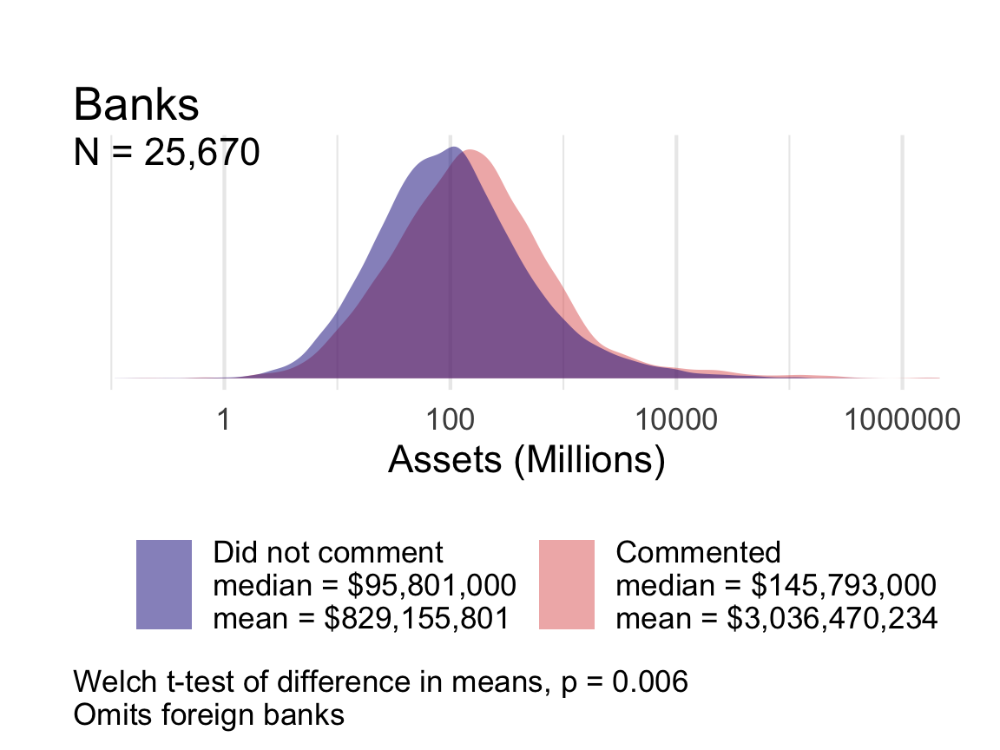
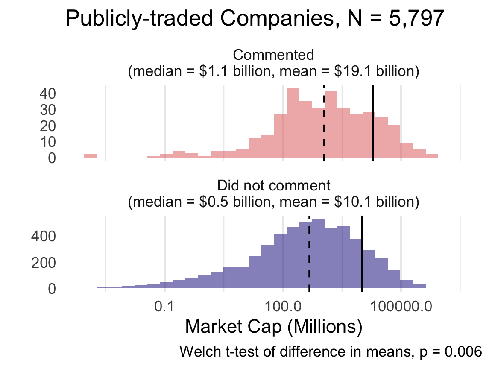

```{r libraries,echo=F,message=F,warning=F}
## Sets defaults for R chunks
knitr::opts_chunk$set(echo = FALSE, # echo = TRUE means that code will show
                      cache = TRUE,
                      #cache = TRUE,
                      warning = FALSE,
                      message = FALSE,
                      fig.show="hold",
                      fig.pos= "htbp",
                      fig.path = "figs/",
                      fig.align='center',
                      fig.cap = '   ',
                      fig.retina = 6,
                      fig.height = 3,
                      fig.width = 7,
                      out.width = "100%",
                      out.extra = "")

library(tidyverse)
library(lubridate)
library(ggthemes)
library(cowplot)
library(latex2exp)
theme_set(theme_tufte())
theme_update(plot.title = element_text(hjust=0.5,size=12))

```


# Introduction

Studies of political inequality have revealed profound and durable patterns of disproportionate influence of wealthier citizens, which @Gilens2012 calls the influence of affluence. Critical work in American politics by @Bartels2008, @Baumgartner2009, @Hacker2010, @Gilens2012, @Skocpol2004, and @Schlozman2012, among others, documents ties between economic and political inequality. Relatedly, @Piketty2014 and others in economics and the social sciences have demonstrated rising capital-based wealth inequality over the twentieth century, especially in the United States [e.g., @Saez2020]. 

<!-- These studies convey important lessons about inequality and policymaking, especially in the legislative realm of the U.S. Congress. -->

In contrast to the wealth of literature on inequality in lawmaking, however, research on inequality in administrative democracy is sparse, especially when one considers the bureaucracy’s most powerful policy tool: rulemaking [but see, e.g., @Potter2019; @Kerwin2018; @Haeder2015,@YackeeJOP2006]. Research suggests that firms spend hundreds of millions lobbying after a bill has passed, both in the legislature and in the agencies entrusted to implement the legislation [@You2017; @Libgober2020]. Legislators who receive more Corporate Political Action Committee money from companies are much more likely to lobby federal agencies on behalf of those companies [@Powell2022].
These rules are meaningful to the public, as well as to the courts. Through the writing of rules, agencies convert congressional intent into enforci policies with real human and economic effects.  Given the scale and importance of bureaucratic policymaking and the large volume of data on business and interest group participation, rulemaking presents opportunities to study inequalities in policy influence [@Carpenter2020].

*When policymaking occurs in the administrative realm, do inequalities in the legislative process persist or morph? Are they magnified or reduced?* In this expansive study of financial rulemaking, we draw upon a database of over 300,000 comments submitted to U.S. agencies tasked with implementing the Dodd-Frank Wall Street Reform and Consumer Protection Act of 2010 (hereafter Dodd-Frank). Our data cover over eight hundred regulatory actions^[We define a regulatory action as the publication of a proposed or final rule by one agency. For accounting purposes, we consider a joint rule issued by the SEC and the Federal Reserve as two regulatory actions.] such as proposed and final rules on 239 discrete rulemakings. The Dodd-Frank Act has the advantage of spurring historically abundant and significant rulemaking activity and, correspondingly, significant mobilization of interests to shape those rules. Beyond its provision of granular data, however, financial policymaking offers another reason for studying inequality - finance is perhaps an unparalleled site of interaction between economic inequality and unequal democracy. 

<!-- Financial policymaking concerns core issues of capital allocation, regulation of savings institutions, the institutions where the richest Americans invest and stow much of their wealth, and the instruments whereby middle- and lower-class Americans attempt to save, invest, and protect what they have.  -->

As an indicator of the stakes of these developments, consider how media reporting in 2017 illustrated the political priorities of those at the very upper end of the income and power scale in the United States. During that year, major newspapers documented high-level gatherings between CEOs and officials at the Trump White House. For our purposes, what's interesting about these meetings is that the existing inequality literature would likely have predicted America’s wealthiest business leaders and allocators of capital would direct their lobbying at Congress or at the president in the hope of indirectly influencing congressional lawmaking. As two former financial regulators worried aloud in this case, however, the business leaders and their lobbyists were, instead, targeting the Dodd-Frank rules being written by federal agencies. 

The idea that inequality has affected financial policymaking is far from new. Reports of CEO meetings and financial lobbying on regulatory policy issues raise important yet unanswered questions: how can we know what various interests are asking for in regulation; how can we get a handle on whether they are getting what they ask for; and how can we measure what regulation is worth to them? And, perhaps most importantly, what do answers to these questions tell us about political inequality?

We provide an answer to these questions by drawing on an original database of financial rules and comments between 2010 and 2018. Each rule implemented a component of Dodd-Frank. While our data focus squarely on financial regulation—and the interests involved with its promulgation, this research has considerable breadth. For instance, it spans the rulemaking of **INSERT NUMBER HERE** federal agencies, including independent agencies such as the U.S. Securities and Exchange Commission (SEC) and Consumer Financial Protection Bureau (CFPB), and executive branch units such as the Department of the Treasury. Overall, the data represent the most comprehensive effort to date to understand the role of inequality during financial rulemaking.

<!-- Measuring the wealth of participants in rulemaking is difficult, in part because the kinds of surveys available to @Bartels2008 and @Gilens2014 are not available for participants in rulemaking data.   -->
We note that this study has several limitiations.  First, our analyses of wealth are limited to organizations, leaving aside many individual commenters.  We find that wealthier organizations are more likely to comment (a pattern restricted to the nonprofit sphere); that conditioned on commenting, wealthier organizations offer more sophisticated comments (as detected in language); and that wealthier organizations’ comments appear to move rules more (as measured by novel text reuse algorithms [see, @Rashin2020]).

As with the inequality literature pioneered by Bartels and Gilens and others, we are not in a position to comment on the substantive merit or welfare effects of these patterns. On some issues, legislators and administrators may listen to wealthier Americans and organizations because their wealth is correlated with the expertise or value of their information [@McCarty2017; @LibgoberJOP2020]. Yet, in other cases, the disparities we document may reflect patterns where unequal levels of access to power lead to policies that favor wealthier constituents, organizations, and businesses. Our findings should be combined with observations drawn from the legislative policymaking process to provide a fuller—and more accurate picture—of how political inequality manifests across decision-making in America's key political institutions.  

# Theory

## Prior Research

The past two decades have witnessed an outpouring of social science research on inequality in the United States and other nations, with a focus on national-level policymaking. While several scholars concentrated on the structural and technological determinants of inequality [e.g., @Goldin2009; @Piketty2014], others examined the political realm itself as a place where economic inequality shapes political outcomes, which plausibly generates further economic and social inequality. 

In *Unequal Democracy*, @Bartels2008 established an important empirical case for political inequality by showing, among other findings, that legislative voting patterns in the U.S. Senate disproportionately reflect the preferences of those individuals at the highest levels of the income distribution. @Hacker2010 described a “winner-take-all politics” by which wealthier Americans improved and secured their economic prospects under both liberal and conservative political leadership while the prospects of middle- and working-class Americans stagnated. In *Affluence and Influence*, @Gilens2012 further systematized these findings on political inequality using an innovative combination of survey data and legislative voting records. A range of work following from these studies that support and refines these empirical patterns [see, e.g., @Baumgartner2009; @Winters2009; @Kelly2010; @Schlozman2012; @Page2013; @Gilens2014; @Witko2021]. These studies mark critical innovations in our understanding, not only of inequality but also of U.S. political processes themselves. 

Because important policy decisions are made in administrative agencies, however, our collective empirical portrait of political inequality in America remains sorely incomplete. Put differently, policymaking does not stop in Congress. Many critical choices are made in the executive and administrative branches, in part because the legislature delegates policymaking authority to agencies [@Epstein1999; @Huber2002; @Haeder2020], and, in part, because some agencies have acquired sufficient legitimacy and expertise as to gain deference in program initiation, interpretation and policy proposals [@Carpenter2001; @Carpenter2010]. Beyond this, it is well known that moneyed interests spend considerable resources in attempts to influence administrative and executive decision-making [@Haeder2015; @You2017]. These dynamics are often studied under the concept of regulatory capture [@Carpenter2013], yet few regulatory capture projects speak to questions of political inequality, and likewise, few studies of political inequality address issues of capture.

This is a major omission, particularly within the financial regulation space. Specifically, because financial policymaking affects the aggregation, accumulation, and disposition of wealth and income so directly, its plausible role in increasing inequality is large. Numerous experts in financial policymaking have discussed the idea that political inequality affects financial policymaking. For example, as the 2008 financial crisis unfolded, @Johnson2010 and @Kwak2013 pinpointed industry influence in financial regulation, including during the Obama Administration, as one of the main culprits of both the crisis and what they saw as the American government’s problematic response to it. In their view, the very necessity of regulators spending time with banks, combined with the status, sophistication, and resource differentials between bankers and their regulators, resulted in a convergence of the regulator’s frames, assumptions, vocabularies, and methods towards those of the regulated industry. A different literature examines financial firms’ lobbying behavior. For instance, @Igan2011 find correlations between lobbying behavior and pre- and post- financial crisis loan activity.

Other critical research sheds light on the revolving-door dynamics often present within financial regulation. This occurs when federal financial agencies hire those from the regulated sector, and/or those who work at these agencies leave to work in banks and non-bank financial firms [@Lucca2014; @DeHaan2015; @Cornaggia2016]. Many scholars have examined the development of coalitions between financial and non-financial interests [see e.g., @Young2012; @Pagliari2017; @Heilman2017; @James2021]; for example, using network analysis techniques, @Young2017 focused on past and current employment ties between select business firms and the SEC and found that greater direct and indirect ties increase the likelihood of the firm engagement with SEC policy decision-making. 

What this literature currently lacks, however, are measures of financial industry influence during one of the most important venues for political lobbying—agency rulemaking. Rulemaking is a critical—but understudied—part of the American political process. While Congress routinely passes statutes, their implementation almost always requires federal agencies, staffed primarily by civil servants, to devise legally binding standards and procedures (i.e., rules) that make the legislation practically effective. This kind of agency policymaking is pervasive; in 2018, for example, agencies finalized over 3,300 rules. 

The Administrative Procedure Act of 1946 (APA) governs the rulemaking process.  Among other provisions, the APA requires federal agencies to solicit public comments on their draft policy proposals (called Notice of Proposed Rulemakings, or proposed rules) and to consider any comments before issuing the agency’s legally binding rule (called Final Rules). Agency officials may or may not make changes to the proposed rule text based on the public comments—leaving open the possibility that the commenting process creates an avenue for unequal influence. Given the potential impact of agency-issued regulations, those individuals, firms, and other organizations most affected often attempt to influence regulatory policy content. 

Unequal levels of power and access to the government may be especially acute in financial regulation, where Congress tends to rely upon government agencies to develop key regulatory concepts and instruments, and in doing so, to carry out legislative intent. In fact, many of the most important deregulatory decisions of the past three decades in finance were made in administrative agencies, such as reductions in regulatory capital requirements and the deregulation of mortgage and other consumer loans [@Engel2011]. Even while ostensibly re-regulating the financial sector, Dodd-Frank handed considerable authority to federal financial agencies [@Carpenter2012; @Carpenter2013].  For instance, the law contains over 300 provisions authorizing agency rulemaking, and each provision could result in multiple rules [@Copeland2010]. Each rule yields a fresh opportunity for the financial industry (and others) to lobby the government agency for policy change.

The traditional literature from bureaucratic politics has often shied away from both questions of inequality of influence during rulemaking and questions of financial policymaking. An older literature by @McCubbins1987 through @Balla1998 examined rulemaking as an important venue of policymaking, often debating whether legislative institutions (i.e., Congress) could use the APA to control administrative agencies. Other high-profile research focused on the legislature’s delegation decision while largely leaving unanswered how administrative agencies respond to new grants of policymaking authority in practice [@Epstein1999; @Volden2002; @Huber2002]. Still, other work focused on the politics of agency decision-making in the areas of enforcement or permitting decisions but not rulemaking [e.g., @Wood1994]. 

These patterns shifted when scholars began placing increased attention on the role of public comments during rulemaking and attempted to correlate the requests made in comments with regulatory policy change  [@YackeeJOP2006; @YackeeJPART2006; @Yackee2012; @Yackee2015JPART; @Yackee2019; @McKay2007; @Nelson2012; @GoldenJPART1998; @WestPAR2004]. This focus led to advancements in our understanding of political inequality during the agency rulemaking process, but without a specific concentration on financial regulation.

<!-- For example, @YackeeJOP2006 asked whether business interests could, by commenting on proposed regulations, induce greater changes in proposed rules than non-business interests, and they observed that business comments better predicted subsequent changes to federal rules in their sample of transportation and labor regulations. @Haeder2015 similarly focused on political inequality in rulemaking but within the U.S. Office of Management and Budget’s (OMB) review of important agency rules. They found more regulatory policy movement occurring during OMB review when business interests dominated other types of lobbying entities. Recent work has suggested a mechanism by which traditionally disadvantaged interests may combat business bias during rulemaking: band together to lobby in diverse coalitions [@Dwidar2021PSJ; @Dwidar2021APSR]. However, these studies point to continued inequalities, including that only certain types of coalitions appear to hold policy influence over agency rules, including those that have greater financial capacity. -->

When we focus on the small subset of existing financial rulemaking studies, we uncover a more mixed portrait of the policy impact, if any, of inequality. As a result, these studies—which tend to focus on one rule or one agency—raise important questions for future scholarship.  @BanBP2019, for instance, studied lobbying and agency rulemaking on a sample of SEC rules after Dodd-Frank. They conclude that the “amount of resources” that an organization can devote to lobbying appeared to influence the likelihood that the SEC would cite the name of the organization in its Final Rule (p. 282). However, in contrast, @Rashin2020, who examined over 47,000 public comments to hundreds of recent SEC rules, found that organizational resources do not appear to be correlated with the commenter's efficacy in securing policy changes. Instead, he demonstrated that other factors, including the amount of data provided in the comment, were more closely related to regulatory modification. 

Similarly, @Krawiec2013 studied public participation patterns early in the rulemaking process in section 619 of Dodd-Frank---commonly known as the Volcker Rule. She found that comments from financial institutions and industry were often detailed, complex, and lengthy during the pre-proposal stage, while other commenters—who generally favored stricter regulation—often signed on to form comments or provided feedback that lacked the type of specificity and detail agencies needed to change policy. Yet, @Ziegler2016 reached a different conclusion. When focusing on macroprudential supervision and derivatives trading rules, they were more optimistic that non-industry group participation was actionable—and potentially influential—on Dodd-Frank regulatory content. Specifically, Ziegler and Woolley concluded that small advocacy groups tended to prevent industry domination in the financial regulation space. 

@Gordon2020 demonstrated that a diverse coalition of actors could come together to counter the role of larger and more established regulated entities—in their case, in the area of credit risk retention regulation in the post-Dodd-Frank environment. As a result, their work, like Ziegler and Woolley’s, suggested a more complicated explanation than traditional regulatory capture accounts. In doing so, it aligned with @Nixon2002 older analysis of SEC rule changes, which did not suggest a severe bias toward what they called “privileged” interests. That said, other research points to the difficulty of diverse and non-industry coalitions coming together. @Pagliari2017, for instance, found that such coalitions may not form with great frequency in the financial sector; their research demonstrated that the voices outside the affected firms were less likely to mobilize, especially when the regulation is technically complex.

In sum, the existing literature yields mixed results on the question of political inequality and thereby leaves open critical questions about the plausible effects of firm behavior upon regulatory policymaking in the financial regulation space. 

## Hypotheses

Overall, our theory leads us to anticipate that among both for-profit and nonprofit organizations, wealthier entities will comment more often, with greater sophistication and with greater influence. These intuitions yield several hypotheses:

<!-- Our theory leads to expectations about variation within the population of organizations that comment on proposed policies.  -->

**H1. Differential Participation** We theorize that larger and wealthier financial sector interests will participate in financial rulemaking more frequently than consumer protection, labor, public interest, and smaller financial groups. Differential levels of participation may be a result of legal and technical complexity of rulemaking processes, which create financial barriers to participation. This is important because unequal levels of participation could lead to unequal influence. Regardless of whether some organizations are more influential than others *when they participate*, differential commenting behavior alone could lead some organizations to be more influential than others, simply by showing up.
Specific, testable assertions include: 

> *H1* Overall, organizations that comment on more rules will be wealthier than organizations that comment on fewer rules.

> *H1.1* Nonprofits with more assets will comment more frequently than nonprofits with fewer assets.

>  *H1.2* Among nonprofits that participate in financial rulemaking, nonprofits with more assets will comment on more proposed rules.

>  *H1.3* Firms with more assets will comment more frequently than firms with fewer assets.

> *H1.4* Among firms that participate in financial rulemaking, firms with more assets will comment on more proposed rules.

### Differential Sophistication and Mobilization of Expertise

Theories about mechanisms of lobbying influence suggest that wealthier organizations are better able to deploy sophisticated legal arguments and technical information [@WagnerALR2011]. We thus expect wealthier entities will utilize greater expertise and sophistication in their comments. <!--Large financial firms and bank-holding companies will comment separately (and in addition) to trade associations and other nonprofits. <!-- when the stakes are larger and when rules have larger distributive effects. When they do so, their comments will differ from their trade associations’ comments in observable ways.--> Large financial firms will marshal legal and technical expertise disproportionately to write complex and sophisticated comments to rules in which they are interested. We expect them to be more highly sophisticated, reflecting greater legal expertise, and more technically supported. Large financial firms may also marshal different mixtures of lobbyists and legal experts in their comments, drawing upon ties to lobbying firms and to other financial institutions.

Our second hypothesis poses testable assertions about the strategies of commenting upon which different organizations rely: 

> *H2.* Organizations with more resources will use more technical and legal language when commenting on proposed rules.

<!-- TODO BREAK OUT TEXT REUSE FINDINGS BY ORG TYPE 

- H2.1 Firms with greater assets will use more legal language.

- H2.2 Firms with greater assets will use more technical language in their comments.

- H2.3 Nonprofits with greater resources will use more legal language.

- H2.4 Nonprofits with greater resources will use more technical language in their comments.-->

### Differential Commenting Influence

Our third hypothesis extends existing research to the financial regulation arena. One expectation from @YackeeJOP2006 and related work is that industry comments, in general, will move rules more than non-industry comments. Yet because any industry, not least the financial industry, is composed of companies smaller and larger, as well as wealthier and poorer, we seek to understand whether larger and wealthier firms have more commenting influence than do smaller firms. In general, we anticipate that wealthier organizations are more influential.

> *H.3*: More influential comments tend to come from wealthier organizations.  

> *H3.1*: The comments that suggest language identical to language added to the final rule will more often come from organizations that are wealthier compared to the organizations that submitted comments that are less aligned with the changes made to rules.

### The Dividends of Sophistication

Finally, we link the second and third hypothesis to make testable claims about legal and technical sophistication as a mechanism of influence. We theorize that organizations with more resources are more influential *because* they have the capacity to produce more sophisticated comments and that more sophisticated comments are more influential. 

> *H4*. The language suggested by comments with more legal and technical language will be more likely to appear in text added between draft and final rules. 


Together, these hypothesis are designed to test for two major kinds of potential bias in modering U.S. policymaking: that weathy are better able to particpate, and even when less wealthy groups participate, the wealthy are more influential. Additionally, they test a major theorized mechanism of lobbying influence: the ability of the wealthy to mobilize lawyers and experts to make sophisticated and thus influential arguments on their behalf.

# Data

```{r}
wide =  read.csv( here::here("data", "pivot_example.csv") )

long = read.csv( here::here("data", "actions.csv") )

long %<>% 
  mutate(year = publication_date %>% str_sub(1,4),
         Stage = stage  %>% 
           str_replace("ANPR", "Advance NRPM (ANPRM)") %>% 
           str_replace("^FINAL", "Final Rule") %>% 
           str_replace("GUIDANCE", "Guidance") %>% 
           str_replace("INTERIM-FINAL", "Interim Final Rule") %>% 
           str_replace("^NPR", "Notice of Proposed\nRulemaking (NPRM)")) %>% 
    group_by(agency_acronym) %>%
  add_count(name = "agency_total") %>% 
  ungroup()
```              

To assess the extent of inequality in rulemaking implementing the Dodd-Frank Act, we assembled data from the Federal Register, Regulations.gov, Wharton Research Data Services (WRDS), the Internal Revenue Service (IRS), the Consumer Financial Protection Bureau (CFPB), Commodity Futures Trading Commission (CFTC), Federal Reserve (FRS), National Credit Union Administration (NCUA), and the Securities and Exchange Commission (SEC). **CHECK THIS LIST WHEN WE'RE DONE**.  The expansive data collection effort includes data on comment texts and metadata, Dodd-Frank metadata, agency metadata, and data on for-profit and non-profit organizations.  We define our sampling frame as rules promulgated under the Dodd-Frank Act, as defined by the law firm Davis Polk LLP, which maintained a regulatory tracker for such actions.  We used Davis Polk's tracker as it was the most complete source of regulatory actions under the Dodd-Frank Act. This tracker was scraped throughout 2017 and early 2018 while we collected other data about these rules, most importantly tracking down the web location of dockets and their rule texts. Our final set of rules covers the set of Dodd-Frank rules after enactment on July 20, 2010, and before July 8, 2018. 

<!-- the date when our outside data collection reached currency with Davis Polk's tracker. -->

## Rules

Rulemaking involves a series of related regulatory actions. Figure \ref{fig:actions} shows policy the number of actions that key agencies took to implement the Dodd-Frank Act from 2009 to 2018. These actions include advance notices of proposed rulemaking (ANPRMs), proposed rules (NPRMs), interim rules, final rules, and others. Multiple of each kind of action may appear in some rulemakings, but none necessarily appears in any rulemaking. The range of possible action sequences creates semantic challenges for social scientists. Defining operationally how many rules were made or in the making by financial regulators sometimes requires complex choices.  In our study, we define a "rulemaking" (or "rule") as a set of regulatory actions that are connected via shared Regulation Identifier Number (RIN).^[RINs are assigned by OIRA to (almost) all actions by each agency and are usually preserved through rulemaking. We consider two RINs to be "directly connected" if there is a regulatory action (i.e., a document like a proposed rule) where those RINs appear together. Two RINs are "indirectly connected" or more simply "connected" if there is a way to start from one RIN and go from direct connection to direct connection and eventually arrive at the other RIN.] Using this definition, we found that between 2010 and July 8, 2018, there were 239 rulemakings by 21 regulators involving 802 regulatory actions. Some agencies, like the Department of Veterans Affairs, were not involved in more than a small number of rules. When they were, they usually engaged in a collaborative fashion with other agencies. Therefore, for the purposes of collecting data on comments, we focused our attention on the primary financial regulators: the Federal Reserve, the Consumer Financial Protection Bureau, the Securities and Exchange Commission, the Commodity Futures Trading Commission, and the National Credit Union Administration **CHECK THIS LIST**. <!-- the Federal Deposit Insurance Corporation, and the Office of the Comptroller of the Currency.
--REMOVED THESE LAST TWO BECAUSE WE CURRENTLY HAVE NO DATA FOR FDIC OR OCC (DEVIN HAS OCC DATA, BUT WE NEVER INTEGRATED IT, NOT SURE ABOUT FDIC)--> 
For each Dodd-Frank rulemaking that reached the stage of a proposed or final rule, we collected draft and final policies from the Federal Register.


```{r actions, fig.width=7, fig.height=4, out.width="100%", fig.cap= "Dodd-Frank Act Implimenting Actions by Agency, Including the Consumer Financial Protection Bureau (CFPB), Commodity Futures Trading Commission (CFTC), Federal Reserve (FRS), National Credit Union Administration (NCUA), and Securities and Exchange Commission (SEC)", cache=FALSE}
long %>% 
  filter(!is.na(stage), stage != "Unclassified", agency_total>9) %>% 
  count(year, agency_acronym, Stage) %>% 
  ggplot() +
  aes(y = n, x = year, fill = Stage) %>% 
  geom_col(alpha = .8) + 
  facet_wrap("agency_acronym") +
  scale_fill_viridis_d() +
  labs(fill = "Document Type",
       x = "", 
       y = "") + 
  theme_minimal() +
  theme(axis.text.x = element_text(hjust = .7, angle = 60),
        panel.grid.major.x = element_blank(),
        panel.grid.minor.x = element_blank())
```

## Comments

The authors and research assistants scraped all available public comments from each financial regulator's website or regulations.gov for all Dodd-Frank rules. In doing so, we collected key metadata include the name of the individual and organization submitting comments and the date of their submission. We used the open-source software tesseract to OCR comments that were not machine-readable on the Open Science Grid computing cluster.  Comments are posted on agency websites and regulations.gov as either open text boxes or attachments.  We collected collected **NUMBER** open text responses and **NUMBER** comments.  Comments are not distributed uniformly across rules or agencies; for example, our sample included **NUMBER** comments from the CFPB and **SMALLER NUMBER** from **SMALLEST AGENCY**.   

<!-- *Do we want to add some information about the total number of comments we have per agency or wait until the figs showing the number of comments that are matched to a dataset.*-->

We then collected data about the relative resources of potential participants in rulemaking and matched these data to organizations that submitted comments. Given the varied types of organizations that participate in rulemaking (including small nonprofits and large corporations), no single database contains data on the resources available to all types of participants. However, we were able to systematically collect data on organizational resources for particular types of organizations. 

Following @LibgoberQJPS2020, we collect information on public companies listed on U.S. exchanges during this time period and gather commonly reported financial data, for example, market capitalization from the Federal Deposit Insurance Corporation (FDIC). The primary source for these data are various databases from Wharton Research Data Service, especially their Compustat and bank regulatory datasets. From the Compustat data, we selected a key measure of corporate size: the firm's total assets, which represents a company’s reported assets and liabilities.
For bank and bank-like entities that report to the Federal Financial Institutions Examinations Council (FFIEC), we also collected a measure of their total assets under management from call reports. <!--TODO from *XXXXX*. -->

To capture the resources of nonprofit organizations that do and do not engage in financial rulemaking, we download all Internal Revenue Service (IRS) reports from nonprofits from 2012. 
We also collect data on Political Action Committee (PAC) donations and lobbying expenses from companies profiled by the Center for Responsive Politics using the Center's bulk data files. <!--TODO CLARIFY CRP VARIABLE USED--> 

Finally, we use a probabilistic matching algorithm to match comments to organizations in these databases as the names which organizations use to submit comments and the names by which they appear in datasets like Compustat are often different. To do this, we identified comments that were likely from an organization, excluding those that were likely from an individual or public pressure campaign ("mass comments"). Each of the remaining comments was then linked to the organization with the best matching name (or no organization, where the matching algorithm did not identify any high-probability match in any of the datasets discussed above). The vast majority of comments that we did not match to an organization were submitted by individuals and thus beyond the scope of this study.  

Our main dataset includes all comments that matched to either an FDIC-insured bank, a bank or bank-like entity that reports to the FFIEC, an organization that reports to the SEC (i.e. a publicly traded company), additional companies that appear in the Compustat database, and or an IRS compliant nonprofit organization. To some degree, these categories may overlap. For example, some, but not all, banks are publicly traded. <!--Credit unions are a class of nonprofits that also report to the FFIEC.--> At the same time, each data source delimits a category of related entities that plausibly constitutes a sampling frame for making relevant comparisons.

This new dataset includes financial data on over 6,378 distinct organizations that submitted 27,601 unique comments on the Dodd-Frank rules in our database. 
<!--Correct as of May 2022--> 

## Types of Organizations

```{r org-types, fig.cap="Number of Organizations by Type and Agency to which they Commented, Including the Consumer Financial Protection Bureau (CFPB), Commodity Futures Trading Commission (CFTC), Federal Reserve (FRS), National Credit Union Administration (NCUA), and Securities and Exchange Commission (SEC)", out.width = "80%"}
knitr::include_graphics("figs/org_count_type-2.png")
```

Each database contains qualitatively different types of organizations; we can compare patterns of commenting within each type and across types. The remainder of this section describes the distribution of these data, which are not equally distributed across agencies, rules, and commenter types.  Figure \ref{fig:org-types} shows the number of unique commenting organizations matched to each database by the agency or agencies to which they submitted comments. Across all agencies except for the Federal Reserve (FRS), the majority of commenting organizations are nonprofits. The next most common federally-insured (FDIC) banks. Organizations that report to the SEC (CIK) and donors to PACs were less common. 


```{r comment-types, fig.cap="Number of Comments by Authoring Organization Type and Agency, Including the Consumer Financial Protection Bureau (CFPB), Commodity Futures Trading Commission (CFTC), Federal Reserve (FRS), National Credit Union Administration (NCUA), and Securities and Exchange Commission (SEC)", out.width="80%"}
# NOTE: Devin will revise these figs to be more clear in the legend about what is in each of these databases. We should do this for all figs so that they can stand on their own. 

knitr::include_graphics("figs/org_count_type-1.png")
```

Figure \ref{fig:comment-types} shows the number of comments submitted to each agency by an organization matched to each database described above.

## Measuring Comment Sophistication and Influence

We measure comment sophistication by counting the financial and legal terms in each comment.  We argue that, on average, more sophisticated commenters will use more legal and finance terms in their arguments.^[Note that we're making no assumptions on how well an organization uses these terms.  A commenter using ten terms incorrectly will have the same score as a commenter using the same terms in the correct context.]  For finance terms we use the [Oxford Dictionary of Finance and Banking](https://www.oxfordreference.com/view/10.1093/acref/9780199664931.001.0001/acref-9780199664931).  For law, we use the [Merriam Webster law dictionary](https://www.merriam-webster.com/browse/legal/).  ^[While Black's is a more common law dictionary, a complete version is not available online.]  As there are terms with both financial and legal meaning (e.g., consideration, immunization, underwrite, etc...) and we do not want to double count overlapping terms, we calculate the sophistication of each comment by summing the legal and financial terms and then subtracting the subset of those that appear in both dictionaries ^[For example, a comment may have 20 banking terms and 15 legal terms.  If 5 of these are in both dictionaries, then the comment should have 30 banking and finance terms instead of 35.]

We assess influence by measuring the overlap in language between comments and final rules excluding the text of the proposed rule.^[We exclude the text of the proposed rule so that if someone cited the proposed rule they would not score highly on an influence measure.  Formally, we do this by tokenizing the proposed and final rules by sentence and keeping only full sentences in the final rule that were not in the proposed rule.]  We argue that organizations whose language is cited more often are more influential than organizations whose language is cited less often.  To construct the measure we first link proposed rules to final rules by their RINs and docket numbers - internal agency identifiers that uniquely identify rulemaking sequences - where RINs are not available.  We tokenize each rule and comment in groups of ten words and take the total number of words in the overlap as the measure of comment influence on a final rule.  For rules with more than one proposed rule, we match comments to proposed rules by publication date; that is, if a comment comes after the publication of a second proposed rule it is assumed to be on the second proposed rule.  For rules with multiple final rules, we take the sum of the rules influence on both final rules.  When an organization submits a comment with multiple attachments, we include only the highest scoring document as the primary comment.^[We do this as organizations that submit multiple attachments often have one primary comment and a bunch of supporting material.  We are only interested in the effect of the comment, not the supporting material.]

# Results

We test our hypotheses about wealth and access to the policy process using two broad sets of comparisons. First, we compare organizations that did and did not comment on Dodd-Frank rules. 
Because our data included data on a full population of similar organizations that could submit comments (e.g., all FDIC-insured banks and all tax-exempt nonprofits), only some of which submitted comments, we are able to compare commenters to similar organizations that did comment (e.g., FDIC-insured banks that did and did not comment). Second, we assess our hypotheses within the population of organizations that did comment. These analyses give us even more certainty that we are comparing similar organizations with similar interests---all commented on at least one Dodd-Frank rule, but some commented more frequently, with more sophisticated language, and addressed comments to more agencies than others. Moreover, phrases from the texts of some comments are much more likely to be added to final rules than others. We explore whether each of these types of variation is related to wealth.

## Variation Across Commenters and Non-Commenters

First, we compare levels of resources among commenting organizations and similar organizations that did not comment. 

### Commenting organizations are wealthier than non-commenters


```{r, commenters-noncommenters, fig.cap="Financial Resources of Organizations that Did and Did Not Comment", out.width= "49%"}
knitr::include_graphics("figs/nonprofit-density-1.png")

knitr::include_graphics("figs/creditunion-density-1.png")

knitr::include_graphics("figs/compustat-density-1.png")


```


Figure \ref{fig:commenters-noncommenters} shows the distribution (on a log scale) of organizations' financial resources for commenting organizations that matched in our comment database compared to other, similar organizations. 
<!--NONPROFITS-->
The top left panel in Figure \ref{fig:commenters-noncommenters} shows that nonprofits that comment on proposed financial regulations tend to be significantly better-resourced than we would expect from a random sample of nonprofits. The average nonprofit that did not comment has about \$7.5 million in assets, whereas the average nonprofit that did comment has \$74.1 million in assets. The average assets of commenting nonprofits was ten times larger than nonprofits that did not participate. This supports the *Differential Participation* Hypothesis (H1), specifically H1.1.
<!--CREDIT UNIONS  -->
Similarly, the top right panel in Figure \ref{fig:commenters-noncommenters} shows that credit unions that comment on proposed financial regulations also tend to be significantly better-resourced than we would expect from a random sample of credit unions. The average nonprofit that did not comment has about \$19.5 million in assets, whereas the average credit union that did comment has \$108.6 million in assets. The average commenting credit union is five times larger than the average credit union that did not comment. This also supports the *Differential Participation* Hypothesis (H1), specifically H1.1.

<!--MARKT CAP--> 
The bottom left panel in Figure \ref{fig:commenters-noncommenters} shows the same distributions for banks and bank-like entities that file with the Securities and Exchange Commission. The banks that comment on proposed financial regulations are better-resourced than we would expect from a random sample of these organizations. Specifically, they have more capital, as measured by the the totall value of their stock. <!--MORE ON THIS? --> 

<!--FDIC--> 
In contrast, the bottom right panel in Figure \ref{fig:commenters-noncommenters} shows that, on average, large (FDIC-insured) banks that comment on proposed financial regulations are not significantly better-resourced, on average, than we would expect from a random sample of large banks. The x-axis shows assets in the (in thousdands of dollars). <!-- FIXME TODO CHECK THAT JACOB DIVIDED BY 100 (IDEALLY RE-DO THIS FIGURE) -->
At first glance, this does not support the *Differential Participation* Hypothesis (H1), specifically H1.3.
<!--However, the population of large banks that did comment is more likely to contain very large banks (those with over $100,000,000 in assets) than the population that did not comment.   -->
However, when we look within categories of banks, we see that it is the wealthier banks in each class are more likely to participate. The top-left panel of Figure \ref{fig:FDIC-count-by-class} shows that Commercial banks that comment are wealther than those that did not comment. The top-right panel of Figure \ref{fig:FDIC-count-by-class} shows that Savings Banks banks that comment are wealthier than those that did not comment. The modal savings bank that commented has nearly twice the assets of the modal savings bank that did not comment. The bottom-left panel of Figure \ref{fig:FDIC-count-by-class} shows that state banks banks that comment are wealthier than those that did not comment. The average assets of state banks that commented were three times the average assets of the state banks that did not comment. While savings associations are less likely to comment than more profit-oriented banks (see Figure \ref{fig:mpFDIC}), the bottom-right panel of Figure \ref{fig:FDIC-count-by-class} shows that when savings associations do comment, it tends to be the wealthier ones. 

```{r, FDIC-count-by-class, fig.cap="Financial Resources of FDIC-Insured Banks that Did and Did Not Comment", out.width= "49%"}
knitr::include_graphics("figs/FDIC-count-by-class-1.png")

knitr::include_graphics("figs/FDIC-count-by-class-2.png")

knitr::include_graphics("figs/FDIC-count-by-class-3.png")

knitr::include_graphics("figs/FDIC-count-by-class-4.png")

```

<!-- FDIC REGRESSION--> 
Moreover, when we assess the odds of commenting among different types of FDIC banks,  we find find that Commercial Banks, State Banks, and Savings Banks are much more likely to comment than Saving Associations. Commercial banks are often large multinational corporations managed by a board selected by shareholders. In contrast Savings Associations are chartered with the narrow purpose of providing affordable residential mortgages. While both types of banks may hold large volumes of assets, Banks and Savings Associations serve different clients. Figure \ref{fig:mpFDIC} shows that banks that serve corporations and wealthier clients were disproportionately represented in Dodd-Frank rulemaking, and that savings associations were less represented. This supports the *Differential Participation* Hypothesis (H1), specifically H1.3.

```{r, mpFDIC, fig.cap= "Log Odds of Participating in Dodd-Frank Rulemaking by Type of FDIC-Insured Bank", out.width="80%"}
#TODO Make predicted probablity plots showing that all kinds of banks are more likley to comment when wealthier
knitr::include_graphics(
"figs/mpFDIC-1.png")
```


### Wealthier organizations are more likely to participate


```{r mp-assets, fig.cap= "Log Odds of Participating in Dodd-Frank Rulemaking by Assets", out.width="80%"}
knitr::include_graphics(
"figs/mp-nonprofit-credit-unions-1.png")
```


Figure \ref{fig:mp-assets} shows the results of three logit models predicting the log odds of commenting on a Dodd-Frank rules by assets for FDIC-Insured banks, credit unions, and nonprofits. Aligned with descriptive results above, wealthier organizations of all three types are more likely to comment. Of these three types of organizations, the marginal effect of assets on the log odds of commenting is largest for banks. 

<!-- TODO ADD MARKET CAP RESULTS AFTER WE NAIL DOWN THOSE DATA
```{r mp-marketcap, fig.cap= "Log Odds of Participating in Dodd-Frank Rulemaking by Market Capitalization", out.width="80%"}
knitr::include_graphics(
"figs/mp-compustat-1.png")
```

Similarly \ref(fig:mp-marketcap) shows the results of three logit models predicting the log odds of commenting on a Dodd-Frank rules by market capitalization (the total value of stock).
-->


### Organizations that make larger campaign donations are more likely to comment


```{r opensecrets-density, fig.cap= "Campaign Spending of Organizations that Did and Did Not Comment", out.width="49%"}
knitr::include_graphics(
"figs/opensecrets-count-1.png")
```

Figure \ref{fig:opensecrets-density} shows that organizations profiled by the Center for Responsive Politics (generally, those that donate to Political Action Committees) that comment on Dodd-Frank rules are better-resourced than we would expect from a random sample of political donor organizations. <!--The left panel of Figure \ref{fig:opensecrets-density} shows the average campaign contiributions and the right panel shows the total contributions for the period where Dodd-Frank rules were initially drafted between 2010 and 2017.   <!--Whereas the average non-commenting donor has assets of about XXXXX.--> This aligns with the *Differential Participation* Hypothesis (H1), specifically H1.3. The average campaign spending per 2-year cycle was \$80 thousand for donors organizations that did not comment, and the average for a donor organization that did comment on a Dodd-Frank rule was \$96 thousand. <!--DEVIN UPDATED THESE NUMBERS MAY 2022, BUT WE MAY NEE TO REVIZE THESE NUMBERS WITH NEW DATA--> 


The main takeaway from this analysis is that resources are correlated with the commenting behavior of nonprofits. That is, wealthy nonprofits are represented more than less wealthy nonprofits. In general, companies with high market capitalization are represented better than companies with lower market capitalization. Additionally, campaign donations are correlated with commenting on Dodd-Frank rules.

## Variation Within Commenting Organizations

### Repeat players in commenting are substantially wealthier

```{r, dockets-percentile, fig.cap="Frequent and infrequent commenters (By Percentile of the Number of Dockets on which the Organization Commented) by Resources (Log Scale)", out.width="80%"}
#TODO DEVIN REMAKE THIS PLOT FOR NUMBER OF DOCKETS AND ADD IT HERE: https://judgelord.github.io/finreg/participation#Among_firms_that_commented_on_a_Dodd-Frank_rule
knitr::include_graphics(
"figs/ridgeline_plot_of_financialResources_by_Quantiles_of_numRulesCommentedOn.png"
)
```

Figure \ref{fig:dockets-percentile} shows that organizations that comment on more rulemaking dockets tend to be wealthier.^[
Note that this does not necessarily imply that wealthier organizations submit more comments. Many wealthy organizations only submit one comment on a docket, where other organizations may submit many comments on the same rule. For example, Axcess Financial (a payday lending company) and Advance Financial (a credit union) both mobilized over 1000 comments from their stores on the Consumer Financial Protection Bureau's Payday Loan Rule. These are not the wealthiest organizations.]  <!--(see Figure \ref{fig:ridgeline_plot_of_numRulesCommentedOn_by_Quantiles_of_financialResources.png} in the appendix)]--> 
More specifically, it shows that organizations that comment infrequently are more likely to have less financial resources (less than a million dollars in assets). In contrast, the top five percent of the most frequent commenters tend to have well over ten million dollars in assets. Organizations in the top percentile of most frequent commenters have assets closer to 100 million dollars on average. A substantial share of organizations that are in the top ten percent of most frequent commenters have over $10 billion in assets, while only a tiny share bottom fifty percent of commenters have that level of wealth. In line with Hypothesis 2.5, frequent commenters tend to be wealthy organizations.


### Wealthier organizations are more sophisticated at lobbying

<!-- TODO I think we still need a figure showing the correlation between assets and sophistication? -->

Wealthier organizations generally advance more sophisticated comments. 
<!--Figure \ref{fig:assets-bluebook} shows that comments from wealthier organizations tend to include more legal citations. DEVIN WAS UNABLE TO MERGE THESE DATA  -->
Figure \ref{fig:assets-terms} shows that comments from wealthier organizations tend to include more technical language. Specifically, it shows that FDIC-insured banks with more assets use more legal and banking terms. Similarly, Figure \ref{fig:marketcap-terms} shows that a company's comment uses four additional terms, on average, for every additional billion dollars in market capitalization. Both of these patterns align with the *Mobilization of Expertise* Hypothesis (H2) that better resourced companies will utilize greater technical and legal expertise. 

```{r assets-terms, out.width="50%",  fig.cap="Amount of Legal and Technical Language by Assets (Among Comments from FDIC-Insured Banks on Dodd-Frank Rules)"}
knitr::include_graphics("figs/assets-tech-1.png")
```


```{r marketcap-terms, out.width="80%",  fig.cap="Amount of Legal and Technical Language by Market Capitialzation (Among Comments  on Dodd-Frank Rules)"}
knitr::include_graphics("figs/mt-2.png")
```


<!--However, the disparities emerge differently for nonprofits and for-profits. TODO CLARIFY-->


### Wealthier commenters are more influential 

```{r repeated-text-assets, fig.cap="Amount of Text Repeated in Final Rules by Commenter Resources"}
#TODO Would be better to this not broken out by agency for the body text.
knitr::include_graphics("figs/Repeated_text_agency_assets_cumulative_over10.pdf")
```

Our measure of comment influence increases with the wealth of the commenting organization. Figure \ref{fig:repeated-text-assets} shows the number of words that appear in 10-word phrases in both a comment and the final rule but were not present in the draft rule. This measure captures the extent to which text added to final policy documents contains exact phrases used or suggested by a particular commenter. While this does not necessarily represent a causal relationship (for example, both the commenter and regulator may have copied the phrase from a third source), it shows the alignment of specific comments and policy changes. Ten-word phrases are long enough that they rarely co-occur by chance and are thus a well-validated measure of textual similarity [@Wilkerson2015; @Casas2019; @JudgeLord2017; @Rashin2019]. The strong positive correlation between an organization's wealth and its comment's similarity to text added to the final rule aligns with the *Differential Commenting Influence* Hypothesis (H3).

<!-- TEXT REUSE REGRESSION
```{r child = here::here("Tables/efficacy_and_resources.txt")}
```
-->

### More sophisticated comments are more influential 

```{r repeated-text-bluebook, fig.cap="Amount of Text Repeated in Final Rules by Comment Sophistication"}
#TODO Would be better to have this not be broken out by agency for the body text.

# dictionary words
knitr::include_graphics("figs/Repeated_text_agency_dictionary_cumulative_over10.pdf")

# bluebook words 
knitr::include_graphics("figs/Repeated_text_agency_bluebook_cumulative_over10.pdf")
```

To investigate our proposed mechanism for unequal influence, we assess the relationship between legal and technical sophistication and policy influence. 
Figure \ref{fig:repeated-text-bluebook} shows that comments that use more sophisticated legal and technical language are more likely to contain phrases that were added to the final rule. This aligns with the *Dividends of Sophistication* Hypothesis (H4). We measure the sophistication of comments in two ways and observe similar results. The top panel of Figure \ref{fig:repeated-text-bluebook} shows a positive correlation between the number of legal and banking terms and the amount of text a comment shares with the final rule. To capture sophistication with respect to the use of finance and banking jargon, we use the Oxford Dictionary of Finance and Banking, which includes 5260 finance and banking terms. To capture sophistication with respect to legal jargon, we use the Merriam-Webster law dictionary, which includes 10,172 legal terms. 

To be clear, these relationships do not necessarily imply a causal relationship between sophistication and policy influence. The processes that lead commenters to include particular phrases in comments may be endogenous to policy outcomes. For example, because comments are explicitly responding to proposed policy texts, they often reference phrases and ideas that are already under consideration. 

In dealing with endogeneity, one methodological choice merits elaboration: we chose to exclude text from the proposed rule when measuring influence but not when measuring sophistication. This choice rests on the underlying concepts we are attempting to measure. In measuring text reuse, we aim to capture ideas that are not yet in the policy. Thus, text copied from the agency's proposal must be excluded. Indeed text that appears in both the draft and final rule is precisely what did *not* change. If a commenter attached a marked-up version of the proposed rule, we aim to exclude all but their suggested changes. 

In contrast, in measuring sophistication, we aim to assess the extent to which the commenter is utilizing expertise to engage in legal and technical policy debates. Here, when attaching a marked-up version of the proposed rule does capture the underlying concept of sophistication. Thus, our counts of legal and banking terms and bluebook citations do not exclude the text of the draft rule. Even if they are the agency's own terms and citations, engaging with the agency's texts indicates sophistication. For example, the comment with by the most bluebook/legal terms from an FDIC-insured bank contained a 4-page comment and 112 pages of attachments, 105 pages of which were the full proposed rule. These 105 pages were excluded from our measure of text reuse but included in the count of legal and banking terms.


<!--TODO Assess sophistication as a mediator between assets and text reuse
--> 
# Conclusion

By combining multiple methods and sources of data, this paper offers a new and systematic perspective on inequality in bureaucratic policymaking. Our systematic approach, covering all rules across multiple agencies implementing the same landmark piece of legislation (the Dodd-Frank Act) and rich data on multiple kinds of participants, allows unique comparisons within and across agencies and types of organizations. This new dataset allows us to assess the relative level of access and influence that different types of organizations enjoy across policymaking institutions.

We have shown that commenting is disproportionately concentrated among wealthier nonprofits but not wealthier for-profits. One possible explanation for this finding is that all large banks have the basic resources to engage in policymaking when it fits their interests. In contrast, many nonprofits do not have the baseline level of resources to engage in sophisticated lobbying. An alternative explanation may lie in the correlation between nonprofit wealth and issue area. It is possible that nonprofits that work on financial regulation are wealthier, on average, than other nonprofits. Further research could dig deeper into the resource constraints among nonprofits and compare the wealth of nonprofits that focus on financial issues to others in order to assess these competing hypotheses. Both explanations (that nonprofits lack resources to participate or that finance-focused nonprofits are wealthier) have implications for the American political economy and representation. 

Our finding that wealthier organizations generally advance more sophisticated comments suggests that wealth is correlated with exactly the kind of lobbying behavior that past studies have found to be most influential. Sophisticated and technical lobbying strategies are effective. Indeed this has been a common explanation for why businesses enjoy unique levels of access and influence in agency rulemaking [@YackeeJOP2006]. Our results lend support to this theory. Where previous studies generally assume that businesses are wealthier, we show not only that businesses are wealthier, but that within and across types of organizations---including businesses---organizations with more engage in more sophisticated and technical lobbying efforts.
<!--Again, disparities emerge differently for nonprofits and for-profits), ???-->

Finally, we have shown that wealth is also positively correlated with the best available quantitative measures of commenter influence. Given previous research and our analysis into commenter sophistication, this finding may not be surprising, but the magnitude of these relationships have implications for future research and policy reforms. 

# Appendix {-}

> Do we prefer this to the density plots? 

```{r, commenters-noncommenters-counts, fig.cap="Financial Resources of Organizations that Did and Did Not Comment", out.width= "49%"}
knitr::include_graphics("figs/nonprofit-count-1.png")

knitr::include_graphics("figs/creditunion-count-1.png")



knitr::include_graphics("figs/FDIC-count-select-1.png")
```

## Data Sources

Data for this project came from the following sources:

 - Nonprofit assets and revenue from 990 data from https://www.irs.gov/charities-non-profits/form-990-series-downloads
 
 - FDIC assets (ASSET) and bank class (BKCLASS): https://banks.data.fdic.gov/docs/

  - Credit unions Total Assets scraped from consolidated call report files scraped from https://www.ncua.gov/analysis/credit-union-corporate-call-report-data 

  - Campaign donations (MeanContribAmount and MeanContribAmount) from https://www.opensecrets.org/

  - Market capitalization (marketcap) from CRSP via WRDS: https://wrds-www.wharton.upenn.edu/pages/about/data-vendors/center-for-research-in-security-prices-crsp/
  
  - SEC’s CIK database Compustat: https://wrds-www.wharton.upenn.edu/pages/get-data/compustat-capital-iq-standard-poors/

<!--
THE APPENDIX DRAFT BELOW NEEDS TO BE PUT IN PLAIN LANGUAGE, BUT IT SHOULD KNIT IF YOU WANT TO SEE THE FIGURES. WE MAY NOT WANT ALL OF THEM, EVEN IN THE APPENDIX-->

<!--

```{r ridgeline_plot_of_numRulesCommentedOn_by_Quantiles_of_financialResources, fig.cap="", eval =FALSE}
knitr::include_graphics(
"figs/ridgeline_plot_of_numRulesCommentedOn_by_Quantiles_of_financialResources.png"
)
```

This shows that as we look at organizations with more and more financial resources, the organizations tend to comment on more and more rules, though moderate-level wealth organizations (Q75-90) often comment on more rules than high-level wealth organizations (Q90-95), so this relationship isn't as clean as the one in ridgeline_plot_of_financialResources_by_Quantiles_of_numRulesCommentedOn.png until we get to the 'tip top' of the resource distribution. Note: I wouldn't be surprised if some of the messiness in this graph is coming from the fact that we may not have comparable measures of financial resources across organization types.

```{r, fig.cap="", eval =FALSE}
knitr::include_graphics(
"figs/ridgeline_plot_of_financialResources_by_Quantiles_of_venueBreadth.png"
)
```

This shows that as an organization participates in more and more regulatory agencies' notice and comment processes, it tends to be increasingly well-resourced. Note: The Q0-50 and Q50-75 rows are missing because many organizations (>75%) participate in only one agency's notice and comment process. Likewise, the Q90-95 row is missing because many organizations (>5%, the size of the Q90-95 bucket) participate in only two agencies' notice and comment processes.

```{r, fig.cap="", eval =FALSE}
knitr::include_graphics(
"figs/ridgeline_plot_of_numRulesCommentedOn_by_Quantiles_of_venueBreadth.png"
)
```

This shows that as an organization participates in more and more regulatory agencies' notice and comment processes, it tends to also submit comments on more and more rules. Two Notes: (1) this may in part be a mechanical effect since commenting in two agencies' processes may often entail commenting on at least two rules. (2) the Q0-50 and Q50-75 rows are missing because many organizations (>75%) only participate in only one agency's notice and comment process. Likewise, the Q90-95 row is missing because many organizations (>5%, the size of the Q90-95 bucket) participate in only two agencies' notice and comment processes.

```{r, fig.cap="", eval =FALSE}
knitr::include_graphics(
"figs/ridgeline_plot_of_venueBreadth_by_Quantiles_of_financialResources.png"
)
```

This shows that as we look at organizations with more and more financial resources, the organizations tend to participate in more agencies' notice and comment processes (the distribution gets 'flatter' moving up the graph). Note: the package that makes this plot is pretty black-boxy, so I don't have fine-grained enough control over the horizontal placement of the bars to make the "4" venues bars appear further to the right as they should.

```{r, fig.cap="", eval =FALSE}
knitr::include_graphics(
"figs/ridgeline_plot_of_venueBreadth_by_Quantiles_of_numRulesCommentedOn.png"
)
```

Shows that as we look at organizations who've commented on more and more rules, those organizations tend to also participate in more and more agencies' notice and comment process. Note: The Q0-50 quantile is missing because many organizations (>50%) only comment on 1 rule.


# Appendix


```{r, fig.cap="", eval =FALSE}
knitr::include_graphics(
"figs/appendix-jw/[appendix]_log_kdeplot_of_organization-based_commenter_resources_by_organization_type.png")
```


Plots the distributions (on a log scale) of our various financial measures across organization types. E.g., the measure of financial resources we have for nonprofits is "assets," and that measure has a 'middling' distribution compared to the measures we have for other organization types. Note: this graph is probably the best evidence that our financial measures /aren't/ very comparable


```{r, fig.cap="", eval =FALSE}
knitr::include_graphics(
"figs/appendix-jw/[appendix]_log_kdeplot_of_organization-based_commenter_resources_by_regulatory_venue.png")
```

Shows the distribution (on a log scale) of the distribution of financial resources of commenters by the agency in which they most frequently comment. Shows that the distribution is broadly pretty similar across agencies, though the FRB and CFPB have more poorly-resourced commenters and the CFTC has more abundantly-resourced commenters.


```{r, eval =FALSE}
# read.csv("figs/appendix-jw/[appendix]_statistical_tests_for_difference_between_matches_w_and_wo_financial_data.txt") %>% knitr::kable()
```


Provides various statistical tests of the similarity of the distribution of comments and # rules commented on for organization matches to our comment database that do and don't have valid financial data available. The first test (rule agnostic K.S.) suggests that by the K.S. test, we CAN'T reject the null that the distribution of # comments submitted does not differ between matched organizations that do and don't have valid financial data. The second test (rule agnostic Mann Whitney U test) suggests that by the Mann Whitney U test, we CAN reject the null hypothesis that the distribution of the # comments submitted does not differ between matched organizations that do and don't have valid financial data. The third test (rule agnostic t-test) shows that WE CAN'T reject the null hypothesis that the average number of comments submitted by matched organizations with and without valid financial data is the same. The fourth through sixth tests repeat the first through third but test the distribution of the number of rules commented on rather than simply the number of comments submitted. The results are broadly similar, with the exception of the t-test, where the null hypothesis is rejected.


-->


#   Refrences {-}

\singlespacing

