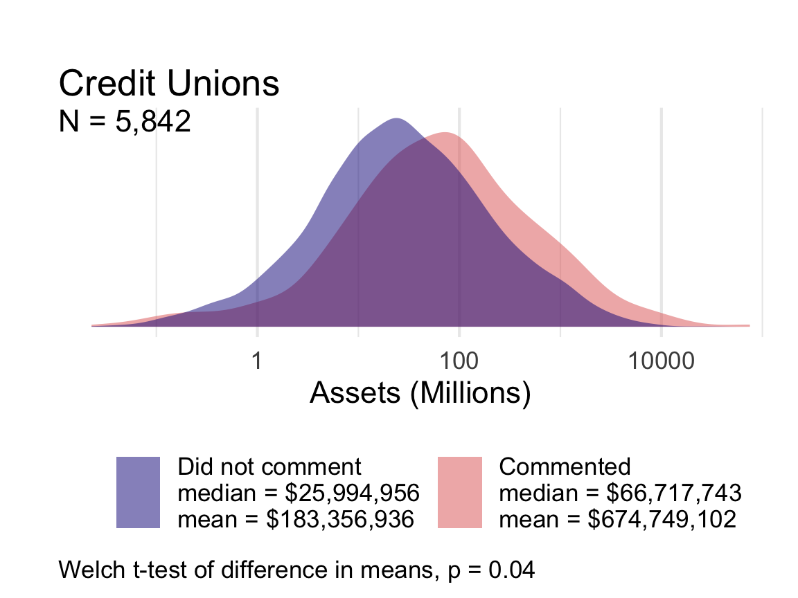

```{r, echo=F, message=F, warning=F}
source("code/setup.R")

# asset data from https://judgelord.github.io/finreg/participation#Save_asset_data
load(here::here("data", "commenter_assets.Rdata"))

# all comment data from https://judgelord.github.io/finreg/efficacy#Save_data
load(here::here("data", "efficacyXsophistication.Rdata"))
``` 


# Introduction

Studies of political inequality have revealed profound and durable patterns of the disproportionate influence of wealthier citizens on lawmaking processes, which @Gilens2012 calls the influence of affluence. Critical work in American politics by @Bartels2008, @Baumgartner2009, @Hacker2010, @Gilens2012, @Skocpol2004, and @Schlozman2012, among others, documents ties between economic and political inequality. Relatedly, @Piketty2014 and others in economics and the social sciences have demonstrated rising capital-based wealth inequality over the twentieth century, especially in the United States [e.g., @Saez2020]. 

In contrast to the large literature on inequality in legislative lawmaking, research on inequality in administrative lawmaking is sparse, especially when one considers the bureaucracy's most powerful policy tool: rulemaking. By writing rules, agencies convert congressional intent into legally binding policies with real human and economic effects  [@West1995; @Kerwin2018]. After all, "policies mean little to nothing until they are given concrete expression through the bureaucracy" [@Moe_Wilson1994]. 

Research suggests that firms spend hundreds of millions of dollars lobbying after a bill has been signed into law, including lobbying those agencies tasked with implementing congressional legislation [@You2017; @Libgober2020]. Legislators who receive more corporate Political Action Committee (PAC) money from companies are much more likely to lobby federal agencies on behalf of those companies [@Powell2022]. Interest groups---particularly business interests---are often the main lobbying participants in most agency rulemakings [@GoldenJPART1998; @YackeeJOP2006]. 
Given the scale and importance of bureaucratic policymaking and the large volume of data on business and interest group lobbying, rulemaking presents opportunities to study inequalities in policy influence [@Carpenter2020].

<!-- (Angelo 7/14/2022: This paragraph is largely repeated from above) -->
<!-- As an indicator of the stakes of these developments, consider how media reporting in 2017 illustrated the political priorities of those at the very upper end of the income and power scale in the United States. During that year, major newspapers documented high-level gatherings between CEOs and officials at the Trump White House. For our purposes, what is interesting about these meetings is that the existing inequality literature would likely have predicted America's wealthiest business leaders and allocators of capital would direct their lobbying at congressional lawmaking. Instead, these business leaders and their lobbyists were targeting the rules implementing the Dodd-Frank Wall Street Reform and Consumer Protection Act of 2010 (hereafter Dodd-Frank) [see, e.g., @Protess2017; @Radnofsky2017]. -->

*When policymaking occurs in the administrative realm, do inequalities in the legislative process persist or morph? Are they magnified or reduced?* We develop a suite of measurement and analytic tools to identify organizational commenting, measure commenter wealth and comment sophistication, and assess relationships between wealth, sophistication, and influence.

In this study of financial rulemaking, we draw upon a database of `r n_comments` comments submitted to U.S. agencies tasked with implementing the Dodd-Frank Wall Street Reform and Consumer Protection Act of 2010 (hereafter Dodd-Frank). Our data cover over eight hundred regulatory actions, such as proposed and final rules on `r n_rules` proposed rules.^[We define a regulatory action as the publication of a proposed or final rule by one agency. We count a joint rule issued by the SEC and the Federal Reserve as two regulatory actions.]
The Dodd-Frank Act spurred significant rulemaking activity and mobilized interests to shape those rules. Beyond its provision of granular data, however, financial policymaking offers another reason for studying inequality --- finance is perhaps an unparalleled site of interaction between economic inequality and unequal representation in democratic government. 

As an indicator of the stakes of these developments, consider how media reporting in 2017 illustrated the political priorities of those at the very upper end of the income and power scale in the United States. During that year, major newspapers documented high-level gatherings between CEOs and officials at the Trump White House. For our purposes, what is interesting about these meetings is that the existing inequality literature would likely have predicted America's wealthiest business leaders and allocators of capital would direct their lobbying at congressional lawmaking. Instead, these business leaders and their lobbyists were targeting the rules implementing the Dodd-Frank Wall Street Reform and Consumer Protection Act of 2010 (hereafter Dodd-Frank) [see, e.g., @Protess2017; @Radnofsky2017]

<!-- (Steve 7/21/2022: Replace paragraph with the one with the correct cite) -->

<!-- As an indicator of the stakes of these developments, consider how media reporting in 2017 illustrated the political priorities of those at the very upper end of the income and power scale in the United States. During that year, major newspapers documented high-level gatherings between CEOs and officials at the Trump White House. For our purposes, what's interesting about these meetings is that the existing inequality literature would likely have predicted America's wealthiest business leaders and allocators of capital would direct their lobbying at Congress or the president in the hope of indirectly influencing congressional lawmaking. Instead, the business leaders and their lobbyists were, targeting the rules implementing the Dodd-Frank Act [@LaCapra2013]. -->

The idea that inequality has affected financial policymaking is far from new. Reports of CEO meetings and financial lobbying on regulatory policy issues raise important yet unanswered questions: how can we know what various interests are asking for in regulation; how can we get a handle on whether they are getting what they ask for; and how can we measure what regulation is worth to them? And, perhaps most importantly, what do answers to these questions tell us about political inequality?

We produce seven main findings, all of which support the conclusion that wealthy organizations are advantaged in the policy process. First, wealthier organizations participate in agency rulemaking at higher rates---a result that holds within various types of for-profit firms and non-profit organizations. Second, for-profit banks are more likely to participate than non-profit banks. Third, organizations that spend more money on political campaigns and lobbying are also more likely to participate in rulemaking. Fourth, conditioned on commenting, organizations that frequently in rulemaking are wealthier than those that participate infrequently. Fifth, wealthier organizations advance more sophisticated comments than less wealthy organizations. Sixth, wealthier organizations are more successful in shifting the content of federal agency rules through their comments. Finally, using causal mediation analysis, we demonstrate that the influence of wealthier organizations on regulatory content is largely driven by the sophistication of their comments.  

The substantive differences in wealth between organizations that participate and do not participate are large. Banks, non-profits, and credit unions that comment on proposed rules have much greater assets on average than similar organizations that did not comment. The median credit union that comments had three times the assets of the median credit union that does not. The median non-profit that comments had six times the assets of the median non-profit that does not. And the median bank had 40% more assets than the median bank that did not comment.

As we detail below, the idea that wealth inequality has affected financial policymaking is far from new. Nevertheless, critical questions have remained unanswered. Does wealth inequality drive differential lobbying participation? Do wealthy organizations get what they want more often during rulemaking? And, if so, why? We provide the data and tools to address these questions, and our analysis of financial rulemaking yields initial answers and evidence within a significant policy domain. Such information is critical to inform scholarly research regarding the impact of wealth inequality on American policymaking, as well as further our understanding of modern American governance, lobbying influence, and the role of money in politics within our administrative democracy.

<!-- This paper makes three primary contributions to the literature. First, we develop a suite of measurement and analytic tools to identify organizational commenting, measure commenter wealth and comment sophistication, and assess relationships between wealth, sophistication, and influence in the administrative sphere. To our knowledge, we are the first to measure the wealth of organizations that comment on entities that submitted comments to regulatory agencies. While other studies have identified organizations in rulemaking (see, e.g., Yackee and Nelson 2012; Ban and You 2019; Carpenter and Libgober 2018), looked at comment sophistication (Balla et al. 2019; Coglianese 2005), and assessed comment influence (see, e.g., Yackee and Yackee 2005), none of these studies have combined these tools to tens of thousands of comments. For example, in identifying organizations, we used an iterative matching procedure to find matches between nearly 500,000 publicly traded companies or nonprofits and organizations that commented on Dodd-Frank rules. Second, we created a novel dataset of all organizations that commented on Dodd-Frank rules that spans 264,709 comments over 239 separate rulemaking dockets within seven federal agencies. Third, we leverage the dataset to provide the first large-scale assessment of the impacts of wealth inequality in agency rulemaking. This allows us to answer questions on inequality and lobbying participation which were, up to now, only answerable in the legislative process. Such information is critical to inform scholarly research regarding the impact of wealth inequality on American policymaking, as well as further our understanding of modern American governance, lobbying influence, and the role of money in politics within our administrative democracy. -->


# Theorical Foundations

The past two decades have witnessed an outpouring of social science research on inequality in the United States and other nations, focusing on national-level policymaking. While several scholars concentrated on the structural and technological determinants of inequality [e.g., @Goldin2009; @Piketty2014], others examined the political realm as a place where economic inequality shapes political outcomes, which plausibly generates further economic and social inequality. 

In *Unequal Democracy*, @Bartels2008 established an important empirical case for political inequality by showing, among other findings, that legislative voting patterns in the U.S. Senate disproportionately reflect the preferences of those individuals at the highest levels of the income distribution. @Hacker2010 described a "winner-take-all politics" by which wealthier Americans improved and secured their economic prospects under both liberal and conservative political leadership. In contrast, the prospects of middle- and working-class Americans stagnated. In *Affluence and Influence*, @Gilens2012 further systematized these findings on political inequality using an innovative combination of survey data and legislative voting records. Further studies support and refine their observations [see, e.g., @Baumgartner2009; @Winters2009; @Kelly2010; @Schlozman2012; @Page2013; @Gilens2014; @Witko2021]. These studies mark critical innovations in our understanding, not only of inequality but also of U.S. political processes themselves. 

Yet our empirical portrait of the relationship between wealth and political inequality in America remains sorely incomplete. Policymaking does not stop when Congress passes a law. Many critical policy decisions are made by administrative agencies, in part because the legislature delegates significant policymaking authority and discretion to these agencies to make public policy [@Epstein1999; @Huber2002; @Haeder2020]. Some agencies have acquired sufficient legitimacy and expertise to gain deference in program initiation, interpretation, and policy proposals [@Carpenter2001; @Carpenter2010]. Beyond this, it is well known that moneyed interests spend considerable resources in attempts to influence administrative and executive decision-making [@Haeder2015; @You2017]. These dynamics are often studied under the concept of regulatory capture [@Carpenter2013]. Yet, few regulatory capture projects speak to questions of political inequality, and likewise, few studies of political inequality address issues of capture.

This is a major omission, particularly within the financial regulation space. Because financial policymaking affects the aggregation, accumulation, and disposition of wealth and income so directly, its plausible role in increasing inequality is large. Numerous experts in financial policymaking have discussed the idea that political inequality affects financial policymaking. For example, as the 2008 financial crisis unfolded, @Johnson2010 and @Kwak2013 pinpointed industry influence in financial regulation, including during the Obama Administration, as one of the main culprits of the crisis and what they saw as the American government's problematic response to it. In their view, the necessity of regulators spending time with banks, combined with the status, sophistication, and resource differentials between bankers and their regulators, resulted in a convergence of the regulator's frames, assumptions, vocabularies, and methods towards those of the regulated industry. Others examine financial firms' lobbying behavior. For instance, @Igan2011 find correlations between lobbying behavior and pre- and post- financial crisis loan activity.

Critical research also highlights the revolving-door dynamics often present within financial regulation. This occurs when federal financial agencies hire those from the regulated sector, and/or those who work at these agencies leave to work in banks and non-bank financial firms [@Lucca2014; @DeHaan2015; @Cornaggia2016]. Many scholars have examined the development of coalitions between financial and non-financial interests [see, e.g., @Young2012; @Pagliari2017; @Heilman2017; @James2021]; for example, using network analysis techniques, @Young2017 focused on past and current employment ties between select business firms and the SEC and found that greater direct and indirect ties increase the likelihood of the firm engagement with SEC policy decision-making. 

What the literature currently lacks, however, are measures of wealth inequality in organizational participation and influence during one of the most important venues for political lobbying: agency rulemaking. Rulemaking is a critical but understudied part of the American political process. While Congress routinely passes statutes, their implementation almost always requires federal agencies, staffed primarily by civil servants, to devise legally binding standards and procedures (i.e., rules) that make the legislation practically effective [@West1995; @Kerwin2018]. This kind of agency policymaking is pervasive; in 2018, federal agencies finalized over 3,300 rules.

The Administrative Procedure Act of 1946 (APA) governs the rulemaking process. The APA requires federal agencies to solicit public comments on their draft policy proposals (called Notice of Proposed Rulemakings, NPRMs, or proposed rules) and to consider any comments before issuing the agency's legally binding rule (called Final Rules). Agency officials may or may not make changes to the proposed rule text based on the public comments—leaving open the possibility that the commenting process creates an avenue for unequal influence. Given the potential impact of agency-issued regulations, those individuals, firms, and other organizations most affected often attempt to influence regulatory policy content through the submission of public comments. Federal agency restrictions on ex parte (or "off the public record") lobbying after the issuance of a proposed regulation allow researchers to use comments during notice and comment rulemaking to identify interest group mobilization [@Yackee2012].

Unequal levels of power and access to the government may be especially acute in financial regulation, where Congress tends to rely upon government agencies to develop key regulatory concepts and instruments and, in doing so, to carry out legislative intent. Administrative agencies made many of the most important deregulatory decisions of the past three decades. These include reductions in regulatory capital requirements and the deregulation of mortgage and other consumer loans [@Engel2011]. While ostensibly re-regulating the financial sector, Dodd-Frank handed considerable authority to federal financial agencies [@Carpenter2012; @Carpenter2013]. For instance, the law contains over 300 provisions authorizing new agency rulemaking, and each provision could result in multiple rules [@Copeland2010]. Each rule yields a fresh opportunity for the financial industry and others to lobby the government agency for policy change.

The traditional literature on bureaucratic politics has often shied away from questions of inequality of influence during rulemaking and financial policymaking. An older literature by @McCubbins1987 through @Balla1998 examined rulemaking as an important venue of policymaking, often debating whether legislative institutions (i.e., Congress) could use the APA to control administrative agencies. Other high-profile research focused on the legislature's delegation decision while largely ignoring how administrative agencies respond to new grants of policymaking authority in practice [@Epstein1999; @Volden2002; @Huber2002]. Other major work focused on the politics of agency decision-making in enforcement or permitting decisions but not in rulemaking  [e.g., @Wood1994]. 

These patterns shifted when scholars began focusing more on the role of public comments during rulemaking and attempted to correlate the requests made in comments with regulatory policy change  [@GoldenJPART1998; @WestPAR2004; @YackeeJOP2006; @YackeeJPART2006; @McKay2007]. This advanced understanding of political inequality during the agency rulemaking process, but without a specific concentration on wealth or on financial regulation.

<!-- CUT FOR NOW 

For example, @YackeeJOP2006 asked whether business interests could, by commenting on proposed regulations, induce greater changes in proposed rules than non-business interests. They observed that business comments better predicted subsequent changes to federal rules in their sample of transportation and labor regulations. @Haeder2015 similarly focused on political inequality in rulemaking but within the U.S. Office of Management and Budget's (OMB) review of important agency rules. They found more regulatory policy movement occurring during OMB review when business interests dominated other types of lobbying entities. Recent work has suggested a mechanism by which traditionally disadvantaged interests may combat business bias during rulemaking: band together to lobby in diverse coalitions [@Dwidar2021PSJ; @Dwidar2021APSR]. However, these studies point to continued inequalities, including that only certain types of coalitions appear to hold policy influence over agency rules, including those with greater financial capacity. 

END CUT-->

When we focus on the handful of existing financial rulemaking studies, we uncover a mixed portrait of the policy impact of wealth inequality. These studies—which tend to focus on a single agency or a single rule—raise important questions for future scholarship. 
@Krawiec2013 studied public participation patterns early in the rulemaking process in section 619 of Dodd-Frank (commonly known as the Volcker Rule). She found that comments from financial institutions and industry were more detailed, complex, and lengthy during Volcker's pre-NPRM stage than from non-financial firms. @BanBP2019 focused on lobbying and agency rulemaking on a sample of SEC rules after Dodd-Frank. They concluded that the resources that an organization devotes to lobbying appeared to influence the likelihood that the SEC would list an organization's name in its final rule. @Rashin2020 examined thousands of public comments on SEC rules and found that organizational resources do not appear to be correlated with a commenter's efficacy in securing policy changes. In doing so, Rashin's account appears to align with Nixon, Howard, and DeWitt's (2002) older analysis of SEC rule changes, which did not suggest a severe bias toward what they called "privileged" interests. Finally, @Gordon2020 find that a diverse coalition of actors can come together to counter the role of larger and more established regulated entities in credit risk retention regulation [see also @Ziegler2016]. However, @Young2017 found that participants outside the affected firms are less likely to mobilize in the financial sector, especially when a rule is technically complex.
Thus, the existing literature yields a mix of conclusions on the impact of wealth inequality during rulemaking and thereby leaves critical hypotheses regarding the plausible effects of wealth inequality during agency rulemaking in financial regulation.

<!-- @Nixon2002 older analysis of SEC rule changes, which did not suggest a severe bias toward what they called "privileged" interests. That said, other research points to the difficulty of diverse and non-industry coalitions coming together. @Pagliari2017, for example, find that such coalitions may not form with great frequency in the financial sector and that the voices outside the affected firms were less likely to mobilize, especially when the regulation is technically complex.
-->

Thus, the existing literature yields a mix of conclusions on the impact of wealth inequality during rulemaking and thereby leaves open critical hypotheses regarding the plausible effects of wealth inequality during agency rulemaking in the financial regulation space.

## Wealth Inequality Hypotheses

We investigate the role that wealth inequality may play during the development of financial regulations. We group our arguments under two categories, which represent the two kinds of potential bias in U.S. rulemaking: (1) bias in participation and (2) bias in influence. We develop six hypotheses.


### Differential Lobbying Participation

Previous work suggests that wealthier organizations, such as business firms, will participate in agency rulemaking via the submission of comments at a greater rate than other less wealthy organized interests, such as labor and public interest organizations [@YackeeJOP2006]. Past research theorizes that the high costs associated with public comment submission are one reason for this bias. @Rossi1997 writes of the need to monitor the bureaucracy's rulemaking activities, which can be complex and arcane, to know when and how to participate in regulation is being formulated [see also, @Kerwin2018]. @Yackee2019 implies that these high participation costs may be paid more readily by business interests, which often have hired lobbyists and government affairs offices to monitor agency rulemaking on their behalf [see also, @JewellJPART2006].

While past research has focused on differences in lobbying participation across different organizational types (i.e., business firms versus public interest groups), we go a step further to also address the effects of wealth differentials *within* organizations of a similar type. For example, we theorize that, even among banks, wealthier banks will participate in rulemaking via the submission of comments to financial rules more often than banks with fewer assets to draw upon. The theoretical reasons for this expectation are the same as articulated above---wealthy organizations are better able to pay the up-front costs of lobbying and often have more concentrated stakes in policy outcomes. By comparing similar organizations, however, we can better isolate whether wealth inequality (rather than other differences across organizations) drives differential lobbying participation in rulemaking.

> *Differential Participation Hypothesis (H1):* Organizations that comment on financial rules will be wealthier than organizations that do not comment on financial rules.

<!--
> *H1.1* non-profits with more assets will comment more frequently than non-profits with fewer assets.

> *H1.2* Firms with more assets will comment more frequently than firms with fewer assets.
-->


 A separate rational driving differential participation by wealthy organizations focuses on the concentrated costs and benefits of lobbying on government regulations [see broadly, @Lowi1964; @Olson1965; @Wilson1989]. For-profit organizations, such as private and publicly-traded companies and banks, are profit-seeking and tend to have a narrow stake in financial regulations. Wealthy, profit-seeking companies have especially strong incentives to lobby in rulemaking [@Libgober2020; @LibgoberQJPS2020]. Meanwhile, non-profit organizations such as public interest groups have more diffuse and varied constituencies and may exhibit less profit-seeking incentives to comment. Thus, we anticipate differences between for-profit and non-profit organizations.^[Our paper categorizes for-profit organizations as "profit-seeking" and non-profit organizations as absent of profit-seeking behavior. However, non-profit industry associations can focus their efforts on private interests, demonstrating profit-seeking behavior. Because our data does not include a measure of private-public interests among the organizations featured, we opt for this binary "profit-seeking" categorization between for-profit and non-profit organizations.]
 <!-- (Angelo 7/14/2022: Is this footnote too wordy?) -->

> *Profit-motivated Participation Hypothesis (H2):* Profit-seeking organizations will be more likely to comment.

Moreover, we theorize that wealth inequalities in lobbying participation will persist even among those organizations that are able to pay the initial costs of rulemaking participation. Stated differently, when focused on those entities that have submitted at least one comment to a Dodd-Frank regulation, we argue that more wealthy organizations will, again, hold an advantage over less wealthy organizations by participating across a larger number of rules. For instance, among the non-profit organizations that submit comments on financial regulations, we hypothesize that the wealthier non-profits will comment on more regulations than those less wealthy. 

> *Differential Frequency of Participation Hypothesis (H3):* Among organizations commenting on financial rulemaking, organizations with greater wealth will comment on a larger number of financial rules.

<!--
>  *H2.1* Among non-profits participating in financial rulemaking, non-profits with more assets will comment on more proposed rules.

> *H2.2* Among firms participating in financial rulemaking, firms with more assets will comment on more proposed rules.
--> 


### Differential Lobbying Success

Existing research hints at a differential lobbying benefit attached to wealth during rulemaking. For instance, @Haeder2015 find more policy movement on federal regulations during rulemaking when business interests are more active than other types of organizations, such as public interest groups. Yet, such research does not provide a clean test of wealth inequality. After all, some businesses are large while some are small; some non-profits hold major financial assets while others are poor. We thus seek to understand whether wealth is a common factor driving organizational influence during rulemaking. As a result, we theorize that, among similar organizations, wealthier ones will see greater lobbying success during financial rulemaking. For example, we expect the comments of more wealthy large banks will be more impactful on the content of final financial rules than those of less wealthy large banks.

> *Differential Lobbying Success Hypothesis (H4):* Comments from wealthier organizations will be more successful in shifting the content of agency rules.

Research suggests that wealthier organizations are more influential because they can better deploy sophisticated technical information than less well-off entities [@WagnerALR2011]. Put differently; large organizations are disproportionately able to marshal the technical expertise necessary to write sophisticated comments for rules. Building on @Yackee2015JPART, we theorize that more sophisticated comments will be associated with greater lobbying success during rulemaking. Agency officials pay greater attention to abstract and technical arguments, such as those often in comments from business organizations, while often minimizing common moral and personal arguments to less sophisticated comments from individuals [@JewellJPART2006]. For example, in the pre-proposal stage of the Volcker rule, non-industry comments often lacked the specificity and the detail that agencies needed to change policy [@Krawiec2013]. Consequently, we hypothesize that wealthier entities will utilize their resources to produce comments that hold greater sophistication than less prosperous groups, and these comments will be more impactful.
<!-- (Angelo 7/14/2022: moved mentions of legal expertise to the appendix.) -->

> *Differential Sophistication Hypothesis (H5):* Wealthier organizations will use more technical and sophisticated language when commenting on proposed rules.

> *Dividends of Sophistication Hypothesis (H6):* Comments from wealthier organizations will be more successful in affecting the content of agency rules because of comment sophistication.  


Together, these hypotheses test for two major kinds of potential bias in policymaking: that the wealthy are better able to participate and that even when less wealthy groups participate, the wealthy are likely to have their demands met. Additionally, they test a major theorized mechanism of lobbying influence: the ability of the wealthy to mobilize lawyers and experts to make sophisticated and thus influential arguments on their behalf.

# Data and Methods
        
<!-- (Angelo: Should we explicitly say "this data provides us with this variable...") -->
To assess the extent of inequality in financial rulemaking, we assembled data on draft and final rules, comments on those rules, and organizational wealth and lobbying expenditures. Data sources included the Federal Register, Regulations.gov, Wharton Research Data Services, the Center for Responsive Politics, Federal Financial Institutions Examinations Council (FFIEC), the Internal Revenue Service (IRS), the Consumer Financial Protection Bureau (CFPB), Commodity Futures Trading Commission (CFTC), the Federal Deposit Insurance Corporation (FIDC), Federal Reserve (FRS), National Credit Union Administration (NCUA), Office of the Comptroller of the Currency (OCC), the Securities and Exchange Commission (SEC). This expansive data collection effort includes data on agency administrative data, public comment and rule texts, and measures of organizational wealth.


## Agency Rules & Public Comments

From the Federal Register, we collected the text of all rules promulgated under authorities granted in Dodd-Frank
between its enactment on July 20, 2010, and July 8, 2018
by the seven primary financial regulators tasked with writing rules under the Dodd-Frank Act: FRS, CFPB, SEC, CFTC, FDIC, NCUA, and OCC. We also collected all public comments and comment metadata available on these rules from each agency's website or regulations.gov. In doing so, we collected key information, including the name of the organization submitting the comments and the comment submission date. We also collected the text of all comments from comment submission forms and file attachments. These data include `r n_comments` comments on `r n_rules` separate rulemaking dockets, covering `r n_actions` regulatory actions issued by one or more of these seven agencies.^[The law firm Davis Polk LLP maintains a list of Dodd-Frank-related rules. Each rule in our sample may be considered a set of connected regulatory actions, which must include a proposed and/or final rule and are connected by a Regulation Identifier Number (RIN). We count a joint rule issued by the SEC and FRS as two rules because both agencies collected comments separately.]

Figure \ref{fig:actions} shows significant variation in regulatory activity across these agencies. The largest agency in our sample by regulatory volume is the CFPB, while the smallest is NCUA. The figure also shows considerable variation in the range of regulatory actions, including advanced notices of proposed rulemaking (ANPRMs), proposed, interim, final, and final rules. 

```{r actions, out.width="100%", fig.cap= "Dodd-Frank Act Implimenting Actions by Agency", cache=FALSE}
knitr::include_graphics("figs/actions-1.png")
```


## Organization Comments on Proposed Rules

We identify `r n_assets` comments submitted by organizations that appear in one or more of the datasets described below. Although we collected the text for all comments on Dodd-Frank rules, our main analyses focus on comments from organizations that we could link to measures of organizational wealth and lobbying activity. Past research suggests that organizations and individuals tend to submit different types of comments to rules [@JewellJPART2006]. We go one step further and compare commenting behavior among similar types of organizations. For example, we compare the commenting behavior of large banks to other large banks. Thus, we control many known sources of variance in commenting behavior, yielding cleaner tests of our hypotheses. Practically, acquiring wealth information for all commenters---including thousands of individuals who submit form comments as part of mass comment campaigns (with no little identifying information)---would have been impossible. Moreover, because nearly all individual commenters are mobilized by an organization, form comments are best conceptualized as supporting the more sophisticated organizational comments that we focus on here [@judgelord2019SPSA].

There was considerable variation in the organizational comments received to rules across the seven financial regulators. For example, the largest number of organizational comments was received by the CFPB on rules regulating payday loans, which received 3898 comments from organizations that we were able to match to asset data. At the same time, many low-salience rules received few comments, in several cases none from organizations with publicly-available wealth data. However, for all rules that received more than 25 comments, we matched at least two organizations to asset data. The agency with the largest median number of organizational comments was the CFPB at 21. 

## Organization Wealth 

We developed several new tools to test our wealth inequality hypotheses, including ones that allowed us to compare the wealth of organizations that commented on financial rules in our sample to the wealth of similar organizations that did not comment on these rules. No single database provides wealth data on all such organizations. As a result, we cast a wide net and identified multiple databases of organizations that might participate in financial rulemaking. These databases include:

1.	All publicly traded companies listed on U.S. exchanges during our analysis time frame from the Wharton Research Data Service's Compustat database, including financial data, such as market capitalization.

2. All corporations that filed disclosures with the SEC and are thus listed in the SEC's Central Index Key (CIK) database.

3.	All bank and bank-like entities covered by the FDIC, which reports each bank's classification and total assets under management.

4. All credit unions from consolidated call report published by the NCUA, which include the total assets under management for each credit union.

5.	All non-profit organizations that are reported by the IRS 990 forms, including each non-profit's total assets and annual revenue.

6.	All organizations reporting Political Action Committee (PAC) donations, as compiled by the Center for Responsive Politics. We then calculate the average annual PAC contributions for each organization.

<!--TODO
7.	All organizations reporting lobbying expenditures, as compiled by the Center for Responsive Politics. We then calculate the average annual lobbying expenditures for each organization.

TODO: Devin will replicate PAC figures and analyses with data/Lobbying_and_Contributions.csv
-->

Next, we used a probabilistic matching algorithm to match comments to organizations in these databases. This step took considerable innovation because the names that organizations use to submit comments and the names by which they appear in various databases often differ. Our matching procedure involved several steps. We first identified comments that were likely from an organization, excluding those that were likely from an individual or a mass commenting campaign. We then linked these comments to the organization with the best matching name or to no organization when our matching algorithm did not identify a high-probability match in any of the above databases. We then spot-checked our processes for false positive matches by inspecting organizations that matched many comments and false negatives by inspecting especially long, sophisticated, or efficacious comments that did not match a known organization. We then improved the matching algorithm through dozens of iterations.
This procedure ultimately resulted in a dataset of over `r n_orgs` distinct organizations that submitted  `r n_assets` unique comments on one or more Dodd-Frank rules. We use these data to compare the wealth of commenting organizations to `r n_orgs_total` similar organizations in one of the above wealth databases that did not comment on financial regulations.


```{r org-types, fig.cap="Number of Organizations by Type and Agency to which they Commented, Including the Consumer Financial Protection Bureau (CFPB), Commodity Futures Trading Commission (CFTC), Federal Reserve (FRS), National Credit Union Administration (NCUA), and Securities and Exchange Commission (SEC)", out.width = "80%"}
knitr::include_graphics("figs/org_count_type-2.png")
```

Each database contains qualitatively different types of organizations; we can compare patterns of commenting within each type and across types. The remainder of this section describes the distribution of these data, which are not equally distributed across agencies, rules, and commenter types. Figure \ref{fig:org-types} shows the number of unique commenting organizations matched to each database by the agency or agencies to which they submitted comments. Across all agencies except for the Federal Reserve (FRS), most commenting organizations are non-profits. The next most common type of commenter was federally-insured (FDIC-insured) banks (hereafter "banks"). Organizations that report to the SEC and donors to PACs were less common.
Figure \ref{fig:comment-types} shows the number of comments submitted to each agency by an organization matched to each database described above.


```{r comment-types, fig.cap=" Number of Comments by Authoring Organization Type and Agency, Including the Consumer Financial Protection Bureau (CFPB), Commodity Futures Trading Commission (CFTC), Federal Reserve (FRS), National Credit Union Administration (NCUA), and Securities and Exchange Commission (SEC)", out.width="80%"}
# NOTE: Devin will revise these figs to be clearer in the legend about what is in each database. We should do this for all figs so they can stand independently. 

knitr::include_graphics("figs/org_count_type-1.png")
```


## Comment Sophistication

We measure comment sophistication by counting the technical terms in each comment. To capture sophistication with respect to the use of finance and banking jargon, we use the Oxford Dictionary of Finance and Banking, which includes 5260 finance and banking terms. When an organization submits a comment with multiple attachments, we measure sophistication by summing up the technical terms and legal citations across all submitted documents. This approach follows the intuition that attachments with additional technical language reflect additional sophistication. For example, the most sophisticated organizations often submit a cover letter, a marked-up version of the proposed rules, and studies supporting their arguments.

<!-- (Angelo 7/14/2022: This was originally in between "...5260 finance and banking terms." and "When an organization...". If we choose to use only one measure of sophistication--technical--do we have to re-run this analysis, so we don't subtract overlap?) -->
 <!-- As there are words with both financial and legal meaning (e.g., "underwrite"), and we do not want to double count overlapping terms, we calculate the sophistication of each comment by summing the legal and financial terms and then subtracting the subset of those that appear in both dictionaries.  -->

<!--TODO 
Second, we count the number of Tables and Figures. Looks at the maximum number of tables, with large jumps excluded. For example, a document with tables 1, 2, 3, and 99 would treat 99 as an error and say there were three tables. This mostly comes from bad OCRing or documents that have footnotes in between the word "table" and the table number.
-->


## Lobbying Success

After reviewing an agency's proposed rule, organizations typically use their comments to articulate the changes they want to see the agency make in the final rule. 
To approximate the extent to which commenters requested changes are made, we measure the overlap between the text of each organization's comment and the text added to the final rule. Importantly, we exclude the text of the agency's proposed rule in this calculation, so we do not include phrases quoting the proposed rule as having informed the final rule. This measure follows the intuition that an organization whose comment text is repeated by the agency in changes to the final rule is more influential in shifting regulatory content in their desired direction than an organization whose comment is not reflected in changes in the final rule. If this intuition is correct, greater text overlap suggests greater policy influence. 

To construct this measure, we first link proposed rules to final rules by their Docket or Regulatory Identification Numbers --- agency identifiers that uniquely identify a series of rulemaking actions. 
For rules with more than one proposed rule, we match comments to proposed rules by publication date; if a comment comes after the publication of a second proposed rule, it is assumed to be on the second proposed rule. 
We then tokenize each draft and final rule and each comment in groups of ten words. Ten-word phrases are long enough that they rarely co-occur by chance and are thus a well-validated measure of textual similarity [@Wilkerson2015; @Casas2019; @JudgeLord2017; @Rashin2019). 
Finally, we count the number of words in phrases of 10 or more that appear in the comment and final rule but do not appear in the draft rule.
For rules with multiple final rules, we take the sum of the comment's alignment with both final rules.
When an organization submits a comment with multiple attachments, we include only the highest scoring document as the primary comment. We do this because organizations that submit multiple attachments often have one primary comment and a bunch of supporting material. We are only interested in the effect of the comment, not the supporting material.

However, this measure of lobbying success does not necessarily indicate that a causal relationship is present between lobbying and rule change. 
For instance, the organizational commenter and the agency may have copied the phrase from some third source. 
It is also possible that the processes that lead organizations to include particular phrases in their comments are endogenous to the policy changes agencies make during the financial rulemaking process. We deal with this potential endogeneity by excluding the text of the proposed rule when we measure lobbying success. Doing so removes the phrases and text that are most likely to be naturally repeated and thus drive endogeneity. In doing so, our measurement approach mitigates this concern.
Despite its limitations, our measure can capture "success" in the sense that it measures the alignment between specific requests made in an organization's comment and specific subsequent policy changes.

In dealing with endogeneity, one methodological choice merits elaboration: we excluded text from the proposed rule when measuring lobbying success but not when measuring sophistication. This choice rests on the underlying concepts we are attempting to measure. In measuring text reuse, we aim to capture ideas that are not yet in the policy. Thus, text copied from the agency's proposal must be excluded. Indeed text that appears in both the draft and final rule is what did *not* change. If a commenter attached a marked-up version of the proposed rule, we aim to exclude all but their suggested changes. 

In contrast, in measuring sophistication, we aim to assess how much the commenter utilizes expertise to engage in technical policy debates. Here, attaching a marked-up version of the proposed rule captures the underlying concept of sophistication. Thus, our counts of technical banking terms do not exclude the text of the draft rule. Even if they are the agency's terms, engaging with the agency's texts indicates sophistication. For example, the comment with the most legal terms from a bank contained a 4-page comment and 112 pages of attachments, 105 of which were the full proposed rule. These 105 pages were excluded from our measure of text reuse but included in the legal and banking terms count.  


<!--CORRELATION BETWEEN SOPHISTICATION AND SUCCESS
This figure is here rather than in the results section to facilitate discussion of the data, but I'm open to suggestions
--> 
Descriptively, our measures of lobbying sophistication and lobbying success are highly correlated. Our measure of commenter lobbying success increases with the wealth of the commenting organization. 
Figure \@ref(fig:efficacyXsophistication) shows that the number of words from the comment added to the final rule is correlated with both the number of technical words. The plot highlights the comment with the highest score on our measure of lobbying success, a comment to the SEC prepared by the law firm White & Case, LLP for the U.S. Chamber of Commerce, Americans for Limited Government, Ryder Systems, Inc., the Financial Services Institute, Inc., and Verizon. This highly-sophisticated comment included a 19-page cover letter with many technical citations underscoring the Chamber's "very serious concerns on the impact [the rule's] whistleblower requirements will have on... companies' responsibilities to act in the best interests of their shareholders."
This comment also included a marked-up draft of the SEC's proposed rule, suggesting specific changes, several of which were adopted by the SEC. 
Other comments with high efficacy scores include an 84-page comment from Standard & Poor's Global Ratings credit rating agency to the SEC, a 59-page comment from the Futures Industry Association to the CFTC, and several marked-up versions of proposed SEC rules from investment companies.
Overall, \ref{fig:efficacyXsophistication} shows a positive correlation between the number of technical banking terms in a comment and the amount of text it shares with the final rule. 
Using these data (organizational comments, their sophistication, and their efficacy), the following section assesses our hypotheses about the relationship between wealth, political participation, lobbying sophistication, and lobbying success. Notably, Section \@ref(mediation) further explores the correlation between sophistication and lobbying success by assessing comment sophistication as a mediator in the relationship between wealth and success.

```{r, efficacyXsophistication, fig.cap="Lobbying Success by Comment Sophistication", out.width= "70%"}
knitr::include_graphics("figs/efficacyXsophistication-2.png")
knitr::include_graphics("figs/efficacyXsophistication-6.png")
```


## Methodology

<!-- (Angelo 7/15: Added broad methods exposition... thought it fit better at the end as its own little subsection?) -->
We apply various methods to the data described above to investigate each individual hypothesis.
Descriptively, we compare the wealth distribution and mean asset amount of different organizations to uncover any significant differences between commenters and non-commenters (H1), for-profit and non-profit organization types (H2), and frequent and infrequent commenters (H3).
Welch t-tests determine whether two samples with unequal variances and sample sizes have equal means.
Because variance and sample sizes are unequal between the groups compared in each hypothesis, Welch t-tests are an appropriate method for uncovering any average difference between them.
The tests' corresponding p-value at or below .05 would demonstrate whether any uncovered difference is statistically significant.

We also use regression analyses to gauge whether organizational wealth is a significant predictor of various outcomes of interest.  
Logit regression is used to model the binary outcome of commenting as a function of wealth (H1) and wealth and for-profit banking types like commercial, saving, and state banks (H2).  
The resulting model coefficients allow us to predicatively estimate how changes in an organization's assets produce changes in that organization's probability and odds of offering a comment on a rule.

Poisson regression is used to model the discrete count of rules an organization comments on (H3), the number of words from a comment added to the final rule (H4), and the number of technical terms used in a comment (H5), as a function of organizational wealth. 
Poisson modeling is useful when trying to correlate an explanatory variable with some outcome of interest that represents a discrete sum of an event occurring.
Because our outcomes in the three hypotheses above are discrete counts, Poisson modeling is an appropriate method to test them.
Model coefficients will then allow us to predict how changes in wealth produce changes in the number of rules commented on, words from a comment in the final rule, and technical terms used.

Causal mediation analysis is used to **DEVIN HERE**


# Results

We assess our hypotheses about the relationship between wealth inequality and policy influence using descriptive and statistical evidence, including t-tests, multivariate models, and causal mediation analyses. The results below take each hypothesis in turn, exploring inequalities in which organizations participate in financial rulemaking and then inequalities in influence among organizations that do participate. We thus test our hypotheses about wealth and access to the policy process using two broad types of variation: (1) variation between commenters and similar organizations that did not participate in Dodd-Frank rulemaking and (2) variation among organizations that did participate in the frequency, sophistication, and impact of their participation.

## Wealth Inequality in Lobbying Participation: Variation Across Commenters and Non-Commenters

First, we compare levels of resources among commenting organizations and similar organizations that did not comment. 


### Wealthier organizations are more likely to participate


Our *Differential Participation Hypothesis (H1)* posits that organizations that comment on financial rules will be wealthier than organizations that do not comment. To assess this, we compare organizations that did and did not comment on Dodd-Frank rules. Because our data included data on a full population of similar organizations that could reasonably be expected to submit comments (e.g., all banks and all non-profits), only some of which did submit comments, we can draw important new conclusions about the relationship between wealth inequality participation in the policy process.

Overall, we find strong support for the *Differential Participation Hypothesis*:  organizations that comment are much wealthier on average than similar organizations that did not comment. 
We can see these results clearly in descriptives. Figure \ref{fig:commenters-noncommenters-counts} shows distributions of logged organizational wealth by whether the organization commented on any Dodd-Frank rule. Organizations that comment are higher on the wealth distribution than similar organizations that did not comment. Differences within non-profits, banks, and public-traded firms are significant at the .01 level in a Welch Two Sample t-test. While differences in credit unions are large, the smaller sample lacks the power to achieve statistical significance. 

<!---adding this because Susan added it, but it is out of place here. Maybe summarize it all first and then dive in--> 
Logistic regression results confirm these differences in means, including statistically significant differences among credit unions.
Figure \ref{fig:mp-assets} (Appendix Table \ref{tab:mp-assets-table}) shows the results of logit models predicting the log odds of commenting on a Dodd-Frank rule by assets for banks, credit unions, and non-profits. These models show that wealthier organizations of all three types are significantly more likely to comment. Of these three types of organizations, the marginal effect of assets on the log odds of commenting is the largest for banks. 

```{r mp-assets, fig.cap= "Log Odds of Participating in Dodd-Frank Rulemaking by Assets", out.width="90%"}
knitr::include_graphics("figs/mp-nonprofit-credit-unions-1.png")
```

```{r, commenters-noncommenters-counts, fig.cap="Financial Resources of Organizations that Did and Did Not Comment", out.width= "49%"}
knitr::include_graphics("figs/nonprofit-count-1.png")

knitr::include_graphics("figs/creditunion-count-1.png")

knitr::include_graphics("figs/compustat-count-1.png")

knitr::include_graphics("figs/FDIC-count-select-1.png")
```

Figure \ref{fig:commenters-noncommenters-counts} shows the distribution (on a log scale) of organizations' financial resources for commenting organizations that matched in our comment database compared to similar organizations. 

**Non-profits.** The top left panel in Figure \ref{fig:commenters-noncommenters} shows that non-profits that comment on proposed financial regulations tend to be significantly better-resourced than we would expect from a random sample of non-profits. The average assets of commenting non-profits were ten times larger than non-profits that did not participate; the average non-profit that did not comment had about \$7.5 million in assets, whereas the average non-profit that did comment had approximately \$75 million in assets. Thus, the average assets of commenting non-profits were ten times larger than non-profits that did not comment. This shows that the *Differential Participation* Hypothesis (H1) holds within non-profit organizations.

**Credit Unions.** Similarly, the top right panel in Figure \ref{fig:commenters-noncommenters} shows that credit unions that comment on proposed financial regulations also tend to be significantly better-resourced than we would expect from a random sample of credit unions. The average credit union that did not comment has about \$27 million in assets, whereas the average credit union that did comment has \$75 million in assets. The average commenting credit union is thus three times larger than the average credit union that did not comment. This shows the *Differential Participation* Hypothesis (H1) among credit unions. 

**Publicly-traded companies.** The bottom left panel in Figure \ref{fig:commenters-noncommenters} shows similar distributions over market capitalization for publicly traded companies. Companies that comment on proposed financial regulations are better-resourced than we would expect from a random sample. Specifically, they have much more capital, as measured by the total value of their stock. The median market capitalization of companies that commented was almost 70 times that of the media company that did not comment.   <!-- TODO: MORE ON THIS? --> 

<!-- TODO: ADD MARKET CAP RESULTS? 

```{r mp-marketcap, fig.cap= "Log Odds of Participating in Dodd-Frank Rulemaking by Market Capitalization", out.width="80%"}
knitr::include_graphics(
"figs/mp-compustat-1.png")
```

Similarly, \ref(fig:mp-marketcap) shows the results of logit models predicting the log odds of commenting on a Dodd-Frank rule by market capitalization (the total value of its stock).

END TODO NOTE -->

**Banks.** The bottom right panel in Figure \ref{fig:commenters-noncommenters} shows that, on average, banks that comment on proposed financial regulations are better-resourced than we would expect from a random sample of banks. The x-axis shows assets in thousands of dollars. Banks that participated in financial rulemaking had almost 40% greater median assets and nearly double the average assets. 

When we look within categories of banks, we see that the wealthier banks within each class are also more likely to submit comments on financial rules than similar banks with less wealth. Figure \@ref(fig:FDIC-count-by-class) shows that, within each class of bank (Commercial Banks, Savings Banks, State Banks, and Savings Associations), wealthier the banks participating in financial rulemaking are the wealthier ones.^[There are over seventeen different types of institutions that the U.S. government defines as banks (see <https://www.ffiec.gov/npw/Help/InstitutionTypes>). This paper focuses on Commercial Banks, thrifts (savings institutions), and credit unions. In general, Commercial Banks are publicly traded corporations that make loans to businesses and individuals. Credit Unions are non-profit banks. Savings institutions (thrifts) are non-profits primarily involved in mortgages.]
Differences in means among for-profit Commercial Banks are significant at the .1 level in a Welch Two Sample t-test. While the differences with other types of banks (State Banks, state-chartered Savings Banks, or non-profit Savings Associations) are large, there are too few of these types of banks for differences in average wealth among them to reach statistical significance.

Figure \ref{fig:FDIC-count-by-class} shows wealth distributions for four prominent classes of banks: Commercial Banks, Savings Banks, State Banks, and non-profit Savings Associations. The top-left panel of Figure \ref{fig:FDIC-count-by-class} shows that Commercial Banks that comment are wealthier than those that did not comment. The modal Commercial Bank that commented was 40 percent more assets than the modal Commercial Bank that did not comment. The top-right panel of Figure \ref{fig:FDIC-count-by-class} shows that Savings Banks banks that comment are wealthier than those that did not comment. The modal Savings Bank that commented has nearly twice the assets of the modal Savings Bank that did not comment. The bottom-left panel of Figure \ref{fig:FDIC-count-by-class} shows that State Banks that comment are wealthier than those that did not comment. The average assets of State Banks that commented were three times the average assets of the State Banks that did not comment. While Savings Associations are less likely to comment than more profit-oriented banks (see Figure \ref{fig:mpFDIC}), the bottom-right panel of Figure \ref{fig:FDIC-count-by-class} shows that, when Savings Associations do comment, it tends to be the wealthier ones. 

```{r, FDIC-count-by-class, fig.cap="Financial Resources of FDIC-Insured Banks that Did and Did Not Comment", out.width= "49%"}
knitr::include_graphics("figs/FDIC-count-by-class-1.png")

knitr::include_graphics("figs/FDIC-count-by-class-2.png")

knitr::include_graphics("figs/FDIC-count-by-class-3.png")

knitr::include_graphics("figs/FDIC-count-by-class-4.png")

```

### Organizations that make larger campaign donations and spend more on lobbying are more likely to comment


```{r opensecrets-density, fig.cap= "Campaign Spending of Organizations that Did and Did Not Comment", out.width="49%"}
knitr::include_graphics("figs/opensecrets-count-1.png")
```

The final two ways that we investigate  *Differential Participation* Hypothesis (H1)
Figure \ref{fig:opensecrets-density} shows that organizations that comment on Dodd-Frank rules also donate more to political campaigns via political action committees. This aligns with the *Differential Participation* Hypothesis (H1). Among organizations that donate to campaigns, the average campaign spending per two-year cycle was \$80,000 for those that did not comment, and the average for a donor organization that did comment on a Dodd-Frank rule was \$95,000. 
The difference in average campaign spending between organizations that commented and do not comment is significant at the 0.01 level in a Welch Two Sample t-test.
<!-- TODO NOTE:
DEVIN UPDATED THESE NUMBERS IN MAY 2022, BUT WE MAY NEED TO REVISE THESE NUMBERS WITH NEW DATA 
DEVIN WILL ADD LOBBYING EXPENDITURES
--> 

### Profit-driven organizations are more likely to comment than non-profits

Our *Profit-motivated Participation* Hypothesis (H2) posited that for-profit organizations would be more likely to comment than non-profit organizations. We find strong support for this hypothesis, both overall (comparing banks with non-profits) and among for-profit and non-profit banks. Twelve percent of Commercial Banks commented on Dodd-Frank rules. In contrast, only three percent of non-profit Savings Associations, two percent of credit unions, and 0.2 percent of other non-profits commented. This means that Comercial Banks were six times more likely to comment on a Dodd-Frank rule than the average credit union and 60 times more likely to comment than the average non-profit. 
 
To further test this hypothesis among banks, we estimate the odds of commenting across different types of banks; we find that for-profit banks (Commercial Banks) are significantly more likely to comment than non-profit Savings Associations and credit unions, further supporting the link between lobbying activity and profit. 
Among FDIC-insured banks with a mean asset amount of \$1,175,970, our model predicts commercial banks to have a 12 percent probability of commenting.  
Meanwhile, non-profit savings associations with the same asset resources have only a 3 percent probability of commenting.
<!-- (Angelo 7/18/2022: Added last two sentences of examples) -->

Commercial Banks are often large multinational corporations managed by a board selected by shareholders. In contrast, Savings Associations are chartered with the narrow purpose of providing affordable residential mortgages. Both types of banks may hold large volumes of assets, but they have very different clients. Commercial Banks and Savings Associations serve different clients. Figure \@ref(fig:mpFDIC) (Appendix Table \@ref(tab:mpFDIC-table)) shows that banks serving corporations and wealthier and profit-motivated clients were disproportionately represented in Dodd-Frank rulemaking and that Savings Associations were less represented, even controlling for asset differences. This supports the *Profit-motivated Participation* Hypothesis (H2). Likewise, assets remain a significant predictor of whether an organization comments, even controlling for differences in the type of institution. This further supports the *Differential Participation* Hypothesis (H1). 

```{r, mpFDIC, fig.cap= "Log Odds of Participating in Dodd-Frank Rulemaking by Type of FDIC-Insured Bank", out.width="90%"}
#TODO Make predicted probability plots showing that all kinds of banks are more likely to comment when wealthier
knitr::include_graphics("figs/mpFDIC-1.png")
```

Further supporting the *Profit-motivated Participation* Hypothesis (H2), non-profits and credit unions are significantly less likely to comment than Banks, even when controlling for differences in assets. 
Table \ref{tab:mp-all-table} shows the results of logit models predicting the log odds of commenting by organization type (credit union, non-profit, or bank) and total assets. In specifications estimating the constant effect of assets (Model 1) and different effects by organization type (Model 2), non-profits are less likely to comment than for-profit organizations. 

```{r mp-all-table}
# models of a number of rules commented on by assets
load(here::here("models", "mpAll.Rdata"))

modelsummary(models, caption = "Log Odds of Commenting on Any Dodd-Frank Rule", notes = "Reference catagory = Banks")  %>% kableExtra::kable_styling()
    #FIXME sometimes scale_down causes an error 
  
```


The main takeaway from this analysis is that organizational resources correlate with commenting behavior. That is, wealthy organizations are represented more than less wealthy organizations. If representation is largely about who shows up to participate in the policy process, companies with high market capitalization, organizations that give more to political campaigns, and banks, credit unions, and non-profits with more assets are represented better than those with lower market capitalization, less lobbying spending, and fewer assets. Both within and across different types of organizations, wealthier organizations are more likely to be at the table when important policy decisions are made. 

## Wealth Inequality in Lobbying Frequency, Sophistication, Success

We now turn to hypotheses about inequalities within the population of organizations participating in the policy process. 
Hypothesis 3 posits that, among commenters, wealthy organizations will participate more frequently. 
Focusing on variation among organizations that all commented on at least one Dodd-Frank rule gives us even more confidence that we are comparing similar organizations with similar interests. Despite their similarities, however, some organizations commented more frequently, used more sophisticated language, or were more successful in having their policy demands met than others. We explore whether each of these types of variation is related to wealth.


### The "usual suspects" are wealthier than those who participate less frequently

To investigate Hypothesis 3, that frequent commenters tend to be wealthy organizations, we count the number of Dodd-Frank rules on which each participating organization commented.
Figure \ref{fig:dockets-percentile} shows that organizations that comment on more rulemaking dockets tend to be wealthier.^[
Note that commenting on *more rules*  is not the same as submitting *more comments*. Many wealthy organizations only submit one comment per rulemaking docket. Some organizations also submit many comments on the same rule as a form of public pressure. Pressure campaigns are mostly organized by public interest groups but are also occasionally organized by regulated companies [@judgelord2019SPSA]. For example, Axcess Financial (a payday lending company) and Advance Financial (a credit union) both mobilized over 1000 comments from their stores on the Consumer Financial Protection Bureau's Payday Loan Rule. Mobilizing public pressure on one rule is different from lobbying. Our analysis here focuses on the breadth, not the amplitude of lobbying.] 

The top-left panel of Figure \ref{fig:dockets-percentile} shows that most of the non-profits in the top one percent of most frequent commenters had assets over \ $10 million. In contrast, non-profits in the bottom 99 percentiles (the least frequent commenters, most commenting on only one rule) had assets under $10 million.

The middle-left panel of Figure \ref{fig:dockets-percentile} shows that, among publicly-traded companies, most of the top ten percent of most frequent commenters had market capitalization over \$10 billion. In contrast, most companies in the bottom 99 percentile had under $10 billion in market capitalization.

The middle-right panel of Figure \ref{fig:dockets-percentile} shows that, even among banks, a large share of the top one percent of most frequent commenters (the select few that commented on more than five rules) had assets over \$1 million; many over $100 million. Yet, nearly all banks in the bottom 99 percentiles of most frequent commenters (most of which only commented on one rule) had under \$1 million in assets.

The bottom panel of Figure \ref{fig:dockets-percentile} shows that most of the campaign donors in the top ten percent of most frequent commenters donated over \$1,000. In contrast, most campaign donors in the bottom 99 percentile donated less than \$1,000.
While differences in average wealth between organizations that comment and those that do not are only statistically significant at the .05 level for non-profits, frequent commenters are systematically wealthier for all organization types. 
This supports Hypothesis 2; frequent commenters tend to be wealthy organizations.

```{r, dockets-percentile, fig.cap="Frequent and Infrequent Commenters (By Percentile of the Number of Dockets on Which each Organization Commented) by Resources (Log Scale)", out.width="49%", fig.show= "hold"}
knitr::include_graphics(c(
    "figs/nonprofit-rules-3.png",
  "figs/creditunion-rules-3.png",
  "figs/compustat-rules-3.png",
    "figs/fdic-rules-3.png",
  "figs/opensecrets-rules-3.png"#TODO , "figs/lobbying-rules-3.png"
))
```

```{r rules-by-assets}
# models of a number of rules commented on by assets
load(here::here("models", "rules-by-assets.Rdata"))

modelsummary(models, caption = "OLS Predicting the Number of Dodd-Frank Rules On Which an Organization Commented")  %>% 
  kableExtra::kable_styling(latex_options = c("scale_down"))     
```

Further supporting Hypothesis 2, OLS models presented in Table \@ref(tab:rules-by-assets) show statistically significant relationships between wealth and frequency of commenting on Dodd-Frank rules for banks, credit unions, and campaign donors.
For every additional billion dollars in assets under management, banks commented on about 12 additional Dodd-Frank rules on average. 
<!--A credit union is predicted to comment on one additional rule for every additional $5 billion in assets. 
-->
Likewise, each additional three million in campaign donations correlates with commenting on one additional rule. <!--TODO: CHECK THESE COEFFICIENTS AFTER UPDATE--> 


### Wealthier commenters are more influential 

Our final three hypotheses focus on biases associated with lobbying influence during financial rulemaking.  
In Hypothesis 4, we argue that wealthy organizations will be more successful in their regulatory lobbying. The final two hypotheses sort out why we may see this pattern emerge.

Figure \ref{fig:repeated-text-assets} provides descriptive evidence regarding Hypothesis 3.  The strong positive correlation between an organization's wealth and its comment's similarity to text added to the final rule aligns with the *Differential Lobbying Success* Hypothesis (H5): wealthier organizational commenters tend to be more successful in shifting the content of final rules than other similar but less wealthy organizations. 
The y-axis of all plots in Figure \ref{fig:repeated-text-assets} indicates the number of words that appear in 10-word phrases in both a comment and the final rule but were not present in the draft rule. 
This measure captures the extent to which text added to final policy documents contains exact phrases used or suggested by a particular organizational commenter. The x-axes of each plot in Figure \ref{fig:repeated-text-assets} represent different indicators of organizational wealth. 

Across the four panels of Figure \ref{fig:repeated-text-assets}, we uncover strong positive correlations between an organization's wealth and lobbying success. As a result of the greater alignment between the comments of wealthier organizations and changes made to rules, there is a much stronger similarity between the text of comments submitted by wealthy entities and the agency's final rule than there for poorer entities. We find this positive correlation between wealth and lobbying success among non-profits, among publicly traded companies, banks, and among organizations that donate to political campaigns.

```{r repeated-text-assets, fig.cap="Amount of Text Repeated in Final Rules by Commenter Resources", out.width="49%"}
knitr::include_graphics("figs/assets-efficacy-4.png")
knitr::include_graphics("figs/assets-efficacy-2.png")
knitr::include_graphics("figs/assets-efficacy-8.png")
knitr::include_graphics("figs/assets-efficacy-6.png")

#TODO ADD CORRELATION COEFFICIENTS TO THESE PLOTS 
#TODO ADD LOBBYING EXPENDITURE PLOT
```

<!-- TODO DEVIN: TEXT REUSE REGRESSION
```{r child = here::here("Tables/efficacy_and_resources.txt")}
```
-->

### Wealthier companies are more sophisticated at lobbying

We theorize in our *Differential Sophistication Hypothesis*  (H5) that wealthier organizations submit more sophisticated comments---especially in terms of their use of technical language---than less well-off entities. Figure \ref{fig:assets-terms} provides evidence of just such a relationship.  It shows that the comments from wealthier organizations tend to include more technical language used in finance and banking. We see this pattern among organizations of several types: banks, publicly traded companies, and campaign donors. Nearly every comment from a company with market capitalization over $50 billion contained over 100 technical terms, while many less capitalized companies submitted less sophisticated comments. 

```{r assets-terms, out.width="49%",  fig.cap="Amount of Technical Language by Assets (Among Comments from FDIC-Insured Banks on Dodd-Frank Rules)"}
## TODO: non-profits #SPLIT OUT CREDIT UNIONS FROM NONPROFITS FIGURE 

## FDIC 
knitr::include_graphics("figs/assets-tech-2.png")
# knitr::include_graphics("figs/assets-blue-2.png")

## Market Cap
knitr::include_graphics("figs/assets-tech-8.png")
# knitr::include_graphics("figs/assets-blue-8.png")

## Campaign donors 
knitr::include_graphics("figs/assets-tech-6.png")
# knitr::include_graphics("figs/assets-blue-6.png")
```


```{r marketcap-terms, out.width="90%",  fig.cap="Amount of Legal and Technical Language by Market Capitalization (Among Comments  on Dodd-Frank Rules)"}
knitr::include_graphics("figs/mt-2.png")
# knitr::include_graphics("figs/mb-2.png")

```


### More sophisticated comments are more influential 

We theorize in our *Dividends of Sophistication* hypothesis (H6) that comments from wealthier organizations will be more successful in shifting the content of financial rules because wealthier organizations submit more sophisticated comments. 
We investigate this proposed mechanism for unequal influence by first assessing the relationship between technical sophistication and lobbying success. 
We find that technical terms correlate with lobbying success.
Figure \ref{fig:efficacyXsophistication} shows that comments that use more sophisticated technical language are more likely to contain text that was added to the final rule. To the extent that this similarity in language reflects lobbying success, this aligns with the *Dividends of Sophistication* Hypothesis (H6).


```{r efficacy-sophistication, out.width="80%",  fig.cap="OLS Models of Lobbying Success by Technical Language"}
knitr::include_graphics("figs/mes-1.png")
# knitr::include_graphics("figs/mes-2.png")
```

Further supporting the *Dividends of Sophistication* Hypothesis (H6), Figure \ref{fig:efficacy-sophistication} shows estimates of lobbying success from Poisson regression models where the predictor is the number of technical terms or legal citations in a comment. Both models suggest a statistically significant relationship. Substantively, ten additional technical finance or banking term used in an organization's comment is associated with an additional word added to the text of the final rule that was originally found in the organization's comment.
<!-- (Angelo 7/14/2022: Will have the change exact prediction amount when Poisson conducted) -->


### Legal and Technical Sophistication Explains the Efficacy of Wealthy Companies {#mediation}

Finally, to draw firmer conclusions regarding the *Dividends of Sophistication* Hypothesis (H6), we use mediation analysis to estimate the extent to which the sophistication of the organizational comments explains the relationship between organizational wealth and lobbying success. Here we concentrate our analyses on publicly traded companies that submitted comments to our Dodd-Frank rules. Because the correlation between wealth and lobbying success was highest in these companies (see Figure \@ref(fig:assets-terms)), this subset offers the best test of a mediated effect. The company's market capitalization is the key predictor variable,
lobbying success is the dependent variable in the main models, and the number of technical terms is the proposed mediator (the dependent variable in the mediator model). 

We find that the bulk of the relationship between wealth and efficacy can be attributed to wealthier organizations using more technical language. Market capitalization is highly correlated with using technical terms, which are associated with efficacy. Thus, we can conclude that much of the effect of market capitalization on lobbying success results from using technical banking terms.

With technical terms as the mediator, Figure \ref{fig:mediation-terms} shows that the Average Conditional Marginal Effect is a large share (69.4%)  of the Total Effect of wealth on lobbying success. The conditional effects of both legal citations and technical language are significant at the .05 level.

<!-- ```{r mediation-bluebook, out.width="60%",  fig.cap="Legal Citations as a Proposed Mediator Between Wealth and Efficacy"} -->
<!-- # TODO DEVIN WILL INSERT mediation-bluebook from https://judgelord.github.io/finreg/efficacy#Market_cap_x_legal_citations -->
<!-- knitr::include_graphics("figs/mediation-marketcap-bluebook-1.png") -->
<!-- ``` -->

```{r mediation-terms, out.width="60%",  fig.cap="Technical Language as a Proposed Mediator Between Wealth and Efficacy"}
# TODO DEVIN WILL INSERT mediation terms from https://judgelord.github.io/finreg/efficacy#Market_cap_x_legal_citations

knitr::include_graphics("figs/mediation-marketcap-terms-1.png")
```

# Conclusion

This paper offers a new and systematic perspective on inequality in bureaucratic policymaking by combining multiple methods and data sources. Our systematic approach, covering all rules across multiple agencies implementing the same landmark piece of legislation (the Dodd-Frank Act) and rich data on multiple participants, allows unique comparisons within and across agencies and types of organizations. This new dataset allows us to assess the relative level of access and lobbying success that different types of organizations enjoy across policymaking institutions.

We find support for theories that predict that economic inequality leads to inequality in the policy process. Vastly unequal levels of resources among organizations lead to inequalities in participation,  frequency of participation, lobbying sophistication, and lobbying success. Further, we offer evidence that differences in lobbying success across wealthy and less wealthy organizations are a result of lobbying sophistication and that participation is profit-motivated.

We have shown that commenting is disproportionately concentrated among wealthier organizations. Many organizations do not have the baseline level of resources to engage in sophisticated lobbying.
Our finding that wealthier companies generally advance more sophisticated comments suggests that wealth correlates with the lobbying behavior that past studies found to be most influential. Sophisticated and technical lobbying strategies are effective. Indeed this has been a common explanation for why businesses enjoy unique levels of access and influence in agency rulemaking [@YackeeJOP2006]. Our results lend support to this theory. Where previous studies generally assume that businesses are wealthier, we show that businesses are wealthier and that within and across types of organizations---including businesses---organizations with more engage in more sophisticated and technical lobbying efforts.

We have also shown that corporate wealth is positively correlated with the best available quantitative measures of commenter lobbying success. Wealth (measured by market capitalization) is strongly correlated with efficacy among publicly-traded firms. 
Market capitalization is also highly correlated with using technical terms, which are associated with efficacy, and causal mediation analysis suggests that much of the effect of market cap on efficacy is a result of the use of technical and legal terms. Given previous research and our analysis of commenter sophistication, this finding may not be surprising, but the magnitude of these relationships has implications for future research and policy reforms. 

The study also has several limitations. For instance, our analyses of wealth focus on organizational commenters, setting aside the views of individual participants, including those submitted via form commenters. Additionally, our tools and findings are focused on the notice and comment rulemaking process and thus, must be combined in the future with observations drawn from the legislative policymaking process to provide a full picture of how inequality may manifest across policymaking in America's key political institutions.

Finally, this study presents a model for studying inequality in the new center of U.S. policymaking. With the rise of the administrative state, scholars have documented the importance of agency rulemaking. Landmark studies have documented institutional bias towards businesses [@YackeeJOP2006] and the massive gains that businesses gain by lobbying agencies [@Libgober2020]. However, systematic study of these many diverse and complex policy processes is difficult. Because of this, our limited understanding of the biases in the process has not been matched with systematic data on the forces behind these biases. The methods we used to document inequality in financial rulemaking are designed to be scalable and reproducible so that future work can compare levels of inequality across other policy domains. Agency rulemaking dominates many policy domains. Companies and other interest groups spend much of their lobbying efforts on agency rulemaking. These methods open up to systematic study the biases of administrative democracy. 


\clearpage


# Appendix {-}


```{r master-table}
read_csv(here::here("data", "master_tables_status.csv")) %>% 
  mutate(attachments_table = replace_na(attachments_table, 0)) %>% 
  rename(`Attachments` = attachments_table,
         `Efficacy and Sophistication Measures` =`term counts`,
         Comments = `comments table`,
         Agency = agency_acronym) %>% 
  left_join(
    commenter_assets %>% count(Agency, name = "Wealth Measures") 
    ) %>% 
  mutate(`Wealth Measures` = replace_na(`Wealth Measures`, 0)) %>% 
  kable3(
    caption = "Comments, Comment Attachments, Comment Sophistication, Comment Efficacy, and Commenter Wealth Data on Rules Implementing the Dodd-Frank Act"
    ) 
```

```{r, docket-table, fig.cap="Dockets and Comments Matched to Asset Data by Agency", out.width="70%"}
knitr::include_graphics("figs/docket-table-1.png")
```

<!-- TODO: PAGE DESCRIBING MATCHING METHOD
\clearpage 

Something like TF-IDF meets a Jaccard index. Basically, for each commenter, I start with the most uncommon token in the submitter's names and look for names in the CIK, FDIC, Nonprofit, etc. datasets that have that token (e.g., if Klamath First Federal Bank submitted a comment, I'd look for names that have the token "Klamath"). I rank the resulting candidate matches using a modified Jaccard index that scores each token in the commenter's name that matches a token in the candidate name in inverse proportion to the token's frequency in the commenter dataset (normalizing by the sum of the inverse frequencies of all the tokens in the commenter's name, matching or otherwise) so that 'more informative' words contribute more to the 'match score.'
-->

\clearpage

**QUESTION** Do we prefer density plots to the count plots in Figure \ref{fig:commenters-noncommenters-counts}? The ones in the pape body take up a bit more space than these, which are simpler, but the histograms have the means and medians on the plot. Is the added detail of the ones we have in the paper worth the extra space? Or would these density plots make the point clearer? 

```{r, commenters-noncommenters, fig.cap="Financial Resources of Organizations that Did and Did Not Comment", out.width= "49%"}
knitr::include_graphics("figs/nonprofit-density-1.png")



knitr::include_graphics("figs/compustat-density-1.png")

knitr::include_graphics("figs/FDIC-density-select-1.png")
```


```{r, number-of-dockets, fig.cap= "Number of Dockets on Which Each Type of Organization Commented", out.width="49%", fig.show= "hold"}
knitr::include_graphics(c(
    "figs/nonprofit-rules-1.png",
  "figs/creditunion-rules-1.png",
  "figs/compustat-rules-1.png",
    "figs/fdic-rules-1.png",
  "figs/opensecrets-rules-1.png"
))
```

```{r, dockets-percentile-five, fig.cap="Frequent and Infrequent Commenters (By the Number of Dockets on Which each Organization Commented) by Resources (Log Scale)", out.width="49%", fig.show= "hold"}
knitr::include_graphics(c(
    "figs/nonprofit-rules-2.png",
      "figs/creditunion-rules-2.png",
  "figs/compustat-rules-2.png",
    "figs/fdic-rules-2.png",
  "figs/opensecrets-rules-2.png"
))
```

\clearpage

Table \ref{tab:mp-assets-table} presents the full the regression table for models shown in Figure \ref{fig:mp-assets}.

```{r mp-assets-table}
# models of the number of rules commented on by assets
load(here::here("models", "pr-of-comment.Rdata"))

modelsummary(models, caption = "Log Odds of Commenting on Any Dodd-Frank Rule")  %>% kableExtra::kable_styling()
    #FIXME sometimes scale_down causes an error 
  
```

Table \ref{tab:mpFDIC-table} presents the full the regression table for models shown in Figure \ref{fig:mpFDIC}.

```{r mpFDIC-table}
# models of the number of rules commented on by assets
load(here::here("models", "mpFDIC.Rdata"))

modelsummary(models, caption = "Log Odds of Commenting on Any Dodd-Frank Rule by Bank Type")  %>% kableExtra::kable_styling()
    #FIXME sometimes scale_down causes an error 
```

<!--EXTRA TEXT 
We define large banks as banks with assets over $10 billion, which is what the FDIC used in 12 CFR 327.8(f) due to Dodd-Frank amending the Federal Deposit Insurance Act.
--> 

\clearpage

## Comment sophistication: Legal citations

Our analyses investigating the *Differential Sophistication* (H5) and *Dividends of Sophistication* (H6) hypotheses rely on a measure of comment sophistication that is based on the number of technical terms used in a given comment. However, the use of technical terms is only one way to gauge sophistication. An alternate measure would be the number of legal citations present in the comment. Wealthier organizations may be more influential by their use of sophistical legal arguments in commenting.

This section replicates the descriptive and regression analyses conducted in sections 4.2.3 and 4.2.4, instead using the number of legal citations as the measure of comment sophistication. To categorize text as legal jargon, we use the Merriam-Webster law dictionary, which includes 10,172 legal terms. We then count the number of citations to the U.S. Code, Supreme Court cases, appellate and district court cases, the code of federal regulations, and the federal register. Like in the analyses relying on technical terms, we sum up citations across all the submitted documents of a commenter.

Descriptive and regression analyses demonstrate that our findings on wealth technical sophistication (H5) hold even with an alternative legal measure of sophistication. Figure \ref{fig:assets-terms_legal} shows that the number of words from the comment added to the final rule is correlated with the number of legal citations. Like the analyses using technical terms, the figure also shows a positive correlation between the number of legal citations in a comment and the amount of text it shares with the final rule. 

```{r assets-terms_legal, out.width="49%",  fig.cap="Amount of Legal Language by Assets (Among Comments from FDIC-Insured Banks on Dodd-Frank Rules)"}
## TODO: non-profits #SPLIT OUT CREDIT UNIONS FROM NONPROFITS FIGURE 

## FDIC 
knitr::include_graphics("figs/assets-blue-2.png")

## Market Cap
knitr::include_graphics("figs/assets-blue-8.png")

## Campaign donors 
knitr::include_graphics("figs/assets-blue-6.png")
```

Figure \ref{fig:assets-terms_legal} also corroborates with regression findings on technical sophistication. Here, comments from wealthier organizations tend to include more legal language, a pattern permeated across banks, publicly traded companies, and campaign donors. Similar to the relationship between technical terms and commenter wealth, most of the comments from publicly traded companies with ten or more legal citations were submitted by companies with over \$50 billion in market capitalization.

```{r marketcap-terms_legal, out.width="90%",  fig.cap="Amount of Legal Language by Market Capitialzation (Among Comments  on Dodd-Frank Rules)"}
knitr::include_graphics("figs/mb-2.png")

```


Analyses on sophistication and influence (H6) also hold up when using a measure of legal sophistication. \ref{fig:efficacyXsophistication_legal} shows that comments using more legal language are more likely to contain text that is added in the final rule. Substantively, each additional legal citation in an organization's comment is associated with 34 additional words in the final rule. 
<!-- (Angelo 7/14/2022: Will have the change exact prediction amount when Poisson conducted) -->

```{r efficacy-sophistication-second, out.width="80%",  fig.cap="OLS Models of Lobbying Success by Legal Language"}
knitr::include_graphics("figs/mes-2.png")
```

Lastly, we further our investigation of sophistication and influence with a causal mediation analysis using legal sophistication. Figure \ref{fig:mediation-bluebook} demonstrates that the Average Conditional Marginal Effect is nearly identical to the Total Effect of market capitalization on efficacy. This means that legal citations explain almost all of the greater success of wealthier companies (the estimated direct effect of wealth, controlling for the number of legal citations, is near zero). 

```{r mediation-bluebook, out.width="60%",  fig.cap="Legal Citations as a Proposed Mediator Between Wealth and Efficacy"}
# TODO DEVIN WILL INSERT mediation-bluebook from https://judgelord.github.io/finreg/efficacy#Market_cap_x_legal_citations
knitr::include_graphics("figs/mediation-marketcap-bluebook-1.png")
```


\clearpage

#   Refrences {-}

\singlespacing

